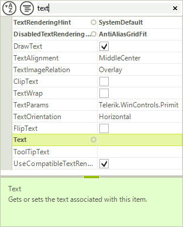
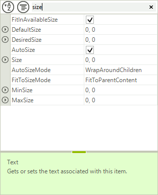

# Filtering

Just like the grouping and sorting functionality, filtering is possible both through the text box of the toolbar, or programmatically by populating the __FilterDescriptors__ collection of RadPropertyGrid. For the first option, just enable the toolbar by setting __ToolBarxVisible__ to *true* and type the desired search string in the text box:

>caption Figure 1: RadPropertyGrid Filtering



To add filters programmatically, first make sure that the __EnableFiltering__ property is set to *true* and then, define the desired __FilterDescriptor__ and add it to the control __FilterDescriptors__ collection.

You can filter by the following criteria’s: 

* __Name__: The property name.

* __Value__: The property value.

* __Category__: Assigned from the __Category__ attrubute name.

* __FormattedValue__: The value of the property converted to string.

* __Label__: By default this is identical to the property name, unless changed by setting the __Label__ property of the item.

* __Description__: This is determined by the property __Description__ attribute

* __OriginalValue__: The value used when the property is initialized.

>caption Figure 2: Filter Descriptor



>note If you need to filter by the category value, not the property name, in addition to the added **FilterDescriptor**, it is necessary to set the PropertyGridElement.ToolbarElement.**FilterPropertyName** property to "**Category**". 

#### Adding a Filter Descriptor

{{source=..\SamplesCS\PropertyGrid\Features\PropertyGridFiltering.cs region=Filtering}} 
{{source=..\SamplesVB\PropertyGrid\Features\PropertyGridFiltering.vb region=Filtering}} 

````C#
FilterDescriptor filter = new FilterDescriptor("Name", FilterOperator.Contains, "size");
radPropertyGrid1.FilterDescriptors.Add(filter);

````
````VB.NET
Dim filter = New FilterDescriptor("Name", FilterOperator.Contains, "size")
RadPropertyGrid1.FilterDescriptors.Add(filter)

````

{{endregion}}

# See Also

* [Grouping]()
* [Sorting]()
* [Editors]()
