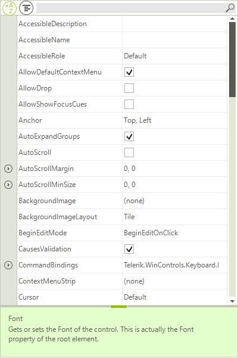

# Kinetic Scrolling

Kinetic Scrolling is a functionality that allows you to scroll by directly dragging the property grid items. The bellow image shows how it can be used:

It is necessary to set the **EnableKineticScrolling** property to **true**.

# See Also

* [Grouping]()
* [Sorting]()
* [Help Bar]()