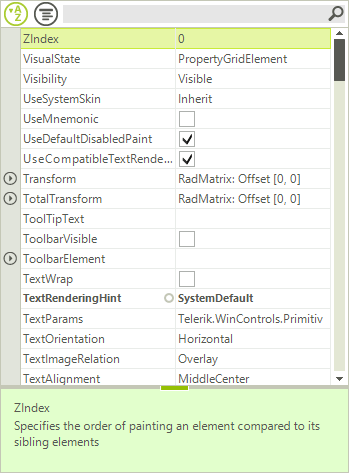
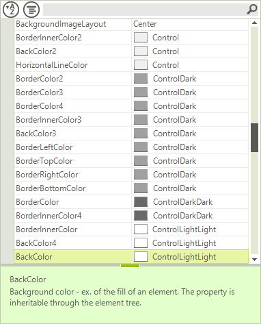

# Sorting

The sorting capabilities can be controlled either by using the predefined sorting options in the __PropertySort__ property together with the __SortOrder__ property, or you can use your own sorting by adding a predefined __SortDescriptor__ to the __SortDescriptors__ collection of **RadPropertyGrid**. The first code snippet demonstrates how to sort the items programmatically in a descending order.

>caption Figure 1: Default Sorting

#### Default Sorting

<snippet id='propertygrid-propertygridsorting-sorting-cs' />
<snippet id='propertygrid-propertygridsorting-sorting-vb' />

Another way to sort the items is to create a __SortDescriptor__ and add it to the __SortDescriptors__ collection of the control. Additionally, to enable sorting with sort descriptors, you have to set the __EnableSorting__ property to *true*.

You can sort by the following criteria’s:      

* __Name__: The property name.

* __Value__: The property value.

* __Category__: Assigned from the __Category__ attrubute name.

* __FormattedValue__: The value of the property converted to string.

* __Label__: By default this is identical to the property name, unless changed by setting the __Label__ property of the item.

* __Description__: This is determined by the property __Description__ attribute/

* __OriginalValue__: The value used when the property is initialized.

Here is an example of sorting the items by their value in ascending order.

>caption Figure 2: SortDescriptors

#### Sorting with SortDescriptors

<snippet id='propertygrid-propertygridsorting-sortdescriptor-cs' />
<snippet id='propertygrid-propertygridsorting-sortdescriptor-vb' />

>important The user should clear programmatically the **SortDescriptors** collection first because there is a default sort order (*Ascending*) for the properties in the object.

# See Also

* [Filtering]()
* [Grouping]()
* [Editors]()
