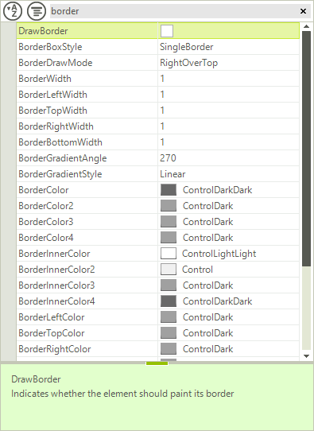
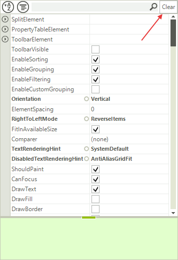

# ToolBar

**RadPropertyGrid** offers a toolbar with out of the box functionality, which appears on the top of the control. This toolbar contains predefined functions to sort the items, to group the items or to filter them by a string entered in the text box. You can enable this tool bar by setting the __ToolBarVisible__ property to *true*:

#### Enabling the Toolbar

{{source=..\SamplesCS\PropertyGrid\Features\PropertyGridToolbar.cs region=ToolbarVisible}} 
{{source=..\SamplesVB\PropertyGrid\Features\PropertyGridToolbar.vb region=ToolbarVisible}} 

````C#
radPropertyGrid1.ToolbarVisible = true;

````
````VB.NET
RadPropertyGrid1.ToolbarVisible = True

````

{{endregion}}

>caption Figure 1: RadPropertyGrid Toolbar



You can set the predefined filter operator and property by making use of the following properties:

#### Customizing Default Filtering

{{source=..\SamplesCS\PropertyGrid\Features\PropertyGridToolbar.cs region=FilterProperties}} 
{{source=..\SamplesVB\PropertyGrid\Features\PropertyGridToolbar.vb region=FilterProperties}} 

````C#
radPropertyGrid1.PropertyGridElement.ToolbarElement.FilterOperator = FilterOperator.Contains;
radPropertyGrid1.PropertyGridElement.ToolbarElement.FilterPropertyName = "Name";

````
````VB.NET
RadPropertyGrid1.PropertyGridElement.ToolbarElement.FilterOperator = FilterOperator.Contains
RadPropertyGrid1.PropertyGridElement.ToolbarElement.FilterPropertyName = "Name"

````

{{endregion}}

The toolbar consists of a __StackLayoutPanel__, which allow you to easily add additional elements or modify the existing once. You can access the existing items as follows:

#### Accessing Toolbar Elements

{{source=..\SamplesCS\PropertyGrid\Features\PropertyGridToolbar.cs region=accessingItems}} 
{{source=..\SamplesVB\PropertyGrid\Features\PropertyGridToolbar.vb region=accessingItems}} 

````C#
RadTextBoxElement filterTextBox = radPropertyGrid1.PropertyGridElement.ToolbarElement.SearchTextBoxElement;
RadToggleButtonElement sortButton = radPropertyGrid1.PropertyGridElement.ToolbarElement.AlphabeticalToggleButton;
RadToggleButtonElement groupButton = radPropertyGrid1.PropertyGridElement.ToolbarElement.CategorizedToggleButton;

````
````VB.NET
Dim filterTextBox As RadTextBoxElement = RadPropertyGrid1.PropertyGridElement.ToolbarElement.SearchTextBoxElement
Dim sortButton As RadToggleButtonElement = RadPropertyGrid1.PropertyGridElement.ToolbarElement.AlphabeticalToggleButton
Dim groupButton As RadToggleButtonElement = RadPropertyGrid1.PropertyGridElement.ToolbarElement.CategorizedToggleButton

````

{{endregion}}

If you want to add a new element in the toolbar, just add it to the __Children__ collection of __ToolbarElement__:

#### Add Element to Toolbar

>caption Figure 2: RadPropertyGrid Toolbar


{{source=..\SamplesCS\PropertyGrid\Features\PropertyGridToolbar.cs region=addElement}} 
{{source=..\SamplesVB\PropertyGrid\Features\PropertyGridToolbar.vb region=addElement}} 

````C#
RadButtonElement clearFiltering = new RadButtonElement();
clearFiltering.Text = "Clear";
clearFiltering.MinSize = new System.Drawing.Size(25, 22);
clearFiltering.StretchHorizontally = false;
radPropertyGrid1.PropertyGridElement.ToolbarElement.Children.Add(clearFiltering);

````
````VB.NET
Dim clearFiltering As New RadButtonElement()
clearFiltering.Text = "Clear"
clearFiltering.MinSize = New System.Drawing.Size(25, 22)
clearFiltering.StretchHorizontally = False
RadPropertyGrid1.PropertyGridElement.ToolbarElement.Children.Add(clearFiltering)

````

{{endregion}}

# See Also

* [Grouping]()
* [Sorting]()
* [Help Bar]()
