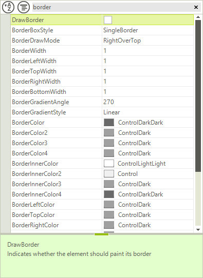
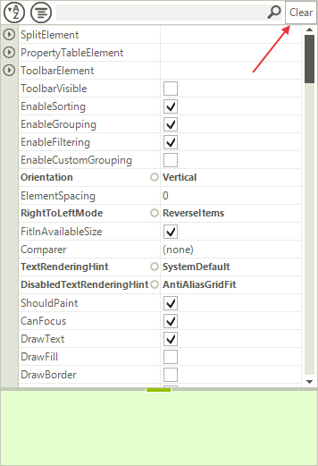

# ToolBar

**RadPropertyGrid** offers a toolbar with out of the box functionality, which appears on the top of the control. This toolbar contains predefined functions to sort the items, to group the items or to filter them by a string entered in the text box. You can enable this tool bar by setting the __ToolBarVisible__ property to *true*:

#### Enabling the Toolbar

<snippet id='propertygrid-propertygridtoolbar-toolbarvisible-cs' />
<snippet id='propertygrid-propertygridtoolbar-toolbarvisible-vb' />

>caption Figure 1: Toolbar

You can set the predefined filter operator and property by making use of the following properties:

#### Customizing Default Filtering

<snippet id='propertygrid-propertygridtoolbar-filterproperties-cs' />
<snippet id='propertygrid-propertygridtoolbar-filterproperties-vb' />

The toolbar consists of a __StackLayoutPanel__, which allow you to easily add additional elements or modify the existing once. You can access the existing items as follows:

#### Accessing Toolbar Elements

<snippet id='propertygrid-propertygridtoolbar-accessingitems-cs' />
<snippet id='propertygrid-propertygridtoolbar-accessingitems-vb' />

If you want to add a new element in the toolbar, just add it to the __Children__ collection of __ToolbarElement__:

#### Add Element to Toolbar

>caption Figure 2: Add Element to Toolbar

<snippet id='propertygrid-propertygridtoolbar-addelement-cs' />
<snippet id='propertygrid-propertygridtoolbar-addelement-vb' />

# See Also

* [Grouping]()
* [Sorting]()
* [Help Bar]()
