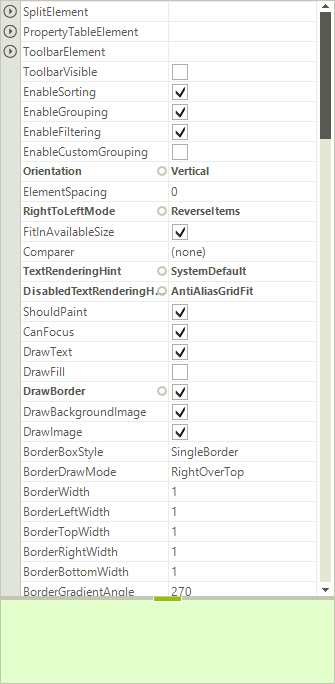
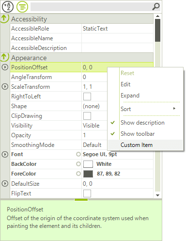
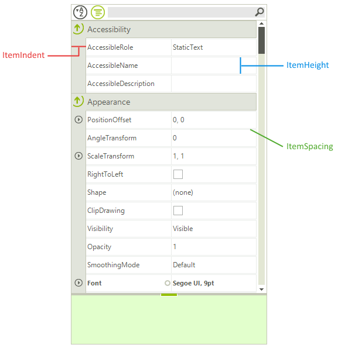

# Getting Started

| RELATED VIDEOS |  |
| ----- | --- |
|RadPropertyGrid provides an easy and versatile approach to processing data objects' properties. Utilizing its autogeneration features and the intuitive custom editors apabilities, users would be able either to display data in a way that best fits their needs or modify it with minimal effort. RadPropertyGrid can be bound to an item with just a single line of code and you may start exploring or editing its properties. The property editor controls are auto generated - text fields for string properties, DateTimePickers for dates, ComboBoxes for enums and Booleans, RadColorPicker for colors. In addition, RadPropertyGrid allows flexible manual settings and customization of editors. RadPropertyGrid also supports scrolling operations via touch interface.|[ Getting started with RadPropertyGrid ](http://tv.telerik.com/watch/winforms/getting-started-with-teleriks-radpropertygrid)<br>|

The following example will demonstrate the basic functionalities of **RadPropertyGrid** control. Let’s start with adding **RadPropertyGrid** control to a **RadForm**. In the code behind we will set the **SelectedObject** property of the control to an object, which properties we  want to display. For the sake of this example we will use the element of the control – **PropertyGridElement**. 

#### RadPropertyGrid`s SelectedObject

{{source=..\SamplesCS\PropertyGrid\PropertyGridGettingStarted.cs region=SelectedObject}} 
{{source=..\SamplesVB\PropertyGrid\PropertyGridGettingStarted.vb region=SelectedObject}} 

````C#
this.radPropertyGrid1.SelectedObject = new PropertyGridElement();

````
````VB.NET
Me.RadPropertyGrid1.SelectedObject = New PropertyGridElement()

````

{{endregion}}

It is all set and **RadProperyGrid** reads all public properties of the given object and displays them:

>caption Figure 1: Selected Object


Now, let’s customize the example a bit and take advantage of some of its features. As you can see in the image above, on the bottom of the control a help section is displayed. This section reads the name and the content of the __Description__ attribute of the selected property. The section visibility is controlled by the __HelpVisible__ property and it is turned on by default.

Next, we will add a predefined toolbox on the top of the control. This toolbox contains of two buttons – for alphabetical sorting and for grouping the items (grups are created by reading the __Category__ attribute of the __SelectedObject__ properties) – and also a text box used for filtering the property grid. All this functionality comes out of the box by simply setting the __ToolBarVisible__ property to *true*:

#### ToolbarVisible

{{source=..\SamplesCS\PropertyGrid\PropertyGridGettingStarted.cs region=ToolBarVisible}} 
{{source=..\SamplesVB\PropertyGrid\PropertyGridGettingStarted.vb region=ToolBarVisible}} 

````C#
this.radPropertyGrid1.ToolbarVisible = true;

````
````VB.NET
Me.RadPropertyGrid1.ToolbarVisible = True

````

{{endregion}}

Additionally, since the toolbox consists of a __StackLayoutPanel__, is supports adding additional elements. Here is how to add a button that clears the filter text box:

#### Add Element to Toolbox

{{source=..\SamplesCS\PropertyGrid\PropertyGridGettingStarted.cs region=AddElementToToolbox1}} 
{{source=..\SamplesVB\PropertyGrid\PropertyGridGettingStarted.vb region=AddElementToToolbox1}}

````C#
RadButtonElement clearFiltering = new RadButtonElement();
clearFiltering.Text = "Clear";
clearFiltering.MinSize = new System.Drawing.Size(25, 22);
clearFiltering.StretchHorizontally = false;
clearFiltering.Click += new EventHandler(clearFiltering_Click);

````
````VB.NET
Dim clearFiltering = New RadButtonElement()
clearFiltering.Text = "Clear"
clearFiltering.MinSize = New System.Drawing.Size(25, 22)
clearFiltering.StretchHorizontally = False
AddHandler clearFiltering.Click, AddressOf clearFiltering_Click

````

{{endregion}}

#### Clear the Filter

{{source=..\SamplesCS\PropertyGrid\PropertyGridGettingStarted.cs region=AddElementToToolbox2}} 
{{source=..\SamplesVB\PropertyGrid\PropertyGridGettingStarted.vb region=AddElementToToolbox2}} 

````C#
void clearFiltering_Click(object sender, EventArgs e)
{
    this.radPropertyGrid1.PropertyGridElement.ToolbarElement.SearchTextBoxElement.Text = "";
}

````
````VB.NET
Private Sub clearFiltering_Click(ByVal sender As Object, ByVal e As EventArgs)
    Me.RadPropertyGrid1.PropertyGridElement.ToolbarElement.SearchTextBoxElement.Text = ""
End Sub

````

{{endregion}} 

By default, opening the editor for editing is done by double clicking the editor. This behavior can be easily changed by selecting one of the predefined options of the __BeginEditMode__ property. The options to choose from are follows:

* **BeginEditOnClick**: The editor is opened on the first click

* **BeginEditOnDoubleClick**: The editor is opened on double click

* **BeginEditoProgramatically**: The editor can be opened only programmatically (by calling BeginEdit() method)

#### Begin Edit Mode

{{source=..\SamplesCS\PropertyGrid\PropertyGridGettingStarted.cs region=BeginEditMode}} 
{{source=..\SamplesVB\PropertyGrid\PropertyGridGettingStarted.vb region=BeginEditMode}} 

````C#
this.radPropertyGrid1.BeginEditMode = RadPropertyGridBeginEditModes.BeginEditOnClick;

````
````VB.NET
Me.RadPropertyGrid1.BeginEditMode = RadPropertyGridBeginEditModes.BeginEditOnClick

````

{{endregion}}

To set the default sorting or grouping of the properties, just set the **PropertySort** property, to one of the enumerated values: 

* **Alphabetical**: Sorts the properties according to the **SortOrder** setting (*Ascending* or *Descending*)

* **Categorized**: Groups the properties according to their **Category** attribute

* **CategorizedAlphabetical**: Groups the properties according to their __Category__ attribute and sorts them Alphabetically, according to the **SortOrder** setting (*Ascending* or *Descending*)

* **None**: Removes sorting and grouping

#### Group by Categories

{{source=..\SamplesCS\PropertyGrid\PropertyGridGettingStarted.cs region=PropertySort}} 
{{source=..\SamplesVB\PropertyGrid\PropertyGridGettingStarted.vb region=PropertySort}} 

````C#
this.radPropertyGrid1.PropertySort = PropertySort.Categorized;

````
````VB.NET
Me.RadPropertyGrid1.PropertySort = PropertySort.Categorized

````

{{endregion}}

You can control the sort order, by setting the **SortOrder** property of the control. Possible values are *Ascending*, *Descending* and *None*:

#### Setting the Sort Order

{{source=..\SamplesCS\PropertyGrid\PropertyGridGettingStarted.cs region=SortOrder}} 
{{source=..\SamplesVB\PropertyGrid\PropertyGridGettingStarted.vb region=SortOrder}} 

````C#
this.radPropertyGrid1.SortOrder = SortOrder.Ascending;

````
````VB.NET
Me.RadPropertyGrid1.SortOrder = SortOrder.Ascending

````

{{endregion}}

There are also four properties that allow you to control the expand/collapse image of the control. These are as follows: __CollapseImage__, __ExpandImage__, __HoveredCollapseImage__ and __HoveredExpandImage__.

The selection of the items is controlled by either setting a certain item to the __SelectedGridItem__ property, or by calling the __Select()__ method of an item.

Accessing and modifying the default context menu, can be achieved by accessing the __RadContextMenu__ property of the control. For more information on how to work with menu items, please refer to our [Menu]() section. 

>caption Figure 2: Context Menu


There are a few properties that you can set in order to change the item appearance:  

* **ItemHeight**: Sets the visible items height.

* **ItemSpacing**: Sets the spacing between the items.

* **ItemIndent**: Sets the indent space in the beginning of the items.

#### Item Settings

{{source=..\SamplesCS\PropertyGrid\PropertyGridGettingStarted.cs region=ItemProperties}} 
{{source=..\SamplesVB\PropertyGrid\PropertyGridGettingStarted.vb region=ItemProperties}}
````C#
this.radPropertyGrid1.ItemHeight = 30;
this.radPropertyGrid1.ItemIndent = 25;
this.radPropertyGrid1.ItemSpacing = 1;

````
````VB.NET
Me.RadPropertyGrid1.ItemHeight = 30
Me.RadPropertyGrid1.ItemIndent = 25
Me.RadPropertyGrid1.ItemSpacing = 1

```` 


{{endregion}}

>caption Figure 3: Selected Object


At the end, if you want to expand all groups automatically, you can set the **AutoExpandGroups** to *true* (which is also the default setting).

# See Also

* [Structure]()
* [Design Time]()
