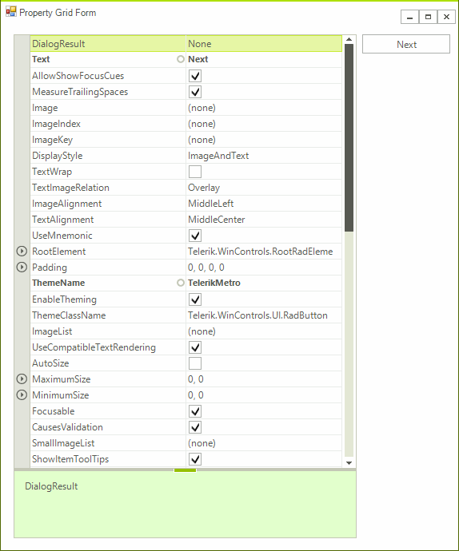

# Custom Keyboard Handling

The key strokes are captured by **RadPropertyGrid** and later passed onto the **RadPropertyGridTableElement** which has its own logic for handling the keys. The following keys are considered special and they are handled by the table element: 

* Keys.End 
* Keys.Home
* Keys.Left
* Keys.Right
* Keys.Up
* Keys.Down
* Keys.Enter
* Keys.Escape

For any other keys the **RadPropertyGrid** does not take any actions.

The example below will handle a scenario in which the *Tab* key is captured and later used to navigate the property grid in a forward direction. Once the last item is reached then the next *Tab* key press will move the focus out of the control. 

>note This approach can be used to modify the current implementation for any of the input keys or new keys be added and handled in a special way. Eventually the key message will reach the **ProcessKeyDown** method in the **PropertyGridTableElement** class. This method is virtual and its implementation can be modified.

>caption Figure 1: Custom Tab Key Behavior

## Custom RadPropertyGrid Control

We need to create a custom **RadPropertyGrid** control so that we can override the initialization of the table element and substitute it with a custom one handling the *Tab* key according to our own logic. 

>note The **ThemeClassName** property needs to be overridden so that the new control can be styled using the base control`s theme settings.

#### Control`s Implementation

<snippet id='propertygrid-propertygridcustomkeyboardnavigation-customradpropertygrid-cs' />
<snippet id='propertygrid-propertygridcustomkeyboardnavigation-customradpropertygrid-vb' />

## Custom Elements 

The various elements building the control are created in special virtual methods allowing easy substitutions.

>note The **ThemeEffectiveType** property needs to be overridden so that the custom elements can be styled using their base element`s theme settings.

#### Elements` Implementation

<snippet id='propertygrid-propertygridcustomkeyboardnavigation-customelements-cs' />
<snippet id='propertygrid-propertygridcustomkeyboardnavigation-customelements-vb' />

# See Also

* [Keyboard Navigation]()
* [Inherit Themes]()
