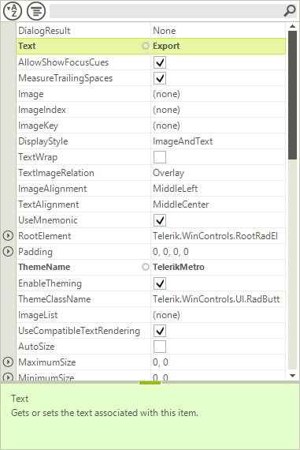

# PropertyGrid

**RadPropertyGrid** for WinForms displays the properties of a given object in a user-friendly way allowing the end-user to edit these properties using our editors. Now you can concentrate all the settings in one place instead of scattering them all over your forms. RadPropertyGrid gives the end-user the ability to filter, group and sort its items thanks to our data processing engine used also by controls like RadGridView, RadListView etc. RadPropertyGrid takes full advantage of the virtualization mechanism, so even if you load an object with hundreds of properties, no problem, RadPropertyGrid will handle these cases.





**RadPropertyGrid** comes with a built-in tool bar which filters properties as you type. You can customize its behavior by defining the part of the property by which the filter is applied. For example, you can filter by property name, property label, property category or property description. You can also change the operator by which the filter is applied - Starts, Contains, etc.

**RadPropertyGrid** also includes a help bar at the bottom where the name of the selected property is displayed along with the description from the DescriptionAttribute of the property. Both bars can be easily shown or hidden by setting a single property for each bar.

For those of you who would like to additionally customize **RadPropertyGrid**, the good news is that this control can be easily extended by adding elements to it, such as your custom toolbars or another type of [Telerik Presentation Framework]()
element. You can add elements to the **RadPropertyGrid** or the tool bar itself.

As to the editing capabilities, **RadPropertyGrid** allows you to control the process of editing all the way through - from the initialization and the type of editor used to validation and value changing events.
        
# See Also

* [Getting Started]()
* [Structure]()
* [Design Time]()
