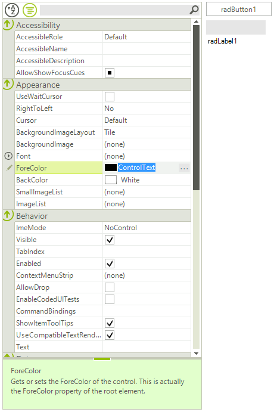

# Binding to Multiple Objects

You can set an array of objects as **SelectedObjects** of **RadPropertyGrid**. When you do so, the **RadPropertyGrid** will display only the common properties of all the objects in the array. A common property is considered a property that has the same name and type across all the objects. If the values of the properties in all objects match, this value will be displayed, otherwise there will be no value displayed for the given property. When you set a property in the **RadPropertyGrid** the value is set in all the objects.

>caption Figure 1: RadPropertyGrid Multiple Objects



Here is how to use this feature:

#### SelectedObjects Property

{{source=..\SamplesCS\PropertyGrid\PropertyGridBindingToMultipleObjects.cs region=BindToMultipleObjects}} 
{{source=..\SamplesVB\PropertyGrid\PropertyGridBindingToMultipleObjects.vb region=BindToMultipleObjects}} 

````C#
object[] objects = new object[] { this.radButton1, this.radTextBox1, this.radLabel1 };
this.radPropertyGrid1.SelectedObjects = objects;

````
````VB.NET
Dim objects As Object() = New Object() {Me.RadButton1, Me.RadTextBox1, Me.RadLabel1}
Me.RadPropertyGrid1.SelectedObjects = objects

````

{{endregion}}

# See Also

* [RadPropertyStore - Adding Custom Properties]()
