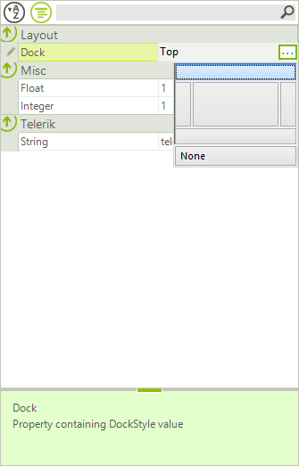

# RadPropertyStore - Adding Custom Properties

To get started with the **RadPropertyStore** follow these three steps:

* Create a new instance of the **RadPropertyStore**.

* Fill it with PropertyStoreItems.

* Set it as **SelectedObject** of **RadPropertyGrid**.

#### Using RadPropertyStore

<snippet id='propertygrid-propertygridradpropertystore-radpropertystore-cs' />
<snippet id='propertygrid-propertygridradpropertystore-radpropertystore-vb' />

>caption Figure 1: RadPropertyStore

You can then use the **RadPropertyGrid** to edit the **PropertyStoreItems** values as if they were properties of an object. You can also change the value of a given property in the RadPropertyStore and the change will be reflected immediately in the RadPropertyGrid. Additionally you can also add or remove items from the RadPropertyStore during runtime and again all changes will be reflected in the **RadPropertyGrid**.

#### Add/Remove/Edit PropertyStoreItems

<snippet id='propertygrid-propertygridradpropertystore-modifystore-cs' />
<snippet id='propertygrid-propertygridradpropertystore-modifystore-vb' />

You have to provide a value of the same type as the PropertyStoreItem or a value that can be converted through the TypeConverter of the type of the property. Otherwise the value would not be stored in the item.

# See Also

* [Binding to Mutitple Objects]()
* [How to implement a TypeConverter](http://msdn.microsoft.com/en-us/library/ayybcxe5.aspx)
