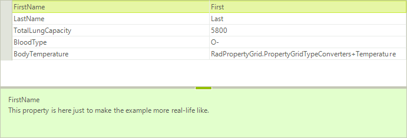
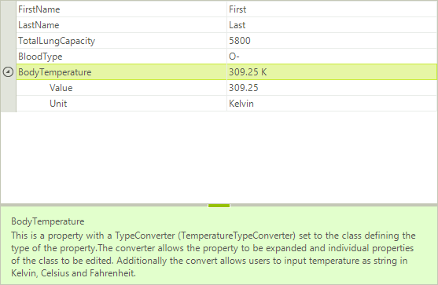
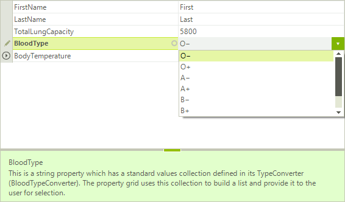
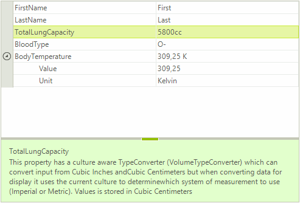

# Type Converters

__RadPropertyGrid__ is commonly used to visualize custom object’s properties and values. A common case is when a certain property is of custom type, or there is no predefined editor for the specific type. In this situation the control will only display the type as a string. This article demonstrates how you can modify the way a property is being displayed and edited by using custom TypeConverters.
A [Type Converter]( https://msdn.microsoft.com/en-us/library/ayybcxe5.aspx) is used to convert values between data types. Here are the four main methods that are usually used when implementing a custom __Type Converter__.

* Override the __CanConvertFrom__ method that specifies which type the converter can convert from.

* Override the __ConvertFrom__ method that implements the conversion.

* Override the __CanConvertTo__ method that specifies which type the converter can convert to. 

* Override the __ConvertTo__ method that implements the conversion. 

Consider the __RadPropertyGrid__ is populated with a __Patient__ object contacting the following properties:

#### Bind RadPropertyGrid

<snippet id='propertygrid-propertygridtypeconverters-populatedata-cs' />
<snippet id='propertygrid-propertygridtypeconverters-populatedata-vb' />

You will notice that the __BodyTemperature__ property displays the property type:

>caption Figure 1: BodyTemperature Property

In order to visualize the __BodyTemperature__ value with a custom formatted string you need to implement a __TypeConverter__ which should convert the *Temperature* value to the desired string.

## Display nested properties with ExpandableObjectConverter

As the __BodyTemperature__ property is of complex type composed of two properties, we will use a custom type converter derived from the [ExpandableObjectConverter](https://msdn.microsoft.com/en-us/library/system.componentmodel.expandableobjectconverter%28v=vs.110%29.aspx):

#### TemperatureTypeConverter

<snippet id='propertygrid-propertygridtypeconverters-temperaturetypeconverter-cs' />
<snippet id='propertygrid-propertygridtypeconverters-temperaturetypeconverter-vb' />

Apply a __TypeConverterAttribute__ that indicates the type of your type converter. The result is illustrated on the screenshot below:

#### BodyTemperature Property

<snippet id='propertygrid-propertygridtypeconverters-applytemparatureattribute-cs' />
<snippet id='propertygrid-propertygridtypeconverters-applytemparatureattribute-vb' />

>caption Figure 2: RadPropertyGrid TypeConverterAttribute

## Display a predefined list of values for a property with TypeConverter 

The __BloodType__ property is a string property which allows entering any string, even if it is not a valid blood type. To handle this case we can create a __TypeConverter__. In it we will override the __GetStandardValuesSupported__ method, which indicates whether the object supports a standard set of values that can be picked from a predefined list. Then we will override the __GetStandardValuesExclusive__ method which indicates whether the collection of standard values is exclusive or the user is allowed to add custom values. Lastly, in the __GetStandardValues__ method we should specify the predefined list. The property grid uses this collection to build a list and  provide it to the user for selection.

#### BloodTypeConverter

<snippet id='propertygrid-propertygridtypeconverters-bloodtypeconverter-cs' />
<snippet id='propertygrid-propertygridtypeconverters-bloodtypeconverter-vb' />

After applying the __TypeConverterAttribute__, when you try to modify the __BloodType__ property __RadPropertyGrid__ will display a drop down list editor with the predefined set of values:

#### BloodType Property

<snippet id='propertygrid-propertygridtypeconverters-applybloodtypeattribute-cs' />
<snippet id='propertygrid-propertygridtypeconverters-applybloodtypeattribute-vb' />

>caption Figure 3: BloodTypeConverter

## Culture Aware TypeConverter

This example demonstrates how to apply a culture aware __TypeConverter__ to the __TotalLungCapacity__ property which can convert input from Cubic Inches and Cubic Centimeters but when converting data for display it uses the current culture to determine which system of measurement to use (Imperial or Metric). The value is stored in Cubic Centimeters.

#### VolumeTypeConverter

<snippet id='propertygrid-propertygridtypeconverters-volumetypeconverter-cs' />
<snippet id='propertygrid-propertygridtypeconverters-volumetypeconverter-vb' />

Do not forget to apply the __TypeConverterAttribute__. Additionally, we will specify the editor to be __PropertyGridTextBoxEditor__.

#### ApplyVolumeTypeAttribute

<snippet id='propertygrid-propertygridtypeconverters-applyvolumetypeattribute-cs' />
<snippet id='propertygrid-propertygridtypeconverters-applyvolumetypeattribute-vb' />

>caption Figure 4: TotalLungCapacity Property

# See Also

* [Binding to Multiple Objects]()
* [RadPropertyStore - Adding Custom Properties]()
* [Attributes]()
* [How to Show Nested Collections in RadPropertyGrid]()
* [How to Specify Displayed Enum Values in RadPropertyGrid]()
