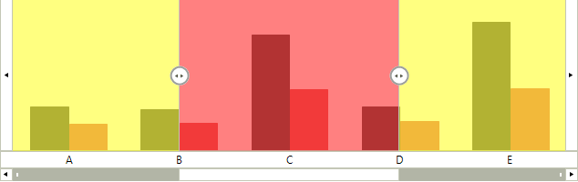
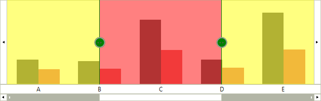
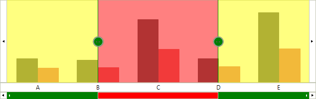
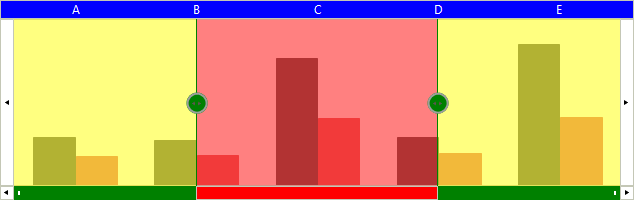
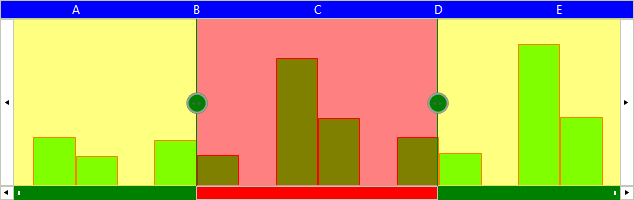

# Customizing RadRangeSelector 

Each of the control's elements can be accessed and customized. Once you access the desired elements, you can tweak its properties in order to modify it. In this tutorial, we will take a look at code snippets, demonstrating how to access and modify different parts of the control:

## Customize Hover Elements

The following code snippet demonstrates how to access and customize the Range and Hover elements through element tree:

<snippet id='rangeselector-customizingradrangeselector-customizehover-cs' />
<snippet id='rangeselector-customizingradrangeselector-customizehover-vb' />

## Customize Thumbs

<snippet id='rangeselector-customizingradrangeselector-customizethumb-cs' />
<snippet id='rangeselector-customizingradrangeselector-customizethumb-vb' />

## Customize Scroll Event

This scroll element appears only when associated element implements IRangeSelectorElement interface.

<snippet id='rangeselector-customizingradrangeselector-customizescroll-cs' />
<snippet id='rangeselector-customizingradrangeselector-customizescroll-vb' />

## Customize Scales

The scales are created dynamically according to the associated element and its look and feel can be customized through the __ScaleInitializing__ event.

<snippet id='rangeselector-customizingradrangeselector-customizescales-cs' />
<snippet id='rangeselector-customizingradrangeselector-customizescales-vb' />

<snippet id='rangeselector-customizingradrangeselector-customizescales1-cs' />
<snippet id='rangeselector-customizingradrangeselector-customizescales1-vb' />

## Customize ChartElement

In order to customize the chart that is drawn into __RadRangeSelector__ when it is associated with __RadChartView__, the associated element should be accessed. The following code snippet demonstrates how this can be achieved.

<snippet id='rangeselector-customizingradrangeselector-customizechartelement-cs' />
<snippet id='rangeselector-customizingradrangeselector-customizechartelement-vb' />

<snippet id='rangeselector-customizingradrangeselector-customizechartelement1-cs' />
<snippet id='rangeselector-customizingradrangeselector-customizechartelement1-vb' />

## See Also

* [Structure]()
* [Integration with RadChartView]()
* [Properties and Events]()
