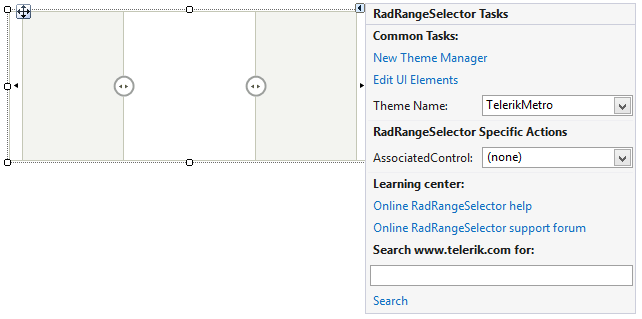

# Design Time

>caption Figure 1: Smart Tag

* __Common Tasks__

	* __New Theme Manager__: Adds a new __RadThemeManager__ component to the form.

	* __Edit UI elements__: Opens a dialog that displays the *Element Hierarchy Editor*. This editor lets you browse all the elements in the control.

	* __Theme Name__: Select a theme name from the drop down list of themes available for that control. Selecting a theme allows you to change all aspects of the controls visual style at one time.

* __RadRangeSelector Specific Actions__:

	* __Associated Control__: Specifies a particular __RadChartView__ instance.

* __Learning Center__: Navigate to the Telerik help, code library projects or support forum.

* __Search__: Search the Telerik website for a given string.

# See Also

* [Structure]()
* [Getting Started]()
* [Integration with RadChartView]()