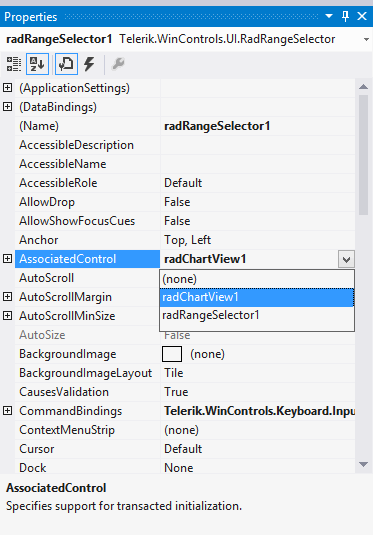
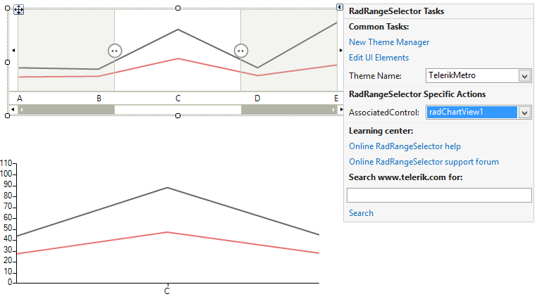
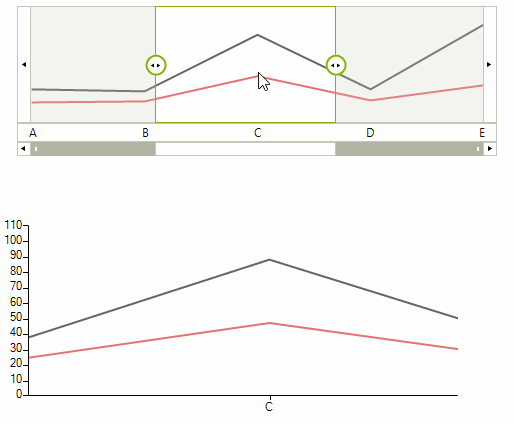

# Getting Started with WinForms RangeSelector

This tutorial will help you to quickly get started using the control.

## Adding Telerik Assemblies Using NuGet

To use `RadRangeSelector` when working with NuGet packages, install the `Telerik.UI.for.WinForms.AllControls` package. The [package target framework version may vary]().

Read more about NuGet installation in the [Install using NuGet Packages]() article.

>tip With the 2025 Q1 release, the Telerik UI for WinForms has a new licensing mechanism. You can learn more about it [here]().

## Adding Assembly References Manually

When dragging and dropping a control from the Visual Studio (VS) Toolbox onto the Form Designer, VS automatically adds the necessary assemblies. However, if you're adding the control programmatically, you'll need to manually reference the following assemblies:

* __Telerik.Licensing.Runtime__
* __Telerik.WinControls__
* __Telerik.WinControls.UI__
* __TelerikCommon__

The Telerik UI for WinForms assemblies can be install by using one of the available [installation approaches](). 

## Defining the RadRangeSelector

This tutorial demonstrates how to use __RadRangeSelector__ to get a fine grain view of the data represented in __RadChartView__.

1\. Place a __RadRangeSelector__ and __RadChartView__ controls on a form.

2\. Setup your __RadChartView__ with some data.

3\. Associate the __RadChartView__ control to __RadRangeSelector__ by setting its __AssociatedControl__ property. You can do that by one of the following ways:

* Set in code:

{{source=..\SamplesCS\RangeSelector\RangeSelectorGettingStarted.cs region=set associatedControl}} 
{{source=..\SamplesVB\RangeSelector\RangeSelectorGettingStarted.vb region=set associatedControl}} 

````C#
this.radRangeSelector1.AssociatedControl = this.radChartView1;

````
````VB.NET
Me.radRangeSelector1.AssociatedControl = Me.radChartView1

````

{{endregion}}

* Set in Property Builder at design time:

    

* Set it by using the control’s SmartTag at design time:
    

4\. Press F5 to run the project.
    

# See Also

* [Design Time]()
* [Structure]()
* [Integration with RadChartView]()

## Telerik UI for WinForms Learning Resources
* [Telerik UI for WinForms RangeSelector Component](https://www.telerik.com/products/winforms/rangeselector.aspx)
* [Getting Started with Telerik UI for WinForms Components](https://docs.telerik.com/devtools/winforms/getting-started/first-steps)
* [Telerik UI for WinForms Setup](https://docs.telerik.com/devtools/winforms/installation-and-upgrades/installing-on-your-computer)
* [Telerik UI for WinForms Application Modernization](https://docs.telerik.com/devtools/winforms/winforms-converter/overview)
* [Telerik UI for WinForms Visual Studio Templates](https://docs.telerik.com/devtools/winforms/visual-studio-integration/visual-studio-templates)
* [Deploy Telerik UI for WinForms Applications](https://docs.telerik.com/devtools/winforms/deployment-and-distribution/application-deployment)
* [Telerik UI for WinForms Virtual Classroom(Training Courses for Registered Users)](https://learn.telerik.com/learn/course/external/view/elearning/17/telerik-ui-for-winforms)
* [Telerik UI for WinForms License Agreement)](https://www.telerik.com/purchase/license-agreement/winforms-dlw-s)

