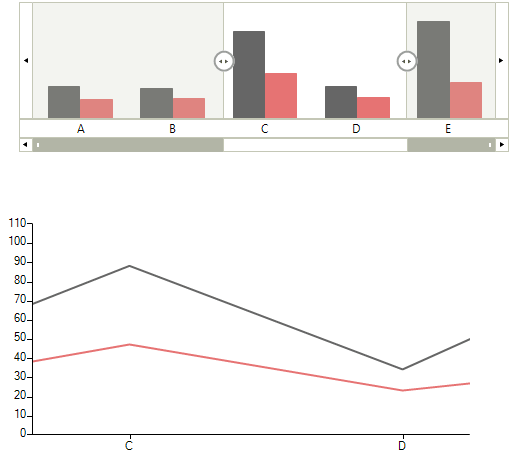
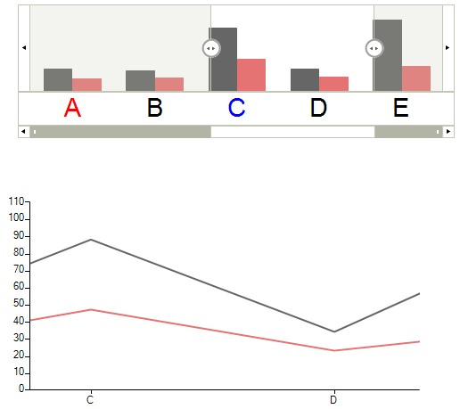

# Integration with RadChartView

__RadChartView__ has full __RadRangeSelector__ integration support, through implementation of the __IRangeSelectorControl__ and __IRangeSelectorElement__ interfaces by __RadChartView__ and __RangeSelectorViewElement__ classes respectively.

>note  __RangeSelectorViewElement__ supports only Cartesian series.
>

__RangeSelectorViewElement__ extends the __RadChartElement__, draws the chart into __RadRangeSelector__ and generates the scales according to its Axes collection. By accessing the __RangeSelectorViewElement__ you can take advantage of some additional controlling mechanisms like __SeriesInitializing__,  __SeriesInitialized__ and __LabelInitializng__ events. With the first two events you can control the series that should draw into RadRangeSelector and their types, while with the __LabelInitializng__ event, you can control the labels that are going to be drawn on the scales.

## Scale Customization

Here is how to access the __RangeSelectorViewElement__ and change the series types:

#### SeriesInitializing Event

{{source=..\SamplesCS\RangeSelector\RangeSelectorIntegrationWithChart.cs region=ScaleCustomization1}} 
{{source=..\SamplesVB\RangeSelector\RangeSelectorIntegrationWithChart.vb region=ScaleCustomization1}} 

````C#
RangeSelectorViewElement chartElement = this.radRangeSelector1.RangeSelectorElement.AssociatedElement as RangeSelectorViewElement;
chartElement.SeriesInitializing += new SeriesInitializingEventHandler(chartElement_SeriesInitializing);

````
````VB.NET
Dim chartElement As RangeSelectorViewElement = TryCast(Me.radRangeSelector1.RangeSelectorElement.AssociatedElement, RangeSelectorViewElement)
AddHandler chartElement.SeriesInitializing, AddressOf chartElement_SeriesInitializing

````

{{endregion}}

#### Change Series Type

{{source=..\SamplesCS\RangeSelector\RangeSelectorIntegrationWithChart.cs region=ScaleCustomization2}} 
{{source=..\SamplesVB\RangeSelector\RangeSelectorIntegrationWithChart.vb region=ScaleCustomization2}} 

````C#
void chartElement_SeriesInitializing(object sender, SeriesInitializingEventArgs e)
{
    e.SeriesType = typeof(BarSeries);
}

````
````VB.NET
Private Sub chartElement_SeriesInitializing(sender As Object, e As SeriesInitializingEventArgs)
    e.SeriesType = GetType(BarSeries)
End Sub

````

{{endregion}} 

>caption Figure 1: BarSeries


As you can see, the chart displays a __LineSeries__, while in __RadRangeSelector__ we have changed it to __BarSeries__.

## Labels Customization

Here is how to access and modify the labels in RadRangeSelector

#### LabelInitializing Event

{{source=..\SamplesCS\RangeSelector\RangeSelectorIntegrationWithChart.cs region=LabelCustomization}} 
{{source=..\SamplesVB\RangeSelector\RangeSelectorIntegrationWithChart.vb region=LabelCustomization}} 

````C#
RangeSelectorViewElement chartElement = this.radRangeSelector1.RangeSelectorElement.AssociatedElement as RangeSelectorViewElement;
chartElement.LabelInitializing += new LabelInitializingEventHandler(chartElement_LabelInitializing);

````
````VB.NET
Dim chartElement As RangeSelectorViewElement = TryCast(Me.radRangeSelector1.RangeSelectorElement.AssociatedElement, RangeSelectorViewElement)
AddHandler chartElement.LabelInitializing, AddressOf chartElement_LabelInitializing

````

{{endregion}} 

#### Change Labels

{{source=..\SamplesCS\RangeSelector\RangeSelectorIntegrationWithChart.cs region=LabelCustomization1}} 
{{source=..\SamplesVB\RangeSelector\RangeSelectorIntegrationWithChart.vb region=LabelCustomization1}} 

````C#
Font f = new Font("Arial", 22);
void chartElement_LabelInitializing(object sender, LabelInitializingEventArgs e)
{
    e.LabelElement.Font = f;
    if (e.LabelElement.Text == "C")
    {
        e.LabelElement.ForeColor = Color.Blue;
    }
    if (e.LabelElement.Text == "A")
    {
        e.LabelElement.ForeColor = Color.Red;
    }
}

````
````VB.NET
Private f As New Font("Arial", 22)
Private Sub chartElement_LabelInitializing(sender As Object, e As LabelInitializingEventArgs)
    e.LabelElement.Font = f
    If e.LabelElement.Text = "C" Then
        e.LabelElement.ForeColor = Color.Blue
    End If
    If e.LabelElement.Text = "A" Then
        e.LabelElement.ForeColor = Color.Red
    End If
End Sub

````

{{endregion}} 

>caption Figure 2: Changed Chart Labels


Also, the generated from __RangeSelectorViewElement__ scales (__RangeSelectorChartScaleContainerElement__) have embedded logic that prevents overlapping of labels and the following properties can be used to control it:

* __ShowAllLabels:__ By default the control will hide the overlapping labels. If you want to show all labels, just set this property back to true.

* __LabelsOffset:__ This property defines the minimum space (in pixels) between the labels when ShowAllLabels is false. Default value of this property is 5 pixels.

The easiest way to access these properties is in the __ScaleInitializing__ event of __RandRangeSelector__.

#### ScaleInitializing Event

{{source=..\SamplesCS\RangeSelector\RangeSelectorIntegrationWithChart.cs region=LabelCustomization2}} 
{{source=..\SamplesVB\RangeSelector\RangeSelectorIntegrationWithChart.vb region=LabelCustomization2}} 

````C#
this.radRangeSelector1.ScaleInitializing += new ScaleInitializingEventHandler(radRangeSelector1_ScaleInitializing);

````
````VB.NET
AddHandler Me.radRangeSelector1.ScaleInitializing, AddressOf radRangeSelector1_ScaleInitializing

````

{{endregion}}

#### Label Settings

{{source=..\SamplesCS\RangeSelector\RangeSelectorIntegrationWithChart.cs region=LabelCustomization3}} 
{{source=..\SamplesVB\RangeSelector\RangeSelectorIntegrationWithChart.vb region=LabelCustomization3}} 

````C#
void radRangeSelector1_ScaleInitializing(object sender, ScaleInitializingEventArgs e)
{
    RangeSelectorChartScaleContainerElement chartScaleElement = e.ScaleElement as RangeSelectorChartScaleContainerElement;
    chartScaleElement.LabelsOffset = 0;
    chartScaleElement.ShowAllLabels = false;
}

````
````VB.NET
Private Sub radRangeSelector1_ScaleInitializing(sender As Object, e As ScaleInitializingEventArgs)
    Dim chartScaleElement As RangeSelectorChartScaleContainerElement = TryCast(e.ScaleElement, RangeSelectorChartScaleContainerElement)
    chartScaleElement.LabelsOffset = 0
    chartScaleElement.ShowAllLabels = False
End Sub

````

{{endregion}}

## Pan and Zoom synchronization

There is two-way synchronization between the pan and zoom functionality of RadChartView and the selected range of RadRangeSelector. By setting __EnablePanAndZoomSynchronization__ property to false this synchronization will be only one way - from RadRangeSelector to RadChartView.

#### Disable Pan and Zoom Synchronization

{{source=..\SamplesCS\RangeSelector\RangeSelectorIntegrationWithChart.cs region=EnablePanAndZoomSynchronization}} 
{{source=..\SamplesVB\RangeSelector\RangeSelectorIntegrationWithChart.vb region=EnablePanAndZoomSynchronization}} 

````C#
((RangeSelectorViewElement)this.radRangeSelector1.RangeSelectorElement.AssociatedElement).EnablePanAndZoomSynchronization = false;

````
````VB.NET
DirectCast(Me.radRangeSelector1.RangeSelectorElement.AssociatedElement, RangeSelectorViewElement).EnablePanAndZoomSynchronization = False

````

{{endregion}}

## See Also

* [Design Time]()
* [Structure]()
* [Getting Started]()
* [Properties and Events]()
