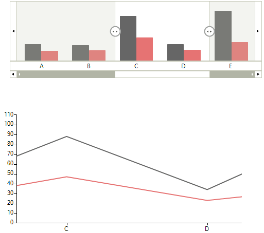
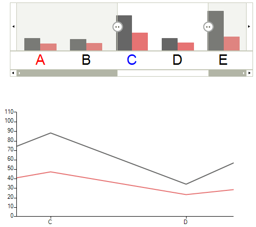

# Integration with RadChartView

__RadChartView__ has full __RadRangeSelector__ integration support, through implementation of the __IRangeSelectorControl__ and __IRangeSelectorElement__ interfaces by __RadChartView__ and __RangeSelectorViewElement__ classes respectively.

>note  __RangeSelectorViewElement__ supports only Cartesian series.
>

__RangeSelectorViewElement__ extends the __RadChartElement__, draws the chart into __RadRangeSelector__ and generates the scales according to its Axes collection. By accessing the __RangeSelectorViewElement__ you can take advantage of some additional controlling mechanisms like __SeriesInitializing__,  __SeriesInitialized__ and __LabelInitializng__ events. With the first two events you can control the series that should draw into RadRangeSelector and their types, while with the __LabelInitializng__ event, you can control the labels that are going to be drawn on the scales.

## Scale Customization

Here is how to access the __RangeSelectorViewElement__ and change the series types:

#### SeriesInitializing Event

<snippet id='rangeselector-rangeselectorintegrationwithchart-scalecustomization1-cs' />
<snippet id='rangeselector-rangeselectorintegrationwithchart-scalecustomization1-vb' />

#### Change Series Type

<snippet id='rangeselector-rangeselectorintegrationwithchart-scalecustomization2-cs' />
<snippet id='rangeselector-rangeselectorintegrationwithchart-scalecustomization2-vb' />

>caption Figure 1: BarSeries

As you can see, the chart displays a __LineSeries__, while in __RadRangeSelector__ we have changed it to __BarSeries__.

## Labels Customization

Here is how to access and modify the labels in RadRangeSelector

#### LabelInitializing Event

<snippet id='rangeselector-rangeselectorintegrationwithchart-labelcustomization-cs' />
<snippet id='rangeselector-rangeselectorintegrationwithchart-labelcustomization-vb' />

#### Change Labels

<snippet id='rangeselector-rangeselectorintegrationwithchart-labelcustomization1-cs' />
<snippet id='rangeselector-rangeselectorintegrationwithchart-labelcustomization1-vb' />

>caption Figure 2: Changed Chart Labels

Also, the generated from __RangeSelectorViewElement__ scales (__RangeSelectorChartScaleContainerElement__) have embedded logic that prevents overlapping of labels and the following properties can be used to control it:

* __ShowAllLabels:__ By default the control will hide the overlapping labels. If you want to show all labels, just set this property back to true.

* __LabelsOffset:__ This property defines the minimum space (in pixels) between the labels when ShowAllLabels is false. Default value of this property is 5 pixels.

The easiest way to access these properties is in the __ScaleInitializing__ event of __RandRangeSelector__.

#### ScaleInitializing Event

<snippet id='rangeselector-rangeselectorintegrationwithchart-labelcustomization2-cs' />
<snippet id='rangeselector-rangeselectorintegrationwithchart-labelcustomization2-vb' />

#### Label Settings

<snippet id='rangeselector-rangeselectorintegrationwithchart-labelcustomization3-cs' />
<snippet id='rangeselector-rangeselectorintegrationwithchart-labelcustomization3-vb' />

## Pan and Zoom Synchronization

There is two-way synchronization between the pan and zoom functionality of RadChartView and the selected range of RadRangeSelector. By setting __EnablePanAndZoomSynchronization__ property to false this synchronization will be only one way - from RadRangeSelector to RadChartView.

#### Disable Pan and Zoom Synchronization

<snippet id='rangeselector-rangeselectorintegrationwithchart-enablepanandzoomsynchronization-cs' />
<snippet id='rangeselector-rangeselectorintegrationwithchart-enablepanandzoomsynchronization-vb' />

## See Also

* [Design Time]()
* [Structure]()
* [Getting Started]()
* [Properties and Events]()
