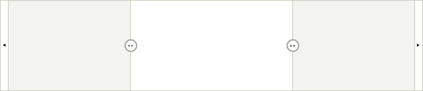

# WinForms RangeSelector Overview

__RadRangeSelector__ provides an elegant solution for end-users to select range (in percentages) and these percentages could be mapped to any kind of visually represented data. Developers can easily set the associated object that will be used as background of __RadRangeSelector__. The associated object should confront with specific interfaces thanks to which it will be able to communicate with __RadRangeSelector.__

Currently, __RadRangeSelector__ works out of the box together with __RadChartView__.





>caption Figure 1: RadRangeSelector

## See Also

* [Design Time]()
* [Structure]()
* [Getting Started]()
* [Integration with RadChartView]()
