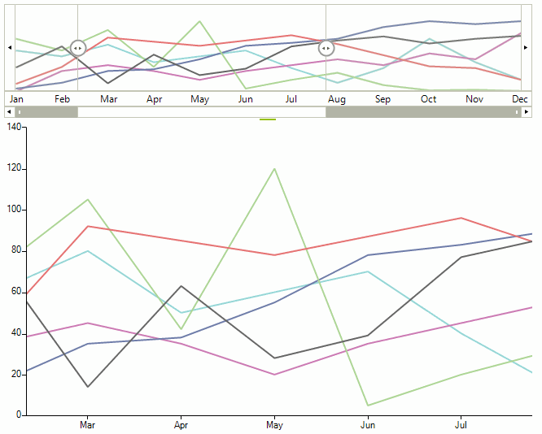
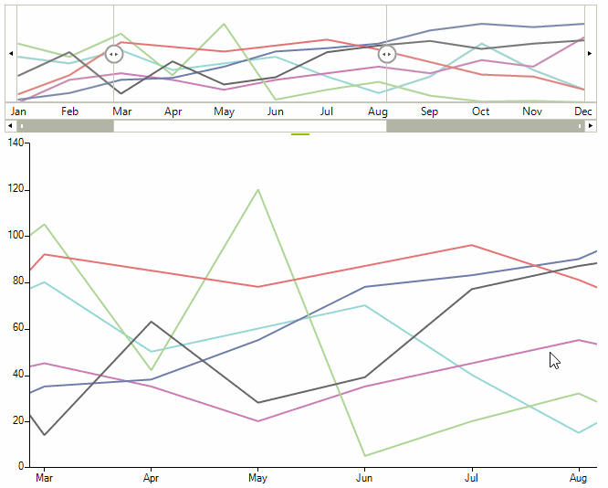

# Properties

Here are the most important properties for changing the control appearance and behavior:

* The __UpdateMode__ property determines how the associated chart control will be updated.
  * __Immeadiate__: This is the default value, the chart is updated as the range selector element is being moved 
  * __Deferred__ : The chat will be updated when the range selector element is released. 

>note The *Deferred* update mode may be suitable for scenarios in which the chart has been loaded with extremely large data sets.

>caption Figure 1: UpdateMode.Immediate


####  UpdateMode.Immediate

{{source=..\SamplesCS\RangeSelector\RangeSelectorPropertiesAndEvents.cs region=UpdateModeImmediate}} 
{{source=..\SamplesVB\RangeSelector\RangeSelectorPropertiesAndEvents.vb region=UpdateModeImmediate}}
````C#
this.radRangeSelector1.UpdateMode = UpdateMode.Deferred;

````
````VB.NET
Me.radRangeSelector1.UpdateMode = UpdateMode.Deferred

```` 


{{endregion}}

>caption Figure 2: UpdateMode.Deferred


####  UpdateMode.Defferred

{{source=..\SamplesCS\RangeSelector\RangeSelectorPropertiesAndEvents.cs region=UpdateModeDeferred}} 
{{source=..\SamplesVB\RangeSelector\RangeSelectorPropertiesAndEvents.vb region=UpdateModeDeferred}}
````C#
this.radRangeSelector1.UpdateMode = UpdateMode.Deferred;

````
````VB.NET
Me.radRangeSelector1.UpdateMode = UpdateMode.Deferred

```` 


{{endregion}}


* The __StartRange__ and __EndRange__ properties specify the range area. The values of these properties are from type double and should between 0 and 100.

#### Start and End Range

{{source=..\SamplesCS\RangeSelector\RangeSelectorPropertiesAndEvents.cs region=StartEnd}} 
{{source=..\SamplesVB\RangeSelector\RangeSelectorPropertiesAndEvents.vb region=StartEnd}} 

````C#
this.radRangeSelector1.StartRange = 20;
this.radRangeSelector1.EndRange = 50;

````
````VB.NET
Me.radRangeSelector1.StartRange = 20
Me.radRangeSelector1.EndRange = 50

````

{{endregion}}

* The __RangeSelectorViewZoomStart__ and __RangeSelectorViewZoomEnd__ define the start and end zoom factor of __RadRangeSelector__. These zoom is in percentages and can be controlled from track bar at the bottom of control. You can use these properties __only__ if associated element implements the __IRangeSelectorElement__ interface. The values of these properties are of type double and should between 0 and 100.

#### Zoom Start and End

{{source=..\SamplesCS\RangeSelector\RangeSelectorPropertiesAndEvents.cs region=StartZoomEndZoom}} 
{{source=..\SamplesVB\RangeSelector\RangeSelectorPropertiesAndEvents.vb region=StartZoomEndZoom}} 

````C#
this.radRangeSelector1.RangeSelectorViewZoomStart = 20;
this.radRangeSelector1.RangeSelectorViewZoomEnd = 50;

````
````VB.NET
Me.radRangeSelector1.RangeSelectorViewZoomStart = 20
Me.radRangeSelector1.RangeSelectorViewZoomEnd = 50

````

{{endregion}}

* The __ShowButtons__ property controls the visibility of the navigation buttons in RadRangeSelector. By default these buttons are displayed. To hide them, set the property to false.

#### ShowButtons Property

{{source=..\SamplesCS\RangeSelector\RangeSelectorPropertiesAndEvents.cs region=hideButtons}} 
{{source=..\SamplesVB\RangeSelector\RangeSelectorPropertiesAndEvents.vb region=hideButtons}} 

````C#
this.radRangeSelector1.ShowButtons = false;

````
````VB.NET
Me.radRangeSelector1.ShowButtons = False

````

{{endregion}}

* The __AssociatedControl__ is the most important property of __RadRangeSeletor__. This property establishes the connection between the __RadRangeSelector__ and the associated control. This property can accept every object that inherits __RadControl__ except __RadRangeSelector__.

#### Associated Control

{{source=..\SamplesCS\RangeSelector\RangeSelectorGettingStarted.cs region=set associatedControl}} 
{{source=..\SamplesVB\RangeSelector\RangeSelectorGettingStarted.vb region=set associatedControl}} 

````C#
this.radRangeSelector1.AssociatedControl = this.radChartView1;

````
````VB.NET
Me.radRangeSelector1.AssociatedControl = Me.radChartView1

````

{{endregion}}

>note To take all advantages of __RadRangeSelector__ - like scales, track bar and controlling the associated control without any additional implementation, the element of associated control should implement the __IRangeSelectorElement__ interface. By design if the associated control implements the __IRangeSelectorControl__ the returned element should implement the __IRangeSelectorElement__ interface as well. For all controls that not implement the __IRangeSelectorControl__ interface the associated elements will be their RootElement.
>

If you want to associate only element without control you can use the following approach:

#### Associated Element

{{source=..\SamplesCS\RangeSelector\RangeSelectorPropertiesAndEvents.cs region=set associatedElement}} 
{{source=..\SamplesVB\RangeSelector\RangeSelectorPropertiesAndEvents.vb region=set associatedElement}} 

````C#
this.radRangeSelector1.RangeSelectorElement.AssociatedElement = new RangeSelectorViewElement(new RadChartElement());

````
````VB.NET
Me.radRangeSelector1.RangeSelectorElement.AssociatedElement = New RangeSelectorViewElement(New RadChartElement())

````

{{endregion}} 

# Events

There are several events that you will find useful in the context of RadRangeSelector:

* __ThumbLeftValueChanging:__ Occurs when the value of left thumb is changing.

* __ThumbLeftValueChanged:__ Occurs when the value of left thumb is changed.

* __ThumbRightValueChanging:__ Occurs when the value of right thumb is changing.

* __ThumbRightValueChanged:__ Occurs when the value of left thumb is changed.

* __SelectionChanging:__ This event is fired when the selection range is about to change.

* __SelectionChanged:__ This event is fired when the range is changed.

* __ScaleInitializing:__ Occurs when scale of the control is initializing. This event is cancelable and can be used to hide some scale or to change its dock position.

#### Initializing Scale

{{source=..\SamplesCS\RangeSelector\RangeSelectorPropertiesAndEvents.cs region=ScaleInitializing}} 
{{source=..\SamplesVB\RangeSelector\RangeSelectorPropertiesAndEvents.vb region=ScaleInitializing}} 

````C#
void radRangeSelector1_ScaleInitializing(object sender, ScaleInitializingEventArgs e)
{
    RangeSelectorChartScaleContainerElement scaleElement = e.ScaleElement as RangeSelectorChartScaleContainerElement;
    if (scaleElement == null)
    {
        return;
    }
    if (scaleElement.Title == "axe1")
    {
        e.Cancel = true;
    }
    else
    {
        scaleElement.ScalePostion = ViewPosition.TopLeft;
    }
}

````
````VB.NET
Private Sub radRangeSelector1_ScaleInitializing(sender As Object, e As ScaleInitializingEventArgs)
    Dim scaleElement As RangeSelectorChartScaleContainerElement = TryCast(e.ScaleElement, RangeSelectorChartScaleContainerElement)
    If scaleElement Is Nothing Then
        Return
    End If
    If scaleElement.Title = "axe1" Then
        e.Cancel = True
    Else
        scaleElement.ScalePostion = ViewPosition.TopLeft
    End If
End Sub

````

{{endregion}}

# Custom Rendering

**RadRangeSelector** can also be setup to use a custom renderer just as the stand-alone **RadChartView** control. In order to utilize this feature, one needs to subscribe to the **CreateRenderer** event of the **RangeSelectorViewElement** instance.

>caption Figure 3: Custom Rendering


{{source=..\SamplesCS\RangeSelector\RadRangeSelectorCustomRenderer.cs region=CustomRendering}} 
{{source=..\SamplesVB\RangeSelector\RadRangeSelectorCustomRenderer.vb region=CustomRendering}}
````C#
public RadRangeSelectorCustomRenderer()
{
    InitializeComponent();
    this.radChartView1.CreateRenderer += OnCreateRenderer;
    this.radChartView1.ShowPanZoom = true;
    LineSeries series = new LineSeries();
    Random rnd = new Random();
    for (int i = 0; i < 30; i++)
    {
        series.DataPoints.Add(new CategoricalDataPoint(rnd.Next(0, 30), DateTime.Now.AddDays(i)));
    }
    this.radChartView1.Series.Add(series);
    series.VerticalAxis.LabelFormat = "{0}°";
    series.HorizontalAxis.LabelFormat = "{0:M}";
    series.HorizontalAxis.LabelFitMode = AxisLabelFitMode.MultiLine;
    this.radChartView1.ShowGrid = true;
    this.radRangeSelector1.AssociatedControl = this.radChartView1;
    RangeSelectorViewElement chartElement = this.radRangeSelector1.RangeSelectorElement.AssociatedElement as RangeSelectorViewElement;
    chartElement.CreateRenderer += OnCreateRenderer;
}
private void OnCreateRenderer(object sender, ChartViewCreateRendererEventArgs e)
{
    e.Renderer = new CustomCartesianRenderer((CartesianArea)e.Area);
}

````
````VB.NET
Public Sub New()
    InitializeComponent()
    AddHandler Me.radChartView1.CreateRenderer, AddressOf OnCreateRenderer
    Me.radChartView1.ShowPanZoom = True
    Dim series As New LineSeries()
    Dim rnd As New Random()
    For i As Integer = 0 To 29
        series.DataPoints.Add(New CategoricalDataPoint(rnd.[Next](0, 30), DateTime.Now.AddDays(i)))
    Next
    Me.radChartView1.Series.Add(series)
    series.VerticalAxis.LabelFormat = "{0}°"
    series.HorizontalAxis.LabelFormat = "{0:M}"
    series.HorizontalAxis.LabelFitMode = AxisLabelFitMode.MultiLine
    Me.radChartView1.ShowGrid = True
    Me.radRangeSelector1.AssociatedControl = Me.radChartView1
    Dim chartElement As RangeSelectorViewElement = TryCast(Me.radRangeSelector1.RangeSelectorElement.AssociatedElement, RangeSelectorViewElement)
    AddHandler chartElement.CreateRenderer, AddressOf OnCreateRenderer
End Sub
Private Sub OnCreateRenderer(sender As Object, e As ChartViewCreateRendererEventArgs)
    e.Renderer = New CustomCartesianRenderer(DirectCast(e.Area, CartesianArea))
End Sub

```` 


{{endregion}}

>note The example above is using the the custom implementation as suggested [here]().

## See Also

* [Design Time]()
* [Structure]()
* [Getting Started]()
* [Integration with RadChartView]()