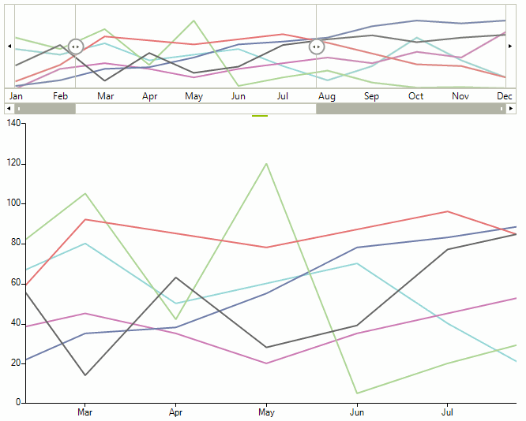
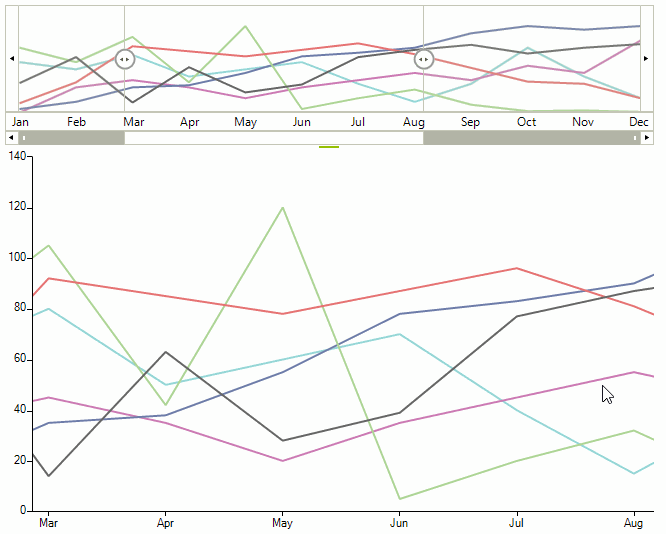
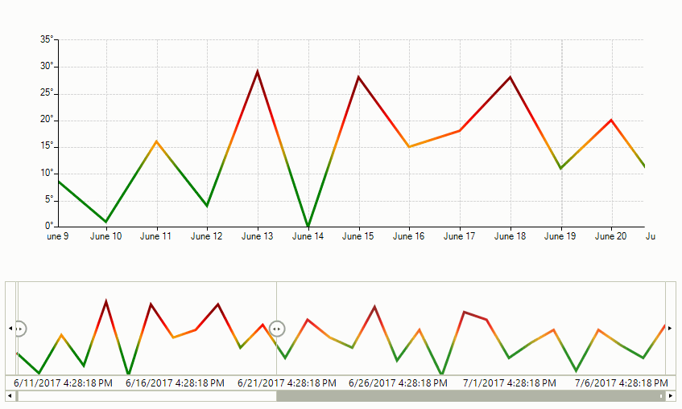

# Properties

Here are the most important properties for changing the control appearance and behavior:

* The __UpdateMode__ property determines how the associated chart control will be updated.
  * __Immeadiate__: This is the default value, the chart is updated as the range selector element is being moved 
  * __Deferred__ : The chat will be updated when the range selector element is released. 

>note The *Deferred* update mode may be suitable for scenarios in which the chart has been loaded with extremely large data sets.

>caption Figure 1: UpdateMode.Immediate

####  UpdateMode.Immediate

<snippet id='rangeselector-rangeselectorpropertiesandevents-updatemodeimmediate-cs' />
<snippet id='rangeselector-rangeselectorpropertiesandevents-updatemodeimmediate-vb' />

>caption Figure 2: UpdateMode.Deferred

####  UpdateMode.Defferred

<snippet id='rangeselector-rangeselectorpropertiesandevents-updatemodedeferred-cs' />
<snippet id='rangeselector-rangeselectorpropertiesandevents-updatemodedeferred-vb' />

* The __StartRange__ and __EndRange__ properties specify the range area. The values of these properties are from type double and should between 0 and 100.

#### Start and End Range

<snippet id='rangeselector-rangeselectorpropertiesandevents-startend-cs' />
<snippet id='rangeselector-rangeselectorpropertiesandevents-startend-vb' />

* The __RangeSelectorViewZoomStart__ and __RangeSelectorViewZoomEnd__ define the start and end zoom factor of __RadRangeSelector__. These zoom is in percentages and can be controlled from track bar at the bottom of control. You can use these properties __only__ if associated element implements the __IRangeSelectorElement__ interface. The values of these properties are of type double and should between 0 and 100.

#### Zoom Start and End

<snippet id='rangeselector-rangeselectorpropertiesandevents-startzoomendzoom-cs' />
<snippet id='rangeselector-rangeselectorpropertiesandevents-startzoomendzoom-vb' />

* The __ShowButtons__ property controls the visibility of the navigation buttons in RadRangeSelector. By default these buttons are displayed. To hide them, set the property to false.

#### ShowButtons Property

<snippet id='rangeselector-rangeselectorpropertiesandevents-hidebuttons-cs' />
<snippet id='rangeselector-rangeselectorpropertiesandevents-hidebuttons-vb' />

* The __AssociatedControl__ is the most important property of __RadRangeSeletor__. This property establishes the connection between the __RadRangeSelector__ and the associated control. This property can accept every object that inherits __RadControl__ except __RadRangeSelector__.

#### Associated Control

<snippet id='rangeselector-rangeselectorgettingstarted-set_associatedcontrol-cs' />
<snippet id='rangeselector-rangeselectorgettingstarted-set_associatedcontrol-vb' />

>note To take all advantages of __RadRangeSelector__ - like scales, track bar and controlling the associated control without any additional implementation, the element of associated control should implement the __IRangeSelectorElement__ interface. By design if the associated control implements the __IRangeSelectorControl__ the returned element should implement the __IRangeSelectorElement__ interface as well. For all controls that not implement the __IRangeSelectorControl__ interface the associated elements will be their RootElement.
>

If you want to associate only element without control you can use the following approach:

#### Associated Element

<snippet id='rangeselector-rangeselectorpropertiesandevents-set_associatedelement-cs' />
<snippet id='rangeselector-rangeselectorpropertiesandevents-set_associatedelement-vb' />

## Events

There are several events that you will find useful in the context of RadRangeSelector:

* __ThumbLeftValueChanging:__ Occurs when the value of left thumb is changing.

* __ThumbLeftValueChanged:__ Occurs when the value of left thumb is changed.

* __ThumbRightValueChanging:__ Occurs when the value of right thumb is changing.

* __ThumbRightValueChanged:__ Occurs when the value of left thumb is changed.

* __SelectionChanging:__ This event is fired when the selection range is about to change.

* __SelectionChanged:__ This event is fired when the range is changed.

* __ScaleInitializing:__ Occurs when scale of the control is initializing. This event is cancelable and can be used to hide some scale or to change its dock position.

#### Initializing Scale

<snippet id='rangeselector-rangeselectorpropertiesandevents-scaleinitializing-cs' />
<snippet id='rangeselector-rangeselectorpropertiesandevents-scaleinitializing-vb' />

## Custom Rendering

**RadRangeSelector** can also be setup to use a custom renderer just as the stand-alone **RadChartView** control. In order to utilize this feature, one needs to subscribe to the **CreateRenderer** event of the **RangeSelectorViewElement** instance.

>caption Figure 3: Custom Rendering

<snippet id='rangeselector-radrangeselectorcustomrenderer-customrendering-cs' />
<snippet id='rangeselector-radrangeselectorcustomrenderer-customrendering-vb' />

>note The example above is using the the custom implementation as suggested [here]().

## See Also

* [Design Time]()
* [Structure]()
* [Getting Started]()
* [Integration with RadChartView]()
