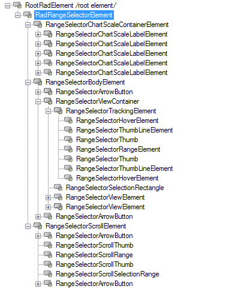
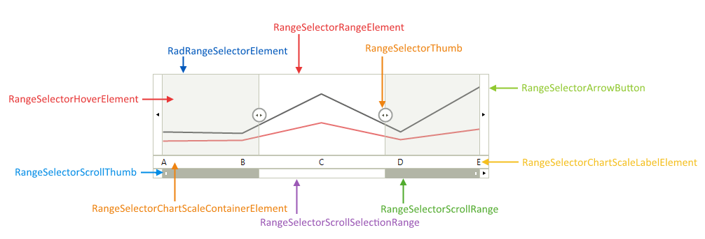

# Structure

This article describes the inner structure and organization of the elements which build the __RadRangeSelector__ control.

__RadRangeSelector__ is built up of several levels of nested elements.  Images below demonstrate the element tree of __RadRangeSelector__. 

>caption Figure 1: RadRangeSelector`s Element Hierarchy

>caption Figure 2: RadRangeSelector`s Structure

Here is a brief explanation of the various elements in the tree:

* The __RadRangeSelectorElement__ represents the entire __RadRangeSelector__ control. It contains various  instances of type __RangeSelectorScaleContainerElement__ and a single instance of __RangeSelectorScrollElement__ and __RangeSelectorBodyElement__.

* __RangeSelectorScaleContainerElement__ is a base class for each scale that is represented in __RadRangeSelector__. Each element that implements __IRangeSelectorElement__ interface decides what scales will contain and how they will be arranged. When the __RadChartView__ is associated with __RadRangeSelector__ the scales are created according to the content of the Axes.

* __RangeSelectorScrollElement__ represent the track bar at the bottom of __RadRangeSelector__. This element will show only if the associated element implements the __IRangeSelectorElement__ Interface.

* __RangeSelectorBodyElement__ wraps and arranges two instances of __RangeSelectorArrowButton__ and __RangeSelectorViewContainer__.

* __RangeSelectorViewContainer__ is the class that arranges the associated element, __RangeSelectorSelectionRectangle__ and __RangeSelectorTrackingElement__.

* __RangeSelectorTrackingElement__ is container that contains all elements that are used by the tracking logic.

# See Also

* [Design Time]()
* [Getting Started]()
* [Integration with RadChartView]()
