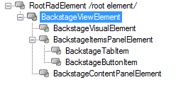

# Customization

The appearance of the Backstage View can be customized by using one of the predefined themes: Control Default, Office2010Blue, Office2010Black, Office2010Silver themes, modifying one of them in the Visual Style Builder, or creating a custom one by using the [Visual Style Builder](). Additionally, appearance modifications can be introduced through code.

The following image demonstrates the Backstage view Element tree, which can help you to access the desired elements.

>caption Figure 1: BackstageViewElement

* __BackstageViewElement__ - main control element, which contains the UI and the logic of the control

* __BackstageVisualElement__ - top border of the BackstageViewElement.

* __BackstageItemsPanelElement__ - the left panel (by default) which contains the BackstageTabItems, 
        BackstageButtonItems or other RadItems

* __BackstageTabItems__ - the visual element that represents the tab in the ItemsPanel

* __BackstageButtonItems__ - the visual element that represents the button in the ItemsPanel

* __BackstageContentPanelElement__ - the visual element representing the area where the pages are rendered

Follows code snippet demonstrates how you can access the most used items in the control:

#### Accessing BackstageView elements

<snippet id='ribbonbar-ribbonbackstageview-accesselements-cs' />
<snippet id='ribbonbar-ribbonbackstageview-accesselements-vb' />

By accessing these elements, you can customize BackstageView. Here is an example on how to change the BackgroundImage of the content area:

#### Customizing the content area

<snippet id='ribbonbar-ribbonbackstageview-changecontentareaimage-cs' />
<snippet id='ribbonbar-ribbonbackstageview-changecontentareaimage-vb' />

>note BackstageTabItems, BackstageItemsPanelElement and BackstageContentPanelElement use[RadImageShape]()for most of the predefinied themes.
>

## See Also

* [Design Time]()
* [Structure]()
* [Getting Started]()
* [Themes]()
