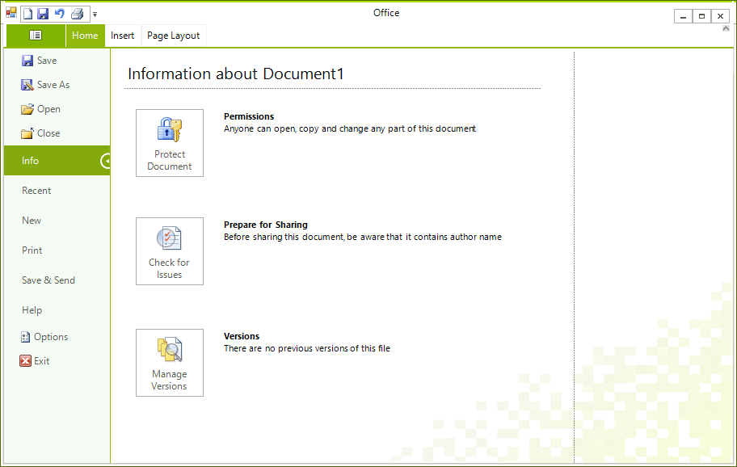
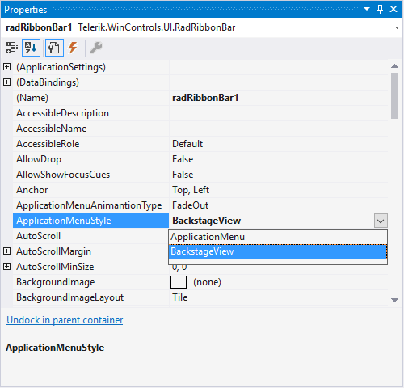
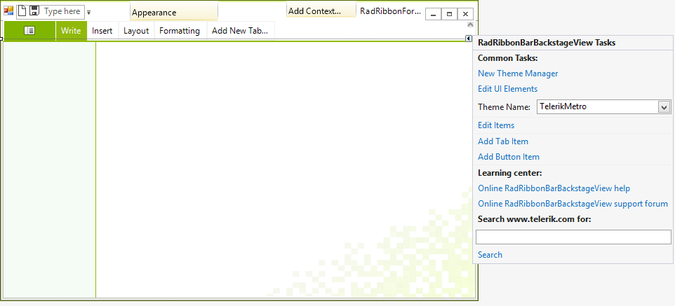
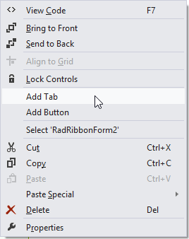
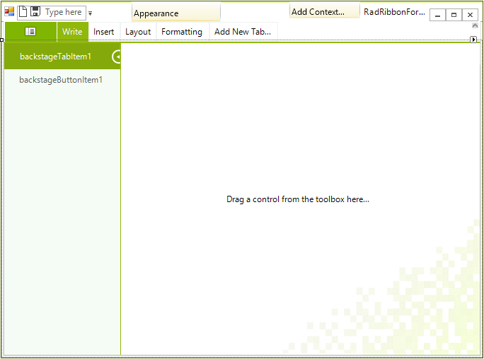

# Working with Backstage View

To enable the Backstage View in __RadRibbonBar__ change the __ApplicationMenuStyle__ property to *BackstageView*.

#### Enable Backstage View Mode

{{source=..\SamplesCS\RibbonBar\BackstageView\RibbonBackstageView.cs region=ApplicationMenuStyle}} 
{{source=..\SamplesVB\RibbonBar\BackstageView\RibbonBackstageView.vb region=ApplicationMenuStyle}} 

````C#
radRibbonBar1.ApplicationMenuStyle = Telerik.WinControls.UI.ApplicationMenuStyle.BackstageView;

````
````VB.NET
RadRibbonBar1.ApplicationMenuStyle = Telerik.WinControls.UI.ApplicationMenuStyle.BackstageView

````

{{endregion}}




At design time you can access the __ApplicationMenuStyle__ property through the Properties window and set it to *BackstageView*. Thus, when you click on the __ApplicationMenuButton__, the __RadRibbonBar__ will automatically create an instance of __RadRibbonBarBackstageView__ class (radRibbonBarBackstageView1). The __RadRibbonBarBackstageView__ represents a BackStageView control that may contain tabs, pages, buttons, etc.



## Adding and editing items and controls at design time

You can add two types of items to the BackstageVIew’s left panel at design time: __BackstageButtonItem__ and __BackstageTabItem__. The __BackstageButtonItem__ serves as a normal button while the __BackstageTabItem__ has a page associated with it on which you can drag controls from the toolbox.

You have three options to add these items to the BackstageView at design time:

* By using the __Smart Tag__

The first one is by using the __Smart Tag__. The __Smart Tag__ would appear when you click on the  __ApplicationMenuButton__. A dotted rectangle shows the radRibbonBarBackstageView1. By clicking on its smart tag a RadRibbonBarBackstageView Tasks window will appear, so you can further edit items, add tabs, etc.




* By using the __RadItem Collection Editor__

The second one is using the __RadItem Collection Editor__ to edit the Items collection. 


* By using the context menu

The third one is using the context menu:



## Adding and Editing Items and Controls at Runtime

You can also add these items as well as any other RadItem to the backstageview’s left panel at runtime via the __Items collection__:

#### Adding items programatically

{{source=..\SamplesCS\RibbonBar\BackstageView\RibbonBackstageView.cs region=addingItems}} 
{{source=..\SamplesVB\RibbonBar\BackstageView\RibbonBackstageView.vb region=addingItems}} 

````C#
radRibbonBarBackstageView1.Items.Add(new BackstageButtonItem("ButtonItem"));
radRibbonBarBackstageView1.Items.Add(new RadButtonElement("ButtonElement"));
radRibbonBarBackstageView1.Items.Add(new RadDropDownListElement());

````
````VB.NET
RadRibbonBarBackstageView1.Items.Add(New BackstageButtonItem("ButtonItem"))
RadRibbonBarBackstageView1.Items.Add(New RadButtonElement("ButtonElement"))
RadRibbonBarBackstageView1.Items.Add(New RadDropDownListElement())

````

{{endregion}}

## Adding Controls to the Pages

When you add __BackstageTabItem__ to the backstage view’s left panel and select it, on the right side you have a __BackstageViewPage__ on which you can arrange any type of controls.



## See Also

* [Design Time]()
* [Structure]()
* [Getting Started]()
