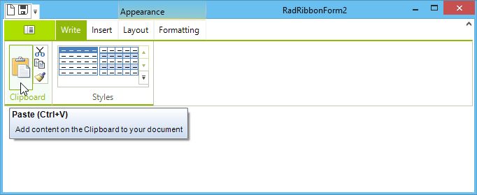
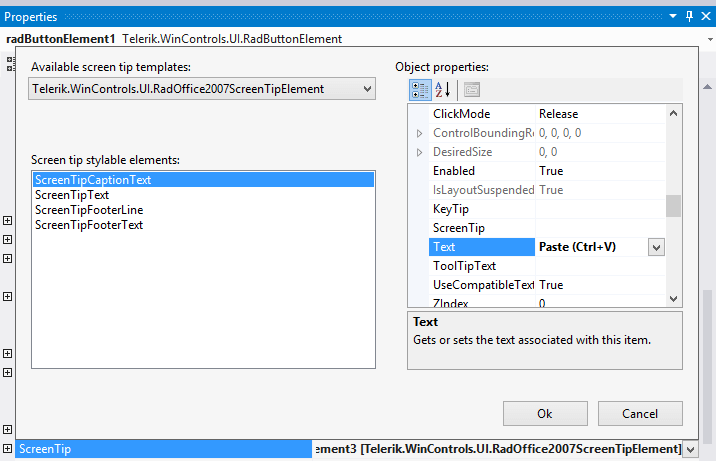
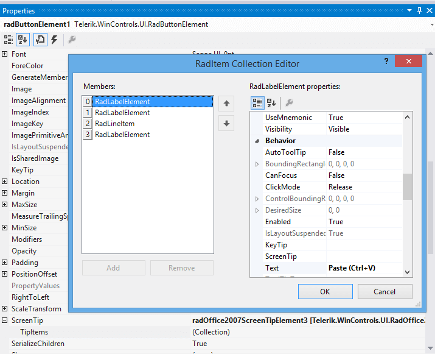

# Adding Screen Tips

Screen tips give you a mechanism to provide extended tooltips for any element within a Telerik RadRibbonBar.

>caption Figure 1: RibbonBar Screen Tips

## Creating a Screen Tip

To create a screen tip, follow these steps:

1. Select an element on a RadRibbonBar control such as a RadButtonElement.

1. Click the drop-down arrow in the element's __ScreenTip__ property.

1. Select the __Telerik.WinControls.UI.RadOffice2007ScreenTipElement__ template.

1. Use the embedded property sheet to customize the screen tip. 

## Modifying a Screen Tip

To modify an existing screen tip, follow these steps:

1. Select the element whose screen tip you wish to customize.

1. Expand the __ScreenTip__ property.

1. Click the ellipsis button in the __TipItems__ collection.

1. Use the RadItems Collection Editor to change the properties of any part of the screen tip. 

## Adding Screen Tips Programmatically

There are several options for Office 2007-like screen tips we introduced in 2008 R3 for your convenience.

To completely customize the screen tips appearance, its size, text wrapping, etc you may handle the ScreenTipNeeded event of any RadControl (RadRibbonBar, RadGridView, etc) and customize the screen tip provided by the event arguments, or even assign a new ScreenTip object to the corresponding item. 

## Using ScreenTipNeeded

<snippet id='ribbonbar-addingscreentips-addingscreentips-cs' />
<snippet id='ribbonbar-addingscreentips-addingscreentips-vb' />

The code sample below adds screen tips to two button elements in the __RadRibbonBar__:

#### Directly Acess Elements

<snippet id='ribbonbar-addingscreentips-addscreentipstobuttonelements-cs' />
<snippet id='ribbonbar-addingscreentips-addscreentipstobuttonelements-vb' />

## See Also

* [Design Time]()
* [Structure]()
* [Getting Started]()
* [Backstage View]()
* [Themes]()
