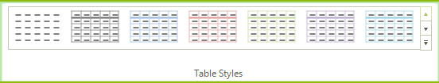
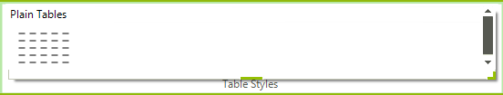
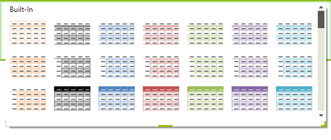
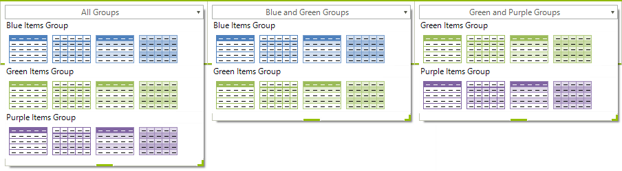

# Creating a Gallery

__RadGalleryElement__ allows the user to choose among large number of visual items. In its default collapsed view, a gallery shows a single row of its items, as well as an up arrow and a down arrow that scroll to other rows of items. Special properties allow you to specify the number of visible rows and columns of items in the collapsed view. 

>caption Figure 1: Collapsed Gallery 


The gallery also has a drop-down arrow which sets the element into expanded view. In this view the gallery shows a popup containing all of its items, organized in groups.

>caption Figure 2: Expanded Plain Tables


>caption Figure 3: Expanded Built-In


## Creating a Gallery

To create a gallery, first, select a RadRibbonbar group, click its smart tag, and choose the Edit Items option. When the *RadItem Collection Editor *pops up, click the arrow of the Add button and select the *RadGalleryElement* option. Click OK to save the changes and the gallery should appear in your ribbon group.

## Gallery properties

* __MaxColumns__: The property specifies the number of columns to appear in the gallery in its collapsed view.

* __MaxRows__: The property sets the number of rows to be shown in the gallery in its collapsed view

* __MaxDropDownColumns__: The property assigns the maximum number of columns that may appear in the gallery drop-down

* __MinDropDownColumns__: The property sets the minimum number of columns to be displayed in the gallery drop-down

## Adding Items

You can add items to the gallery at design-time using the following steps:

1. Select the **RadGalleryElement** control.

1. Go to the *Properties* window and navigate to the **Items** property, then click the ellipsis button

1. In the *RadItem Collection Editor*, click the **Add** button and a **RadGalleryItem** will appear

1. Use the property sheet to set the text and image properties of the newly created RadGalleryItem

1. Click the OK button to save the changes

Alternatively, you can add the items at run-time. Here is a sample snippet:

{{source=..\SamplesCS\RibbonBar\GettingStarted\CreatingAGallery.cs region=snippet1}} 
{{source=..\SamplesVB\RibbonBar\GettingStarted\CreatingAGallery.vb region=snippet1}} 

````C#
RadGalleryItem blueItem1 = new RadGalleryItem("", Properties.Resources.RibbonBar_GettingStarted_CreatingAGallery001);
RadGalleryItem blueItem2 = new RadGalleryItem("", Properties.Resources.RibbonBar_GettingStarted_CreatingAGallery002);
RadGalleryItem blueItem3 = new RadGalleryItem("", Properties.Resources.RibbonBar_GettingStarted_CreatingAGallery003);
RadGalleryItem blueItem4 = new RadGalleryItem("", Properties.Resources.RibbonBar_GettingStarted_CreatingAGallery004);
RadGalleryItem purpleItem1 = new RadGalleryItem("", Properties.Resources.RibbonBar_GettingStarted_CreatingAGallery005);
RadGalleryItem purpleItem2 = new RadGalleryItem("", Properties.Resources.RibbonBar_GettingStarted_CreatingAGallery006);
RadGalleryItem purpleItem3 = new RadGalleryItem("", Properties.Resources.RibbonBar_GettingStarted_CreatingAGallery007);
RadGalleryItem purpleItem4 = new RadGalleryItem("", Properties.Resources.RibbonBar_GettingStarted_CreatingAGallery008);
RadGalleryItem greenItem1 = new RadGalleryItem("", Properties.Resources.RibbonBar_GettingStarted_CreatingAGallery009);
RadGalleryItem greenItem2 = new RadGalleryItem("", Properties.Resources.RibbonBar_GettingStarted_CreatingAGallery010);
RadGalleryItem greenItem3 = new RadGalleryItem("", Properties.Resources.RibbonBar_GettingStarted_CreatingAGallery011);
RadGalleryItem greenItem4 = new RadGalleryItem("", Properties.Resources.RibbonBar_GettingStarted_CreatingAGallery012);
this.radGalleryElement1.Items.AddRange( blueItem1, blueItem2, blueItem3, blueItem4,
                                        greenItem1, greenItem2, greenItem3, greenItem4,
                                        purpleItem1, purpleItem2, purpleItem3, purpleItem4);

````
````VB.NET
Dim blueItem1 As New RadGalleryItem("", My.Resources.RibbonBar_GettingStarted_CreatingAGallery001)
Dim blueItem2 As New RadGalleryItem("", My.Resources.RibbonBar_GettingStarted_CreatingAGallery002)
Dim blueItem3 As New RadGalleryItem("", My.Resources.RibbonBar_GettingStarted_CreatingAGallery003)
Dim blueItem4 As New RadGalleryItem("", My.Resources.RibbonBar_GettingStarted_CreatingAGallery004)
Dim purpleItem1 As New RadGalleryItem("", My.Resources.RibbonBar_GettingStarted_CreatingAGallery005)
Dim purpleItem2 As New RadGalleryItem("", My.Resources.RibbonBar_GettingStarted_CreatingAGallery006)
Dim purpleItem3 As New RadGalleryItem("", My.Resources.RibbonBar_GettingStarted_CreatingAGallery007)
Dim purpleItem4 As New RadGalleryItem("", My.Resources.RibbonBar_GettingStarted_CreatingAGallery008)
Dim greenItem1 As New RadGalleryItem("", My.Resources.RibbonBar_GettingStarted_CreatingAGallery009)
Dim greenItem2 As New RadGalleryItem("", My.Resources.RibbonBar_GettingStarted_CreatingAGallery010)
Dim greenItem3 As New RadGalleryItem("", My.Resources.RibbonBar_GettingStarted_CreatingAGallery011)
Dim greenItem4 As New RadGalleryItem("", My.Resources.RibbonBar_GettingStarted_CreatingAGallery012)
Me.RadGalleryElement1.Items.AddRange(blueItem1, blueItem2, blueItem3, blueItem4, greenItem1, greenItem2, _
 greenItem3, greenItem4, purpleItem1, purpleItem2, purpleItem3, purpleItem4)

````

{{endregion}} 

## Adding Groups

Groups organize the items within a gallery into distinct sections. Groups are not visible when the gallery is in collapsed view. They appear in the gallery popup as blocks of items under the same title. For example, in the screenshot above the Plain Tables and Built-In are the titles of gallery groups. The Plain Tables group contains a single item and the Built-In group contains plenty. The following screenshot has six groups: Black Items, Blue Items, Red Items, Green Items, Purple Items, Orange Items. <br>

To add a group at design-time, please follow these steps:

1. Select the **RadGalleryElement**

1. Go to the *Properties* windows and navigate to the **Groups** property, then click the ellipsis button

1. In the *RadItem Collection Editor* click the **Add** button and a new **RadGalleryGroupItem** will appear in the dialog

1. Set the **Text** property of the newly created group

1. Navigate to its **Items** property and click the ellipsis button 

1. When the *Items Collection Editor* opens you can choose which **RadGalleryItems** to be associated with this group. Each time you click **Add**, one of the items that you already created will be added to the group. Click **Remove** to exclude items from the group.

1. Click **OK** to save the group items

1. Click **OK** to save the group

Alternatively, you can add the items at run-time. Here is a sample snippet:

{{source=..\SamplesCS\RibbonBar\GettingStarted\CreatingAGallery.cs region=snippet2}} 
{{source=..\SamplesVB\RibbonBar\GettingStarted\CreatingAGallery.vb region=snippet2}} 

````C#
RadGalleryGroupItem blueGroup = new RadGalleryGroupItem();
blueGroup.Text = "Blue Items Group";
blueGroup.Items.AddRange(blueItem1, blueItem2, blueItem3, blueItem4);
this.radGalleryElement1.Groups.Add(blueGroup);
RadGalleryGroupItem greenGroup = new RadGalleryGroupItem();
greenGroup.Text = "Green Items Group";
greenGroup.Items.AddRange(greenItem1, greenItem2, greenItem3, greenItem4);
this.radGalleryElement1.Groups.Add(greenGroup);
RadGalleryGroupItem purpleGroup = new RadGalleryGroupItem();
purpleGroup.Text = "Purple Items Group";
purpleGroup.Items.AddRange(purpleItem1, purpleItem2, purpleItem3, purpleItem4);
this.radGalleryElement1.Groups.Add(purpleGroup);

````
````VB.NET
Dim blueGroup As New RadGalleryGroupItem()
blueGroup.Text = "Blue Items Group"
blueGroup.Items.AddRange(blueItem1, blueItem2, blueItem3, blueItem4)
Me.RadGalleryElement1.Groups.Add(blueGroup)
Dim greenGroup As New RadGalleryGroupItem()
greenGroup.Text = "Green Items Group"
greenGroup.Items.AddRange(greenItem1, greenItem2, greenItem3, greenItem4)
Me.RadGalleryElement1.Groups.Add(greenGroup)
Dim purpleGroup As New RadGalleryGroupItem()
purpleGroup.Text = "Purple Items Group"
purpleGroup.Items.AddRange(purpleItem1, purpleItem2, purpleItem3, purpleItem4)
Me.RadGalleryElement1.Groups.Add(purpleGroup)

````

{{endregion}}

## Creating Filters

A gallery filter is a set of groups. Filters appear as options of a drop-down list, docked at the top of the gallery popup. They allow the user to choose the combination of groups to be displayed in the popup. For example, the following screenshot contains three filters. The All filter displays all groups; the Red, Orange and Green Items filter shows the items in groups Red, Orange and Green; the Blue and Purple Items lists the items in the Blue and Purple groups.



To create a filter, follow these steps:

1. Select the **RadGalleryElement**

1. Go to the *Properties* window, navigate to the **Filters** property, and click the ellipsis button

1. In the *RadItem Collection Editor* click the **Add** button and a new filter will appear in the dialog

1. Set the **Text** property of the newly created filter

1. Navigate to the **Items** property of the **RadGalleryGroupFilter**, then click the ellipsis button

1. When the Items Collection Editor opens you can choose which **RadGalleryGroupItems** to be associated with this filter. Each time you click **Add**, one of the groups that you already created will be added to the filter. Click Remove to exclude groups from the filter. Note that one group can be assigned to more than one filters

1. Click OK to save the filter items

1. Click OK to save the filter

Alternatively, you can create a filter at run-time. Here is a sample snippet:

{{source=..\SamplesCS\RibbonBar\GettingStarted\CreatingAGallery.cs region=snippet3}} 
{{source=..\SamplesVB\RibbonBar\GettingStarted\CreatingAGallery.vb region=snippet3}} 

````C#
RadGalleryGroupFilter all = new RadGalleryGroupFilter();
all.Text = "All Groups";
all.Items.AddRange(blueGroup, greenGroup, purpleGroup);
this.radGalleryElement1.Filters.Add(all);
RadGalleryGroupFilter blueGreenFilter = new RadGalleryGroupFilter();
blueGreenFilter.Text = "Blue and Green Groups";
blueGreenFilter.Items.Add(blueGroup);
blueGreenFilter.Items.Add(greenGroup);
this.radGalleryElement1.Filters.Add(blueGreenFilter);
RadGalleryGroupFilter greenPurpleFilter = new RadGalleryGroupFilter();
greenPurpleFilter.Text = "Green and Purple Groups";
greenPurpleFilter.Items.Add(greenGroup);
greenPurpleFilter.Items.Add(purpleGroup);
this.radGalleryElement1.Filters.Add(greenPurpleFilter);

````
````VB.NET
Dim all As New RadGalleryGroupFilter()
all.Text = "All Groups"
all.Items.AddRange(blueGroup, greenGroup, purpleGroup)
Me.RadGalleryElement1.Filters.Add(all)
Dim blueGreenFilter As New RadGalleryGroupFilter()
blueGreenFilter.Text = "Blue and Green Groups"
blueGreenFilter.Items.Add(blueGroup)
blueGreenFilter.Items.Add(greenGroup)
Me.RadGalleryElement1.Filters.Add(blueGreenFilter)
Dim greenPurpleFilter As New RadGalleryGroupFilter()
greenPurpleFilter.Text = "Green and Purple Groups"
greenPurpleFilter.Items.Add(greenGroup)
greenPurpleFilter.Items.Add(purpleGroup)
Me.RadGalleryElement1.Filters.Add(greenPurpleFilter)

````

{{endregion}}

## Creating Tools

Tools are items that appear in the popup beneath the groups. They do not belong to groups and are always displayed, regardless of the applied filter.

To add a Tool at design-time please follow these steps:

1. Select the **RadGalleryElement**

1. Go to the *Properties* window, navigate to the **Tools** property, and click the ellipsis button

1. In the *RadItem Collection Editor* click the Add button to add an item. Currently, you can add a **RadMenuItem**, **RadMenuButtonItem** and **RadMenuComboItem**

1. Use the *Properties* window to set the properties of the new tool

1. Click **OK** to save the changes

You can also create tools at run-time. Here is a sample snippet:

{{source=..\SamplesCS\RibbonBar\GettingStarted\CreatingAGallery.cs region=snippet4}} 
{{source=..\SamplesVB\RibbonBar\GettingStarted\CreatingAGallery.vb region=snippet4}} 

````C#
RadMenuButtonItem buttonItem = new RadMenuButtonItem("Click me!");
this.radGalleryElement1.Tools.Add(buttonItem);

````
````VB.NET
Dim buttonItem As New RadMenuButtonItem("Click me!")
Me.RadGalleryElement1.Tools.Add(buttonItem)

````

{{endregion}}

## See Also

* [Design Time]()
* [Structure]()
* [Getting Started]()
* [Backstage View]()
* [Themes]()
