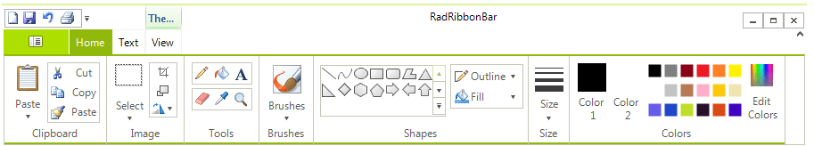
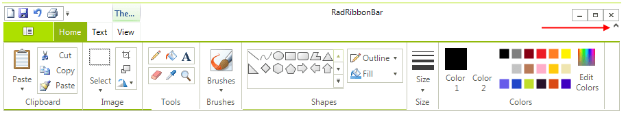
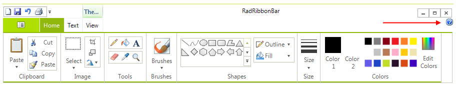
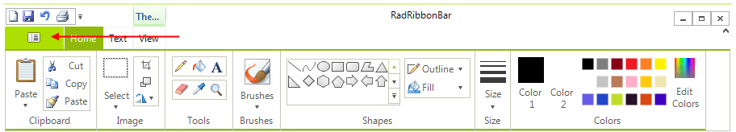

# Customizing RadRibbonBar

You can control several aspects of the overall __RadRibbonBar__ presentation by setting the corresponding properties:

* The __Expanded__ property controls whether the base of the control (the area beneath the tabs) will be visible initially. Set this property to __False__ to hide the base of the control.

>caption Figure 1: Expanded RibbonBar 

>caption Figure 2: Collapsed RibbonBar

>note The Expanded property also indicates whether the Ribbon Bar is expanded or collapsed. For instance, the end-user can collapse the control by double-clicking on any of the tabs
>

* The __ShowExpandButton__ property controls whether the expand/collapse button will shown in RadRibbonBar. Set this property to __True__ to show the button.

* The __ShowHelpButton__ property controls whether the Help button will shown in RadRibbonBar. Set this property to __True__ to show the button.

* The __StartButtonImage__ property specifies an image to use for the Start Button in the upper left corner of the control.
* 

>note The size of the Start Button is determined by the size of the image set.

* The __Text__ property determines the text which is displayed in the Ribbon Bar's caption.

## See Also

* [Design Time]()
* [Structure]()
* [Getting Started]()
* [Backstage View]()
* [Themes]()
