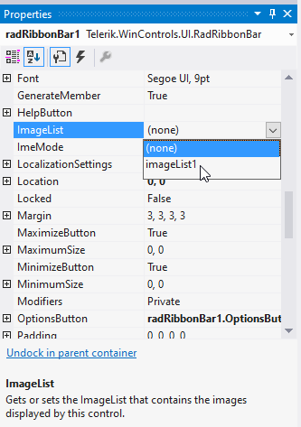
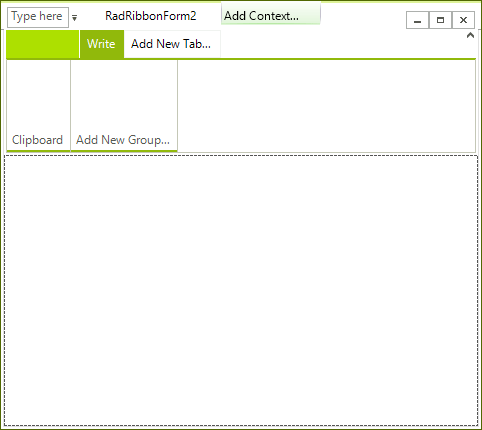
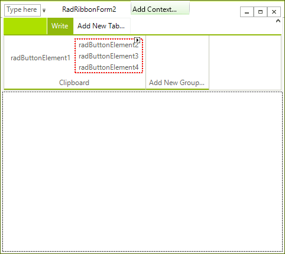
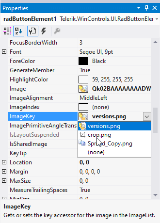
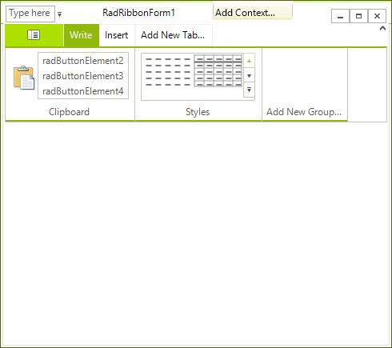
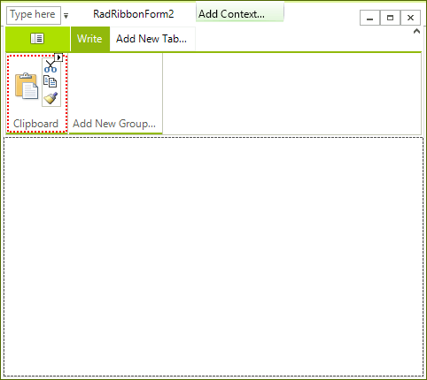
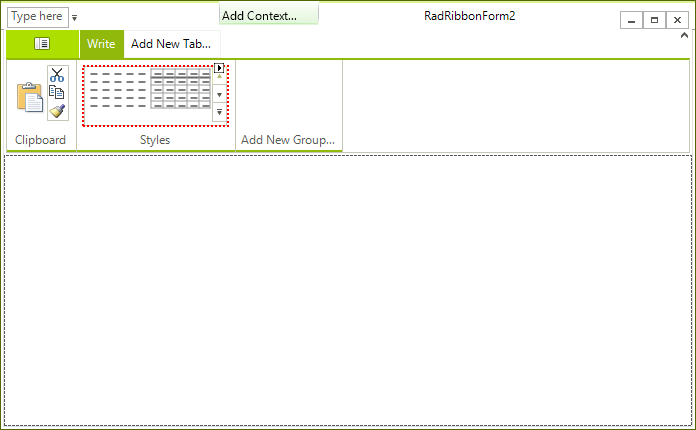

# Using Different Elements on a RadRibbonBar

You can build the user interface with a __RadRibbonBar__ using a variety of different elements. In this tutorial, you will see how some of these elements can be placed and customized.

## Prepare an ImageList to be Used in the Telerik RadRibbonBar

1\. Create a __RadRibbonForm__ control by adding it by clicking on the 'Add New Item...' option in the context menu of the project or by changing the base class of a standard Windows Form to __RadRibbonForm.__

2\. Open the designer of the __RadRibbonForm__

3\. Drag a WinForms __ImageList__ component from the Toolbox to the form. In the area below the design surface, you will see __imageList1__. 

4\. Using the Images Collection Editor, add the desired images to the ImageList. For more help with this task, see [How to: Add or Remove ImageList Images with the Designer in Visual Studio](http://msdn2.microsoft.com/en-us/library/ms233674.aspx) documentation. 

>note A predefined list of images has been prepared for the purpose of this example.

5\. Apply the **ImageList** to **RadRibbonBar**:

## Adding a Tab and a Group

1. Click __Add New Tab...__ to create a new tab. 

1. Type the word __Write__ and press __Enter__. 

1. Click off the __Write__ tab to deselect it. 

1. Select the __Write__ tab again. 

1. Click __Add New Group...__ to create a new group.

1. Set the __Text__ property of the new group to __Clipboard__.  

## Add Elements

1. Right-click the __Clipboard__ group and select __Add an item__, and then __RadButtonElement__.

1. Select the __Clipboard__ group again and by right-clicking on it add a __Vertical Button Group__. 

1. Select the group and open the __Properties__ window. Find the __ShowBorder__ property and set it to __true__.

1. Select the __Vertical Button Group__ and from its __SmartTag__ execute the __Edit Items__ action. 

1. Add three __RadButtonElement__ instances in the button group:
    

## Customize the RadButtonElement

1. Select the __RadButtonElement__ which is outside the __Button Group__.

1. Set the __TextImageRelation__ property to __ImageAboveText__.

1. Set an appropriate image by modifying the __Image__ property or selecting **ImageKey** from the associated ImageList:

	

1. Set the __ImageAlignment__ property to __MiddleCenter__. 

1. Set the __Text__ property to __Paste__ and the __TextAlignment__ property to __MiddleCenter__.

With an appropriate __Image__ the __RadRibbonBar__ should look similarly:
    

## Customize the RadButtonElements in the RadRibbonBarButtonGroup

1. Select the first __RadButtonElement__ in the __RadRibbonBarButtonGroup.__

1. Set the __DisplayStyle__ property to __Image__

1. Set the __ImageAlignment__ property to __MiddleCenter__

1. Set the __Image__ property with an appropriate image

1. Do the same for the rest elements in the __RadRibbonBarButtonGroup__ so that the result looks similar to this:
    

## Adding a RadGalleryElement

1. Select the __RadRibbonBar__ control and add another __RadRibbonBarGroup__ called __Styles__ in the 'Write' tab. 

1. Select the __Styles__ group, right-click on it and add a __RadGalleryElement__. 

1. Select the __RadGalleryElement__ and open the __Properties__ window of Visual Studio. Find the __Items__ collection and add 6 __RadGalleryItem__ instances.

1. Set appropriate images to all of the __RadGalleryItem__ instances.

1. For each __RadGalleryItem__ set the __DisplayStyle__ property to __Image__ so that no text appears.

1. Find the __MaxColumns__ and __MaxRows__ properties of the __RadGalleryElement__ and set their values to 2 and 5 respectively. The result should be similar to this:

>note For the purpose of this demonstration Office 2007 like images for the gallery have been used.
>

## See Also

* [Design Time]()
* [Structure]()
* [Getting Started]()
* [Backstage View]()
* [Themes]()
