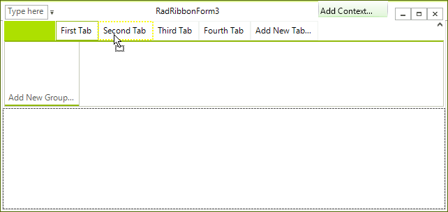
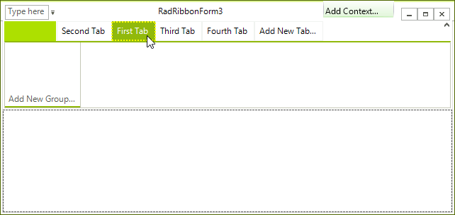

# Using Drag and Drop to Move Items

In the designer, developers can use drag-and-drop to rearrange the tabs within a __RadRibbonBar__. Similarly, drag-and-drop can also be used to rearrange the RibbonBar groups within a tab, the button groups within a group, elements within a group or within a button group, and so forth.

## Rearranging a Ribbon Bar's Tabs

To rearrange the tabs using drag-and-drop, grab a tab by holding the mouse button down when the mouse is positioned over the tab. Then, move the mouse to the position where you want the tab to be placed and then release the mouse button.

When dragging from left-to-right, the tab is inserted to the right of the tab onto which you drop it. When dragging from right-to-left, the tab is inserted to the left of the tab onto which you drop it.

The image below shows the mouse grabbing the First Tab tab.

The mouse is positioned over the Second Tab tab, as shown below. When the mouse button is released, the First Tab tab is dropped onto the Second Tab tab.

>caption Figure 1: Dragging Tabs

The image below shows the tab in its new position. Note that the dragged tab is inserted to the right of the Second Tab tab because it was dragged from left-to-right.

>caption Figure 2: Reorderding Tabs
 
      

## Rearranging Other Items

Drag-and-drop can be used to rearrange other items (RibbonBar groups within a tab, button groups within a RibbonBar group, and so on). The steps are the same as those outlined for dragging-and-dropping tabs within the RibbonBar.

For example, suppose you want to reposition the three RibbonBar groups of the Second Tab tab so that RibbonBar Group 1 is to the left of RibbonBar Group 3. The top image shows the mouse grabbing the group. The second image shows dragging the group and the last one shows the result of the operation.

>caption Figure 3: Reorderding Groups

## See Also

* [Design Time]()
* [Structure]()
* [Getting Started]()
* [Backstage View]()
* [Themes]()
