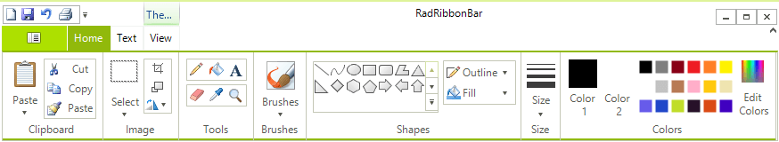
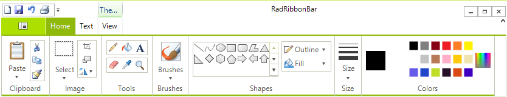
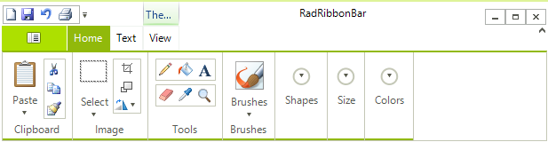
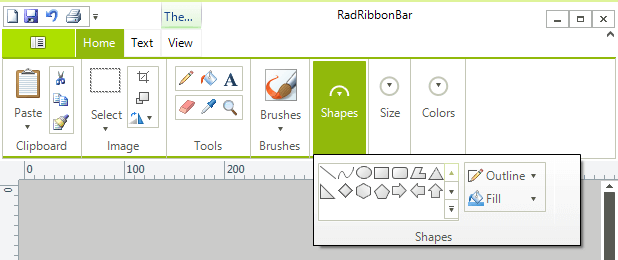
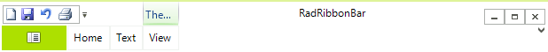

# Collapsing the RibbonBar

__RadRibbonBar__ can appear to take up a large amount of screen real estate, especially when compared to a menu application. To make more efficient use of the space, Telerik RadRibbonBar supports two modes of collapsing.

## Group Collapsing

As you resize horizontally a form containing a __RadRibbonBar__, the individual groups collapse one by one into simple rectangles. Instead of displaying their constituent controls, these rectangles display a drop-down arrow. Clicking the drop-down arrow displays the controls from the collapsed group.    

## Base Collapsing

Double-clicking the selected main tab will collapse all of the groups and hide them from view. Double-clicking the selected main tab again will display the groups again 

## Skipping the No-Text Mode

The **RibbonBarElement** offers the **ItemVisiblityStateChanging** event that gives you the opportunity to control whether a certain collapsing state is allowed or not. The **ItemVisiblityStateChangingEventArgs** gives you access to the **NextVisibilityState**. The available states are:
 * Expanded  
 
 * SmallImages 

 * NoText 
 
 * Collapsed 
 
 * ItemCollapsed 

You can cancel the event if the next state is restricted. 
 

## See Also

* [Structure]()
* [Getting Started]()
