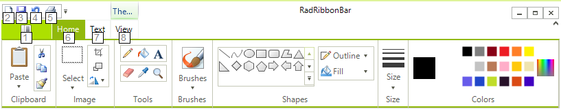
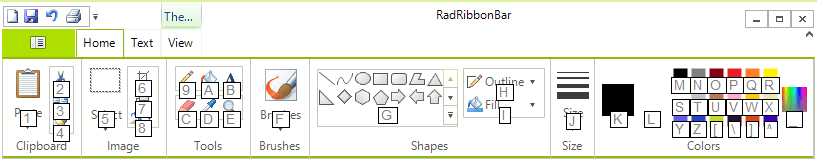

# Using Key Tips

Key tips allow the user to easily discover the keyboard shortcuts for any item of __RadRibbonBar__ control. To display the valid key tips at any time, press and release the __Alt__ key.

For example, when the user presses the __Alt__ key with the control on this **RadRibbonBar**, the top-level key tips are displayed:

>caption Figure 1: Top-Level Key Tips

Furthermore, pressing the __7__ key selects the __Write__ tab and displays the key tips for the elements on that tab:

>caption Figure 2: Text Tab Key Tips

## See Also

* [Customizing the Key Tips]()
* [Structure]()
* [Getting Started]()
