# Getting Started with WinForms RibbonBar

This section will help you in creating your first Telerik __RadRibbonBar__ with some basic functionality (test formatting).

## Adding a Ribbon Bar

1. Add a new __RadRibbonForm__ to your project or create one by changing the base class of a standard __Form__ to __RadRibbonForm__.

1. The __RadRibbonForm__'s designer automatically adds a __RadRibbonBar__ control on the form as shown below:
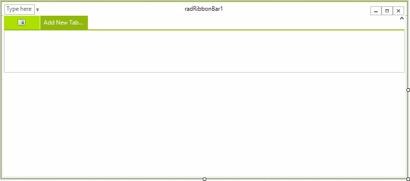

>note By default, __RadRibbonBar__ shows minimize, mazimize and close buttons in its caption element. The __HelpButton__ is not shown. It is necessary to set the RibbonBarElement.RibbonCaption.HelpButton.__Visibility__ property to *ElementVisibility.Visible* in order to be displayed. The form's __HelpButtonClicked__ event is fired when Help button in the ribbon's caption element is clicked. It can be canceled. However, if it is not canceled, the __HelpRequested__ event will be fired when the Help cursor is clicked on any Control. 
> 
> 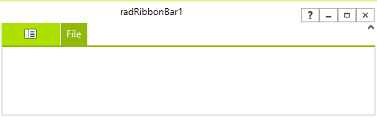

>important Copying/Cutting and Pasting of [tabs](#adding-tabs), [groups](#adding-groups), and [elements](#adding-elements) are not supported in the Visual Studio designer.

## Adding Tabs

1. Click __Add New Tab...__

1. Type __Edit__ and press __Enter__. A new __Add New Tab...__ button will be created to the right of the __Edit__ tab:
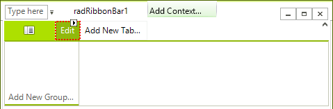

1. Add two more __TabItems__ with captions __Format__ and __Insert:__
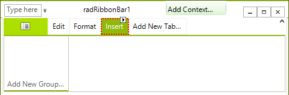

## Adding Groups

1. Click the __Format__ tab.

1. Click the __Add New Group...__ button to create a new __RadRibbonBarGroup__. You will be prompted to enter the __Text__ of the new group. Type *Font* and press Enter to confirm the typed __Text__. Do the whole operation again for another group, but set its __Text__ to *Paragraph*. These groups will become containers that you will use to group controls by the type of functionality they have in common:<br>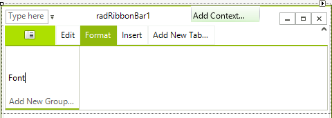<br>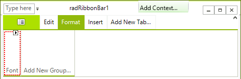<br>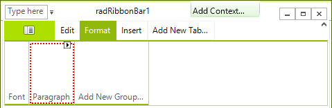

##  Adding Elements

1. Click the __Font__ group *smart tag*.

1. Click on __Add Vertical Button Group__ link. This selection will place a red highlighted area inside of the __Font__ group:
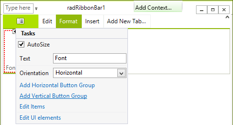

1. Click __radRibbonBarButtonGroup1__ smart tag.

1. Click on __Edit items__ link
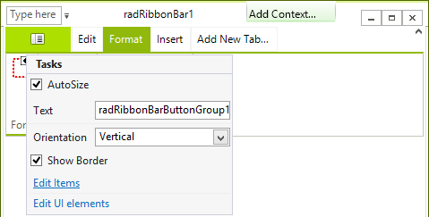

1. Select __RadButtonElement__ from the *drop down* list:
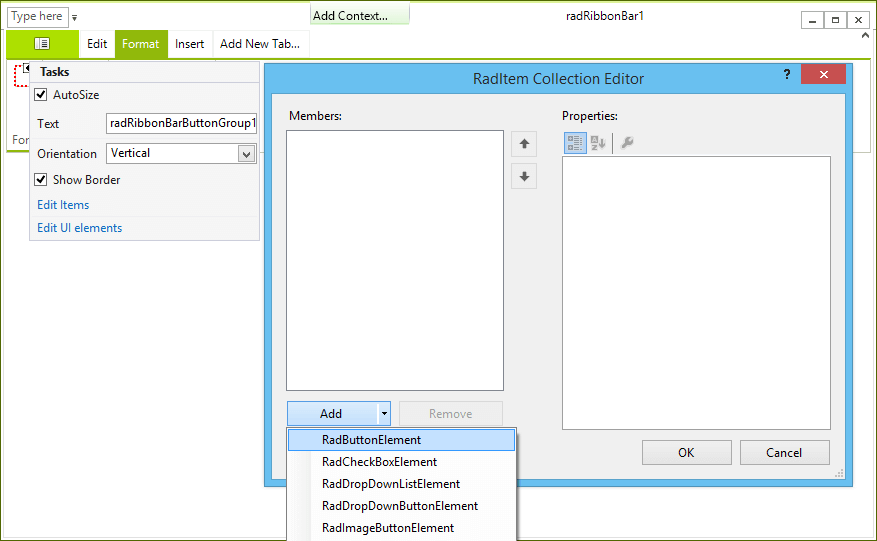

Having done that a __RadButtonElement__ is added to the *button group* that you have just created in the previous steps.
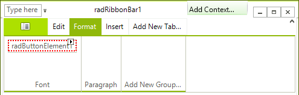  

## Formatting a Button

1. Click __radButtonElement1__, open its Smart Tag menu.

1. Open the drop-down menu of the __DisplayStyle__ property and select __Image__.

1. Open the drop-down menu of the __ImageIndex__ property and select an image.

1. Close the *Smart Tag* menu.

1. In the Properties window of __radButtonElement1__, change the __Name__ property from __radButtonElement1__ to __TextItalic__.

## Prepare an ImageList with RadRibbonBar

1. Drag a WinForms ImageList component from the Toolbox to the form.  In the area below the design surface, you will see __imageList1__.

1. Using the Images Collection Editor, add images to represent __Italic__ text and __Bold__ text to the ImageList. For more help with this task, see [How to: Add or Remove ImageList Images with the Designer](https://msdn.microsoft.com/en-us/library/ms233674) documentation.

1. In the *Properties* window of __radRibbonBar1__, locate the __ImageList__ property. Click the drop-down arrow and choose __imageList1__ from the drop-down list.

## Add a RadRichTextEditor

1. Drag a standard __WinForms RichTextBox__ control onto the form.

1. Open the __Smart Tag__ of the control and execute its __'Dock in parent container__:
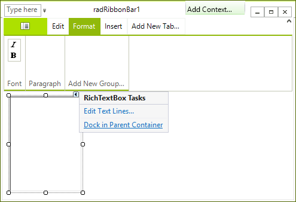

## Add the Code 

#### Toggle Bold or Italic

{{source=..\SamplesCS\RibbonBar\GettingStarted\RibbonGettingStarted.cs region=BoldAndItalicText}} 
{{source=..\SamplesVB\RibbonBar\GettingStarted\RibbonGettingStarted.vb region=BoldAndItalicText}} 

````C#
private void TextBold_Click(object sender, EventArgs e)
{
    if (richTextBox1.SelectionFont.Bold)     
    {
        richTextBox1.SelectionFont = new Font(richTextBox1.SelectionFont, richTextBox1.SelectionFont.Style & ~FontStyle.Bold); 
    }     
    else   
    {
        richTextBox1.SelectionFont = new Font(richTextBox1.SelectionFont, richTextBox1.SelectionFont.Style | FontStyle.Bold);   
    }
}
 
private void TextItalic_Click(object sender, EventArgs e)
{
    if (richTextBox1.SelectionFont.Italic)     
    {
        richTextBox1.SelectionFont = new Font(richTextBox1.SelectionFont, richTextBox1.SelectionFont.Style & ~FontStyle.Italic);     
    }     
    else       
    {
        richTextBox1.SelectionFont = new Font(richTextBox1.SelectionFont, richTextBox1.SelectionFont.Style | FontStyle.Italic);
    }
}

````
````VB.NET
Private Sub TextBold_Click(ByVal sender As System.Object, ByVal e As System.EventArgs) Handles TextBold.Click
    If RichTextBox1.SelectionFont.Bold Then
            RichTextBox1.SelectionFont = New Font(RichTextBox1.SelectionFont, RichTextBox1.SelectionFont.Style And Not FontStyle.Bold)
        Else
            RichTextBox1.SelectionFont = New Font(RichTextBox1.SelectionFont, RichTextBox1.SelectionFont.Style Or FontStyle.Bold)
        End If
    End Sub
Private Sub TextItalic_Click(ByVal sender As System.Object, ByVal e As System.EventArgs) Handles TextItalic.Click
    If RichTextBox1.SelectionFont.Italic Then
            RichTextBox1.SelectionFont = New Font(RichTextBox1.SelectionFont, RichTextBox1.SelectionFont.Style And Not FontStyle.Italic)
        Else
            RichTextBox1.SelectionFont = New Font(RichTextBox1.SelectionFont, RichTextBox1.SelectionFont.Style Or FontStyle.Italic)
        End If
    End Sub

````

{{endregion}}

## Additional Code Instructions

It is necessary to link the Bold and Italic buttons to their event handler code.

1. Click the __Bold__ button.

1. In the Properties window, click the __Event__ code icon ().

1. Locate the Click Action event and select __TextBold_Click__ from its drop-down list.

1. Set the Italic button's Click Action to __TextItalic_Click__ in the same manner.

## Run the Application

1. Press __F5__ to run the QuickStart.

1. Add some text into the text area.

1. Highlight some words and click on the __B__ button to change their font to bold. Click the __B__ button again to remove the bold formatting.


## See Also

* [Design Time]()
* [Structure]()
* [Properties and Events]()
