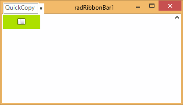

# Set RadRibbonBar in Titlebar Mode

In order to remove the tabstrip part of RadRibbonBar and leave only the titlebar part visible (together with the Start button, and QuickAccess menu), you need to set the following properties:

#### TitleBar Mode

<snippet id='ribbonbar-setradribbonbarintitlebarmode-setradribbonbarintitlebarmode-cs' />
<snippet id='ribbonbar-setradribbonbarintitlebarmode-setradribbonbarintitlebarmode-vb' />

The result is shown on the screenshot below:

>caption Figure 1: Titlebar Mode

## See Also

* [Structure]()
* [Getting Started]()
