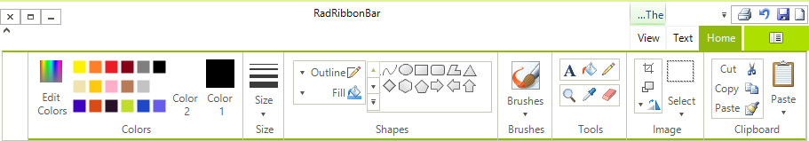

# Right-to-left support

You can present the content of your ribbonbar instance in a right-to-left direction by setting the __RightToLeft__ property to *Yes*:       

{{source=..\SamplesCS\RibbonBar\GettingStarted\AddingScreenTips.cs region=rtl}} 
{{source=..\SamplesVB\RibbonBar\GettingStarted\AddingScreenTips.vb region=rtl}} 

````C#
this.radRibbonBar1.RightToLeft = System.Windows.Forms.RightToLeft.Yes;

````
````VB.NET
Me.RadRibbonBar1.RightToLeft = System.Windows.Forms.RightToLeft.Yes

````

{{endregion}} 

>caption Figure 1: Right-to-left Ribbon UI


## See Also

* [Localization]()