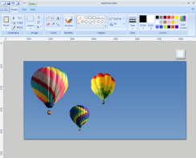
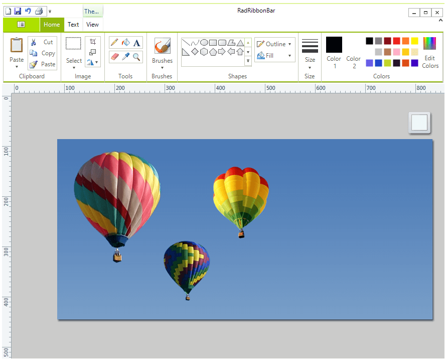

# Overview

| RELATED VIDEOS |  |
| ------ | ------ |
|[WinForms RadRibbonBar RadRibbonBar Overview](http://tv.telerik.com/watch/winforms/radribbonbar/radribbonbar-overview) This video contains a brief overview of the RadRibbonBar. (Runtime: 02:15)||

With the __RadRibbonBar__ control you can build user interfaces similar to those used in Microsoft Office. The figure below shows an example of a __RadRibbonBar__ usage scenario: 





>caption Figure 1: RadRibbonBar

__RadRibbonBar__ control provides a flexible way for organizing all the functionality of your application:
        
* The entire application functionality is accessible from a single place.

* __RadRibbonBar__ is divided into tabs such as *Write*, *Insert*, and *Page Layout*. Tabs can be permanently visible or shown contextually.

* When the users clicks on a tab, they are presented with the ribbon groups such as *Clipboard*, *Font*, and *Paragraph*.

* Each group can hold an unlimited number of controls including toolbars, combo boxes, galleries, and other Telerik controls.

* The Application Menu Button in the upper left of the ribbon provides quick access to the most important commands listed in the Application Menu.

* An optional *Quick Access Toolbar* above or below the ribbon tabs an be used for customization or frequently-used commands.

* Key tips can be used to help users learn the shortcut keys to activate individual controls.

## See Also

* [Design Time]()
* [Structure]()
* [Getting Started]()
