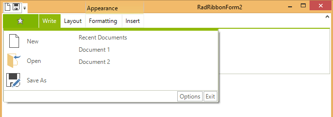
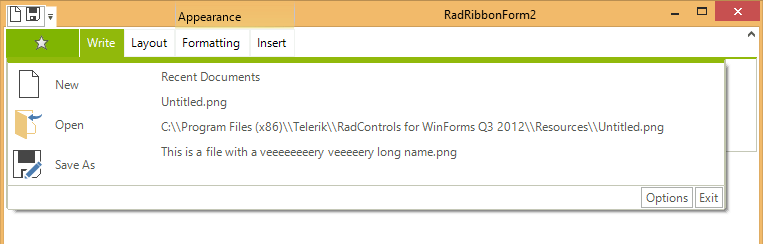
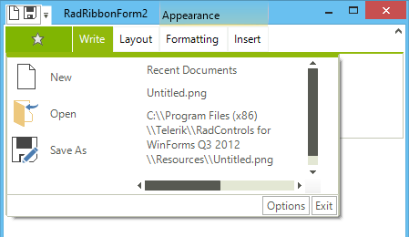

# Customizing the Application Menu

The *Application Menu* is a menu that is displayed when you click on the *Office Button* in the upper left corner of __RadRibbonBar__:

>caption Figure 1: RadRibbonBar Application Menu


The *Application Menu *can contain the same elements as __RadMenu__. Please refer to RadMenu section of the documentation for further a more comprehensive information about __RadMenu__. In contrast to __RadMenu__, menu items can be arranged in two columns.

## Assigning an Image to the Application Menu Office Button

__RadRibbonBar.StartButtonImage__ property defines the image used in the Application Menu button. The following code assigns an image (The example assumes that the image is added to the Project Resources):

#### Assign image to start button

{{source=..\SamplesCS\RibbonBar\ProgrammingRadRibbonBar\CustomizingTheApplicationMenu.cs region=assignImageToStartButton}} 
{{source=..\SamplesVB\RibbonBar\ProgrammingRadRibbonBar\CustomizingTheApplicationMenu.vb region=assignImageToStartButton}} 

````C#
radRibbonBar1.StartButtonImage = new Bitmap("..\\..\\DataSources\\star.png");

````
````VB.NET
RadRibbonBar1.StartButtonImage = New Bitmap("..\\..\\DataSources\\star.png")

````

{{endregion}}

## Adding Items to the Application Menu

There are five types of items which you can add to the Application Menu:

|   |   |
|---|---|
| __RadMenuItem__ |A standard menu item.|
| __RadMenuButtonItem__ |A button menu item.|
| __RadMenuHeaderItem__ |A header menu item.|
| __RadMenuSeperatorItem__ |A separator.|
| __RadMenuComboItem__ |A combobox menu item.|

For example to create a new RadMenuItem and add it to the application menu use the following code:

#### Creating and add new menu item

{{source=..\SamplesCS\RibbonBar\ProgrammingRadRibbonBar\CustomizingTheApplicationMenu.cs region=addingItemsToTheApplicationMenu1}} 
{{source=..\SamplesVB\RibbonBar\ProgrammingRadRibbonBar\CustomizingTheApplicationMenu.vb region=addingItemsToTheApplicationMenu1}} 

````C#
RadMenuItem mnuNew = new RadMenuItem("New File");
mnuNew.Click += new EventHandler(NewFile);
radRibbonBar1.StartMenuItems.Add(mnuNew);

````
````VB.NET
Dim mnuNew As New RadMenuItem("New File")
AddHandler mnuNew.Click, AddressOf NewFile
RadRibbonBar1.StartMenuItems.Add(mnuNew)

````

{{endregion}}

## Below is the method that is referred to by the handler of the Click event. 

#### Handle the menu item click event

{{source=..\SamplesCS\RibbonBar\ProgrammingRadRibbonBar\CustomizingTheApplicationMenu.cs region=addingItemsToTheApplicationMenu2}} 
{{source=..\SamplesVB\RibbonBar\ProgrammingRadRibbonBar\CustomizingTheApplicationMenu.vb region=addingItemsToTheApplicationMenu2}} 

````C#
void NewFile(object sender, EventArgs e)
{
    MessageBox.Show("New File code goes here"); 
}

````
````VB.NET
Private Sub NewFile(sender As Object, e As EventArgs)
    MessageBox.Show("New File code goes here")
End Sub

````

{{endregion}}

## Adding Items to the Right Column

To place items in the right column of the Application Menu use __RadRibbonBar.StartMenuRightColumnItems__ collection. This code adds a RadMenuItem to the right column. The __RadMenuItem.Enabled__ property is set to false so that items will act as labels and clicks will be disallowed. 

#### Adding items to the right column

{{source=..\SamplesCS\RibbonBar\ProgrammingRadRibbonBar\CustomizingTheApplicationMenu.cs region=addingItemsToTheRightColumn}} 
{{source=..\SamplesVB\RibbonBar\ProgrammingRadRibbonBar\CustomizingTheApplicationMenu.vb region=addingItemsToTheRightColumn}} 

````C#
RadMenuItem mnuRecentDocs = new RadMenuItem("Recent Documents");
mnuRecentDocs.Enabled = false;
radRibbonBar1.StartMenuRightColumnItems.Add(mnuRecentDocs);

````
````VB.NET
Dim mnuRecentDocs As New RadMenuItem("Recent Documents")
mnuRecentDocs.Enabled = False
RadRibbonBar1.StartMenuRightColumnItems.Add(mnuRecentDocs)

````

{{endregion}} 


## Adding Items with Sub Items

To create a submenu under a menu item, add items to the __Items__ collection of the first __RadMenuItem__.

This code adds a new __RadMenuItem__, __mnuPrint__, to the Start Menu. Then another three __RadMenuItems__ are created and added to __mnuPrint.Items__. Those three items, which make up the submenu, will have their own event handlers for the user click events.

#### Adding menu items with sub items

{{source=..\SamplesCS\RibbonBar\ProgrammingRadRibbonBar\CustomizingTheApplicationMenu.cs region=addingItemsWithSubItems}} 
{{source=..\SamplesVB\RibbonBar\ProgrammingRadRibbonBar\CustomizingTheApplicationMenu.vb region=addingItemsWithSubItems}} 

````C#
RadMenuItem mnuPrint = new RadMenuItem("Print");
//add Print menu item to the Start Menu 
radRibbonBar1.StartMenuItems.Add(mnuPrint);
//Create Sub-Menu Items with event handlers
RadMenuItem mnuPrintsubPrint = new RadMenuItem("Print");
mnuPrintsubPrint.Click += new EventHandler(Print);
RadMenuItem mnuPrintsubQuickPrint = new RadMenuItem("Quick Print");
mnuPrintsubQuickPrint.Click += new EventHandler(QuickPrint);
RadMenuItem mnuPrintsubPreview = new RadMenuItem("Print Preview");
mnuPrintsubPreview.Click += new EventHandler(Preview);
//add sub-menu items to start menu 
mnuPrint.Items.AddRange(new RadMenuItem[] {mnuPrintsubPrint, mnuPrintsubQuickPrint, mnuPrintsubPreview});

````
````VB.NET
Dim mnuPrint As New RadMenuItem("Print")
'add Print menu item to the Start Menu 
RadRibbonBar1.StartMenuItems.Add(mnuPrint)
'Create Sub-Menu Items with event handlers
Dim mnuPrintsubPrint As New RadMenuItem("Print")
AddHandler mnuPrintsubPrint.Click, AddressOf Print
Dim mnuPrintsubQuickPrint As New RadMenuItem("Quick Print")
AddHandler mnuPrintsubQuickPrint.Click, AddressOf QuickPrint
Dim mnuPrintsubPreview As New RadMenuItem("Print Preview")
AddHandler mnuPrintsubPreview.Click, AddressOf Preview
'Add sub-menu items to the Print menu item 
mnuPrint.Items.AddRange(New RadMenuItem() {mnuPrintsubPrint, mnuPrintsubQuickPrint, mnuPrintsubPreview})

````

{{endregion}}

## Wrapping items' text

The ApplicationMenu of RadRibbonBar supports wrapping of the main and description texts of its items in the right column. To enable it, you should set the TextWrap property of the __Text__ and __Description__ parts of the menu items to true. In addition, you should set the MaxSize of these parts. Finally, you can set the width of the right column to an appropriate value by the ApplicationMenuRightColumnWidth property. Let's say that we have the following RadMenuItems in the right column:

{{source=..\SamplesCS\RibbonBar\ProgrammingRadRibbonBar\CustomizingTheApplicationMenu.cs region=menuItemsTexts}} 
{{source=..\SamplesVB\RibbonBar\ProgrammingRadRibbonBar\CustomizingTheApplicationMenu.vb region=menuItemsTexts}} 

````C#
this.LongNameFileMenuItem.Text = "This is a file with a veeeeeeeery veeeeery long name.png";
this.UntitledFileMenuItem.DescriptionText = "C:\\Program Files (x86)\\Telerik\\RadControls for WinForms Q3 2012\\Resources\\Untitled.png";
this.UntitledFileMenuItem.Text = "Untitled.png";

````
````VB.NET
Me.LongNameFileMenuItem.Text = "This is a file with a veeeeeeeery veeeeery long name.png"
Me.UntitledFileMenuItem.DescriptionText = "C:\\Program Files (x86)\\Telerik\\RadControls for WinForms Q3 2012\\Resources\\Untitled.png"
Me.UntitledFileMenuItem.Text = "Untitled.png"

````

{{endregion}}

By default, the menu will look like this:<br>

So, as mentioned above, we should set the TextWrap and MaxSize properties of the Text and Description parts of the menu items:

{{source=..\SamplesCS\RibbonBar\ProgrammingRadRibbonBar\CustomizingTheApplicationMenu.cs region=settingUpSizes}} 
{{source=..\SamplesVB\RibbonBar\ProgrammingRadRibbonBar\CustomizingTheApplicationMenu.vb region=settingUpSizes}} 

````C#
this.radRibbonBar1.RibbonBarElement.ApplicationMenuRightColumnWidth = 180;
this.LongNameFileMenuItem.Layout.Text.TextWrap = true;
this.LongNameFileMenuItem.Layout.Text.MaxSize = new Size(150, 0);
this.UntitledFileMenuItem.Layout.Description.TextWrap = true;
this.UntitledFileMenuItem.Layout.Description.MaxSize = new Size(150, 0);

````
````VB.NET
Me.RadRibbonBar1.RibbonBarElement.ApplicationMenuRightColumnWidth = 180
Me.LongNameFileMenuItem.Layout.Text.TextWrap = True
Me.LongNameFileMenuItem.Layout.Text.MaxSize = New Size(150, 0)
Me.UntitledFileMenuItem.Layout.Description.TextWrap = True
Me.UntitledFileMenuItem.Layout.Description.MaxSize = New Size(150, 0)

````

{{endregion}}

The result in this case will be:<br>

## Keyboard Support

The Application menu supports mnemonics and Arrows/Enter/Escape navigation.

## See Also

* [Design Time]()
* [Structure]()
* [Getting Started]()
* [Backstage View]()
* [Themes]() 