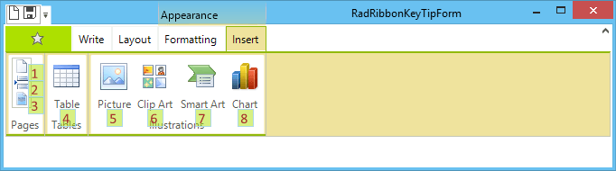
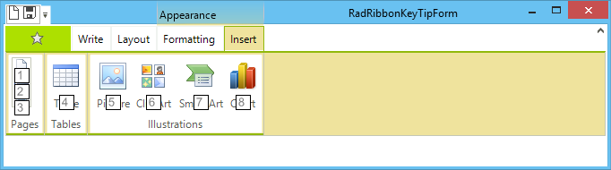

# Customizing the Key Tips

The key tips displayed by **RadRibbonBar** can be customized so that they are shown at special locations with modified styles.

>caption Figure 1: Custom Key Tips


>caption Figure 2: Default Key Tips


## KeyTipShowing Event

The key tip`s location and styles can be modified in the event handler of the **KeyTipShowing** event. The additional parameters allowing these modifications are exposed by the event arguments which need to be cast to **RadKeyTipShowingEventArgs**

* RadKeyTipShowingEventArgs.**CustomLocation**: Defines the coordinates at which the key tip will be shown.


* RadKeyTipShowingEventArgs.**Font**: Gets or sets the font used to paint the text of the key tip.

* RadKeyTipShowingEventArgs.**BackColor**: Gets or sets the back color used to paint the background of the key tip.

* RadKeyTipShowingEventArgs.**BorderColor**: Determines the border color used to paint the borders of the key tip.


* RadKeyTipShowingEventArgs.**ForeColor**: Gets or sets the color used to paint the text of the key tip.

#### Handling the KeyTipShowing Event

{{source=..\SamplesCS\RibbonBar\ProgrammingRadRibbonBar\CustomizingTheKeyTips.cs region=KeyTipShowingEvent}} 
{{source=..\SamplesVB\RibbonBar\ProgrammingRadRibbonBar\CustomizingTheKeyTips.vb region=KeyTipShowingEvent}}
````C#
Font f = new Font("Calibri", 12f, FontStyle.Regular);
private void RadRibbonBar1_KeyTipShowing(object sender, CancelEventArgs e)
{
    RadKeyTipShowingEventArgs args = e as RadKeyTipShowingEventArgs;
    args.BackColor = Color.FromArgb(125, 173, 224, 0);
    args.BorderColor = Color.LightBlue;
    args.ForeColor = Color.Brown;
    args.Font = f;
    Point location = Point.Empty;
    if (sender == this.coverPagesButton || sender == this.blankPageButton || sender == this.pageBreakButton)
    {
        location = new Point(args.CustomLocation.X + 15, args.CustomLocation.Y - 5);
    }
    else
    {
        location = new Point(args.CustomLocation.X, args.CustomLocation.Y + 15);
    }
    args.CustomLocation = location;
}

````
````VB.NET
Private Sub RadRibbonBar1_KeyTipShowing(ByVal sender As Object, ByVal e As CancelEventArgs)
    Dim args As RadKeyTipShowingEventArgs = TryCast(e, RadKeyTipShowingEventArgs)
    args.BackColor = Color.FromArgb(125, 173, 224, 0)
    args.BorderColor = Color.LightBlue
    args.ForeColor = Color.Brown
    args.Font = f
    Dim location As Point = Point.Empty
    If sender Is Me.coverPagesButton OrElse sender Is Me.blankPageButton OrElse sender Is Me.pageBreakButton Then
        location = New Point(args.CustomLocation.X + 15, args.CustomLocation.Y - 5)
    Else
        location = New Point(args.CustomLocation.X, args.CustomLocation.Y + 15)
    End If
    args.CustomLocation = location
End Sub

```` 


{{endregion}}

>note Key tips can also be displayed by the backstage view. The **KeyTipShowing** event needs to be subscribed on the **RadRibbonBarBackstageView** object. 

## See Also

* [Backstage View]()
* [Using the Key Tips]()
