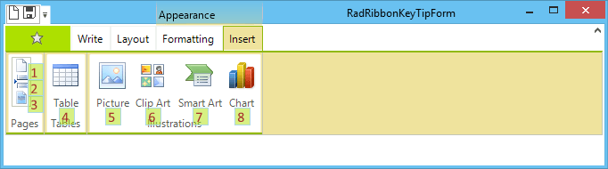
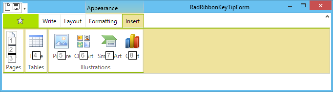

# Customizing the Key Tips

The key tips displayed by **RadRibbonBar** can be customized so that they are shown at special locations with modified styles.

>caption Figure 1: Custom Key Tips

>caption Figure 2: Default Key Tips

## KeyTipShowing Event

The key tip`s location and styles can be modified in the event handler of the **KeyTipShowing** event. The additional parameters allowing these modifications are exposed by the event arguments which need to be cast to **RadKeyTipShowingEventArgs**

* RadKeyTipShowingEventArgs.**CustomLocation**: Defines the coordinates at which the key tip will be shown.

* RadKeyTipShowingEventArgs.**Font**: Gets or sets the font used to paint the text of the key tip.

* RadKeyTipShowingEventArgs.**BackColor**: Gets or sets the back color used to paint the background of the key tip.

* RadKeyTipShowingEventArgs.**BorderColor**: Determines the border color used to paint the borders of the key tip.

* RadKeyTipShowingEventArgs.**ForeColor**: Gets or sets the color used to paint the text of the key tip.

#### Handling the KeyTipShowing Event

<snippet id='ribbonbar-customizingthekeytips-keytipshowingevent-cs' />
<snippet id='ribbonbar-customizingthekeytips-keytipshowingevent-vb' />

>note Key tips can also be displayed by the backstage view. The **KeyTipShowing** event needs to be subscribed on the **RadRibbonBarBackstageView** object. 

## See Also

* [Backstage View]()
* [Using the Key Tips]()
