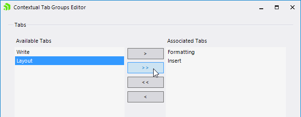

# Managing Contextual Tab Groups

The Contextual Tab Groups can be used to group tabs in a context and thus improve the usability of your UI.

## Using the Designer to Add Contextual Tab Groups

You can add contextual tab groups to __RadRibbonBar__ using the designer in either of the following two ways:

1. Using in-place editing: Click on __Add New Group__, type in the desired name for the contextual tab group, and press __Enter__.

2. Using the collection editor: Select the __ContextualTabGroups__ property of __RadRibbonBar__ and open the property collection editor. In the collection editor, click __Add__. In the contextual tab group __Text__ property, enter the desired name for the contextual tab group and then click __OK__.

## Using the Designer to Assign Tabs to a Contextual Tab Group

You can assign tabs to contextual tab groups using the designer in either of the following two ways: 

1. Using drag-and-drop: Click on the tab that you want to be placed in a particular contextual tab group and then drag it to the desired contextual tab group.

2. Select a Contextual Tab Group and open the __Properties__ window of Visual Studio. Find the __TabItems__ property and open its Collection Editor. You will see the available Ribbon Tabs which can be placed in the Contextual Tab Group. Use the controls on the dialog to place tabs in the group:

>caption Figure 1: Contextual Tab Groups Editor

## Using Contextual Tabs programmatically

The following code snippet shows how to add contextual tab groups and assign tabs to them programmatically:

#### Creating ContextualTabGroups

<snippet id='ribbonbar-managingcontextualtabgroups-managingcontextualtabgroups-cs' />
<snippet id='ribbonbar-managingcontextualtabgroups-managingcontextualtabgroups-vb' />

## See Also

* [Design Time]()
* [Structure]()
* [Getting Started]()
* [Backstage View]()
* [Themes]() 

