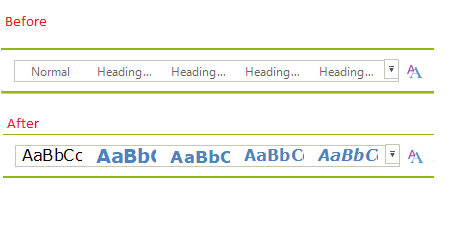

# Customizing Simplified Layout

By default all items are automatically changed so they can fit in one row, this article shows how you can customize this process and change specific item property when the layout mode is switched to simplified.   

## Using the ItemStyleChanging event to change the DisplayStyle of RadGallery items

In this example, you will use the __ItemStyleChanging__ event to change the display style of the gallery items, this way the gallery items will display image only when the simplified mode is enabled. The event arguments are giving information about the mode that we are switching to. There is no need to reset the value when going back to the default mode, this is done automatically. For this example, I am using the word inspired template where this simplified mode is enabled. The following snippet shows how you can change the style of the gallery item.

#### Using the ItemStyleChanging event

<snippet id='ribbonbar-simplifiedribbonlayout-eventexample-cs' />
<snippet id='ribbonbar-simplifiedribbonlayout-eventexample-vb' />

The bellow image shows the difference.

# See Also

* [Simplified Mode]()
