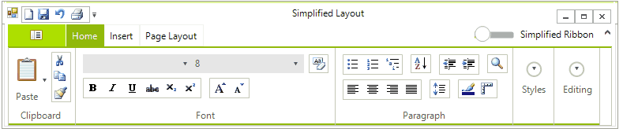
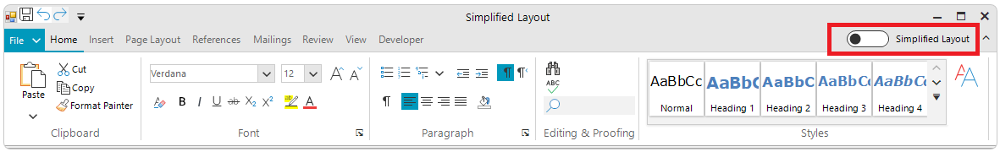

# Simplified mode


When the simplified layout is switched on all elements in the RibbonBar are automatically arranged on a single row. This aims to provide the user with a compact layout which is taking half the height of the standard ribbon. This functionality can be used with new or existing ribbon bars ([RichTextEditorRibbonBar](), [SpreadSheetRibbonBar](), and [DiagramRibbonBar]() are supported out of the box). It automatically changes the items' properties in order to fit them on a single line. The process can be customized as well. If the width is not enough the items are shown in a popup just link in the default ribbon layout.  




## Enabling the simplified mode

To enable the simplified mode set the __LayoutMode__ property: 

{{source=..\SamplesCS\RibbonBar\SimplifiedLayout\SimplifiedRibbonLayout.cs region=EnableRibbon}} 
{{source=..\SamplesVB\RibbonBar\SimplifiedLayout\SimplifiedRibbonLayout.vb region=EnableRibbon}}
````C#
radRibbonBar1.LayoutMode = RibbonLayout.Simplified;

````
````VB.NET
radRibbonBar1.LayoutMode = RibbonLayout.Simplified

```` 
 

{{endregion}}

To allow the end user to change the LayoutMode ar runtime show the layout button:

{{source=..\SamplesCS\RibbonBar\SimplifiedLayout\SimplifiedRibbonLayout.cs region=LayoutButton}} 
{{source=..\SamplesVB\RibbonBar\SimplifiedLayout\SimplifiedRibbonLayout.vb region=LayoutButton}}
````C#
radRibbonBar1.ShowLayoutModeButton = true;

````
````VB.NET
radRibbonBar1.ShowLayoutModeButton = True

```` 
 

{{endregion}}



## Properties

You are allowed to change the height of the ribbon when you are in the simplified mode:

{{source=..\SamplesCS\RibbonBar\SimplifiedLayout\SimplifiedRibbonLayout.cs region=LayoutHeight}} 
{{source=..\SamplesVB\RibbonBar\SimplifiedLayout\SimplifiedRibbonLayout.vb region=LayoutHeight}}
````C#
this.radRibbonBar1.SimplifiedHeight = 100;

````
````VB.NET
Me.radRibbonBar1.SimplifiedHeight = 100

```` 
 

{{endregion}}

Access the simplified mode button:

{{source=..\SamplesCS\RibbonBar\SimplifiedLayout\SimplifiedRibbonLayout.cs region=LayoutButton}} 
{{source=..\SamplesVB\RibbonBar\SimplifiedLayout\SimplifiedRibbonLayout.vb region=LayoutButton}}
````C#
radRibbonBar1.ShowLayoutModeButton = true;

````
````VB.NET
radRibbonBar1.ShowLayoutModeButton = True

```` 
 

{{endregion}}

Access the simplified mode label. The following example shows how you can change the text of the label in the upper right corner:

{{source=..\SamplesCS\RibbonBar\SimplifiedLayout\SimplifiedRibbonLayout.cs region=SimplifiedLabel}} 
{{source=..\SamplesVB\RibbonBar\SimplifiedLayout\SimplifiedRibbonLayout.vb region=SimplifiedLabel}}
````C#
this.radRibbonBar1.RibbonBarElement.LayoutModeTextElement.Text = "Compact Mode";

````
````VB.NET
Me.radRibbonBar1.RibbonBarElement.LayoutModeTextElement.Text = "Compact Mode"

```` 
 

{{endregion}}

## Events

There are 3 events that will be fired when the LayoutMode is changed:

* __LayoutModeChanged__: fired when the end user is changing the layout mode with the button. 
* __ItemStyleChanged__: this event will be fired each time a property of a ribbon item is changed during the layout change operation. The event arguments are specifying the previous and current layout modes. 
* __ItemStyleChanging__: this event will be fired before a property of a ribbon item is changed, allows you to change properties when the LayoutMode is changed. The event arguments are specifying the previous and current layout modes. 


Some of the ribbon items are changed when the simplified mode is turned on or when there is not enough space and the items are shown in a popup. The properties will be restored when switching to the default mode. The following table shows what is changed when switching to the simplified layout and when the items are in a popup.

|Item|Property|Default to Simplified|Simplified to DropDown|
|---|---|---|---|
| RadItem (all)  | Alignment  |MiddleCenter| - |
| RadItem (all)  | Margin  |2, 0, 2, 0| - |
| RadItem (all)  | MaxSize  |Size.Empty| - |
| RadItem (all)  | Text  |Removed new lines| - |
| RadButtonItem  | MinSize  |Size.Empty| - |   
| RadButtonItem  | Padding  |2, 0, 2, 0| 2, 3, 2, 3 |   
| RadButtonItem  | ImageAlignment  |MiddleLeft| - |
| RadButtonItem  | TextAlignment  |MiddleLeft| - |
| RadButtonItem  | TextImageRelation  |ImageBeforeText| - |
| RadButtonItem  | Image  | The image is resized to 16x16| - |
| RadButtonItem  | DisplayStyle  | - | ImageAndText |
| RadDropDownButtonElement  | MinSize  |Size.Empty| - |   
| RadDropDownButtonElement  | Padding  |2, 0, 2, 0| 2, 3, 2, 3 |   
| RadDropDownButtonElement  | ImageAlignment  |MiddleLeft| - |
| RadDropDownButtonElement  | TextAlignment  |MiddleLeft| - |
| RadDropDownButtonElement  | TextImageRelation  |ImageBeforeText| - |
| RadDropDownButtonElement  | Image  | The image is resized to 16x16| - |
| RadDropDownButtonElement  | DisplayStyle  | - | ImageAndText |
| RadGalleryElement  | Padding  | Top and bottom padding is removed | - |
| RadGalleryElement  | MaxSize  | 24 | - |
| RadGalleryItem  | DisplayStyle  | Text | - |
| RadGalleryElement  | Padding  | Top and bottom padding is removed | - |
| RadGalleryItem  | TextAlignment  | MiddleCenter | - |
| RadGalleryItem  | AutoSize  | false | - |
| RadGalleryItem  | Margin  | Top and bottom set to 1px | - |


# See Also

* [Customizing Simplified Layout]()