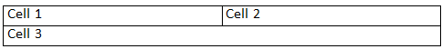
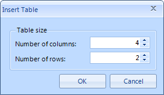

# Tables

The __RadRichTextBox__ is capable of displaying tables. To add a table to the document you can use the provided API.

The tables inside the __RadRichTextBox__ are constructed using the __Table__, __TableRow__ and __TableCell__ classes. The defining of a table is very similar to the one in HTML. The __Table__ class define the table itself and it accepts __TableRow__ objects as children. The __TableRow__ on its hand accepts __TableCell__ objects as children. The __TableCell__ accepts Block elements as children, so to specify its contents of a cell use such one (e.g. a Paragraph) to wrap it.

>note  __Tables__ are block elements.
>

Here is a simple example.

{{source=..\SamplesCS\RichTextBox\Features\Document Elements\RichTextBoxTables.cs region=AddTable}} 
{{source=..\SamplesVB\RichTextBox\Features\Document Elements\RichTextBoxTables.vb region=AddTable}} 

````C#
Section section = new Section();
Table table = new Table();
TableRow row1 = new TableRow();
TableCell cell1 = new TableCell();
Paragraph p1 = new Paragraph();
Span s1 = new Span();
s1.Text = "Cell 1";
p1.Inlines.Add(s1);
cell1.Blocks.Add(p1);
row1.Cells.Add(cell1);
TableCell cell2 = new TableCell();
Paragraph p2 = new Paragraph();
Span s2 = new Span();
s2.Text = "Cell 2";
p2.Inlines.Add(s2);
cell2.Blocks.Add(p2);
row1.Cells.Add(cell2);
table.Rows.Add(row1);
TableRow row2 = new TableRow();
TableCell cell3 = new TableCell();
cell3.ColumnSpan = 2;
Paragraph p3 = new Paragraph();
Span s3 = new Span();
s3.Text = "Cell 3";
p3.Inlines.Add(s3);
cell3.Blocks.Add(p3);
row2.Cells.Add(cell3);
table.Rows.Add(row2);
section.Blocks.Add(table);
this.radRichTextBox1.Document.Sections.Add(section);

````
````VB.NET
Dim _section As New Section()
Dim _table As New Table()
Dim row1 As New TableRow()
Dim cell1 As New TableCell()
Dim p1 As New Paragraph()
Dim s1 As New Span()
s1.Text = "Cell 1"
p1.Inlines.Add(s1)
cell1.Blocks.Add(p1)
row1.Cells.Add(cell1)
Dim cell2 As New TableCell()
Dim p2 As New Paragraph()
Dim s2 As New Span()
s2.Text = "Cell 2"
p2.Inlines.Add(s2)
cell2.Blocks.Add(p2)
row1.Cells.Add(cell2)
_table.Rows.Add(row1)
Dim row2 As New TableRow()
Dim cell3 As New TableCell()
cell3.ColumnSpan = 2
Dim p3 As New Paragraph()
Dim s3 As New Span()
s3.Text = "Cell 3"
p3.Inlines.Add(s3)
cell3.Blocks.Add(p3)
row2.Cells.Add(cell3)
_table.Rows.Add(row2)
_section.Blocks.Add(_table)
Me.RadRichTextBox1.Document.Sections.Add(_section)

````

{{endregion}}



Additionally you can span cells in columns and rows. This is done by using the __RowSpan__ and __ColumnSpan__ properties of the __TableCell__ object. Also you can specify the layout mode for the table via the __LayoutMode__ property. it can have one of the following values:

* __Fixed__ - specifies that the table should have width equal to the value of its __PrefferedWidth__ property.

* __AutoFit__ - specifies that the table should fit into the entire space available. This means that the table will get stretched horizontally.

>tip To learn more about the  __Formatting API__  of the  __RadRichTextBox__ , read [this topic]().

The __RadRichTextBox__ exposes a rich API, which allows you to use various methods to add, modify or delete elements form the __RadDocument__. The methods exposed by the API can be wired to a UI and get executed upon user interaction with this UI. The __RadRichTextBox__ exposes the following methods that regard the creation or deletion of a table:

* __DeleteTable__ - deletes the currently selected table.

* __DeleteTableColumn__ - deletes the currently selected column.

* __DeleteTableRow__ - deletes the currently selected row.

* __InsertTable__ - inserts a table. Allows you to specify the number of rows and columns.

* __InsertTableColumn__ -  inserts a column at the end..

* __InsertTableColumnToTheLeft__ -  inserts a column to the left of the selected one.

* __InsertTableColumnToTheRight__ - inserts a column to the right of the selected one.

* __InsertTableRow__ - inserts a row at the end.

* __InsertTableRowAbove__ - inserts a row above the selected one.

* __InsertTableRowBelow__ - inserts a row below the selected one.

## Creating a Table via the Built-in UI

You can use the __InsertTableDialog__, which comes out of the box. To show it upon a user action just call the __ShowInsertTableDialog()__ method of the __RadRichTextBox__. Here is a snapshot of it.

>note The __RadRichTextBoxUI__ also uses this dialog.
>



## Formatting a Table at Runtime via RadRichTextBox's API

>tip To learn more about the  __Formatting API__  of the  __RadRichTextBox__, read [this topic]().


The __RadRichTextBox__ exposes a rich API, which allows you to use various methods to add, modify or delete elements form the __RadDocument__. The methods exposed by the API can be wired to a UI and get executed upon user interaction with this UI. The __RadRichTextBox__ exposes the following methods that regard the modifying of a table:

* __ChangeTableBorders__ - modifies the borders of the currently selected table via a __TableBorders__ object.

* __ChangeTableCellBackground__ - sets the color of the currently selected cell's borders.

* __ChangeTableCellBorders__ - modifies the borders of the currently selected table via a __TableCellBorders__object.

* __ChangeTableCellContentAlignment__ - modifies the content alignment of the currently selected cell.

* __ChangeTableCellPadding__ -  modifies the padding of the currently selected cell.

* __ChangeTableColumnsLayoutMode__ -  modifies the layout mode of the table's columns.

* __ChangeTableGridColumnWidth__ - modifies the width of the column.

* __MergeTableCells__ - merges the currently selected cells.
