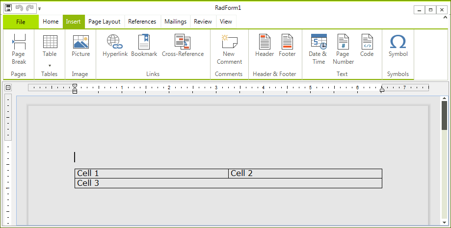
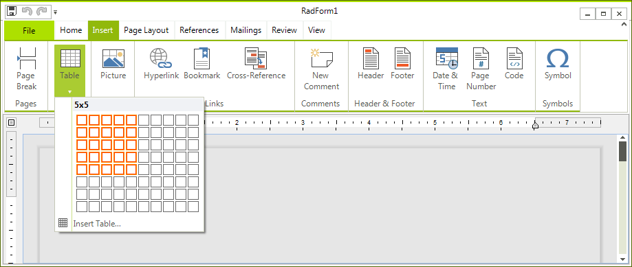
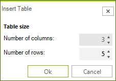
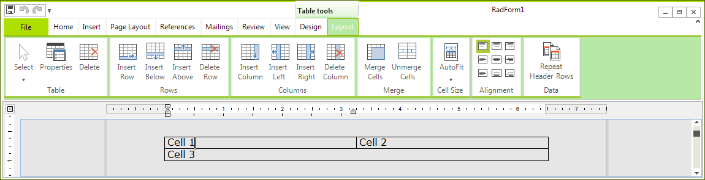
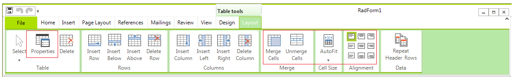
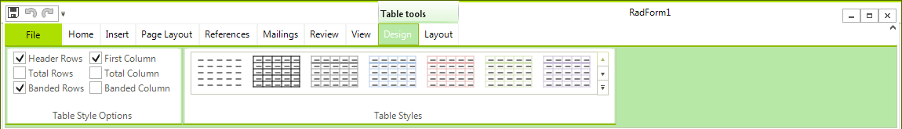
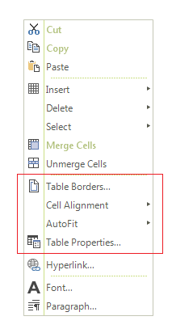

# Table

The __RadRichTextEditor__ is capable of displaying tables. To add a table to the document you can use one of the following approaches:
      
* [Programmatically via RadRichTextEditor's API](#creating-a-table-programmatically-via-radrichtexteditors-api)

* [Via the built-in UI](#creating-a-table-via-the-built-in-ui)

The same approaches can be adopted when formatting the table:

* [Runtime via RadRichTextEditor's API](#formatting-a-table-at-runtime-via-radrichtexteditors-api)

* [Via the built-in UI](#formatting-a-table-via-the-built-in-ui)

## Creating a Table Programmatically via RadRichTextEditor's API

>tip To learn more about the __Formatting API__ of the __RadRichTextEditor__ , read [this topic](https://docs.telerik.com/devtools/winforms/controls/richtexteditor/getting-started/formatting-api).
>

__RadRichTextEditor__ exposes a rich API, which allows you to use various methods to add, modify or delete elements from the __RadDocument__. The methods exposed by the API can be wired to a UI and get executed upon user interaction with this UI.
 
Here is an example done in the code-behind.

<snippet id='richtexteditor-tablecode-add-cs' />
<snippet id='richtexteditor-tablecode-add-vb' />

Here is a snapshot of the result.

The __RadRichTextEditor__ exposes the following methods that regard the creation or deletion of a table:
        
* __DeleteTable__ - deletes the currently selected table.
            
* __DeleteTableColumn__ - deletes the currently selected column.
            
* __DeleteTableRow__ - deletes the currently selected row.
            
* __InsertTable__ - inserts a table. Allows you to specify the number of rows and columns.
            
* __InsertTableColumn__- inserts a column at the end.
            
* __InsertTableColumnToTheLeft__ - inserts a column to the left of the selected one.
            
* __InsertTableColumnToTheRight__ - inserts a column to the right of the selected one.
            
* __InsertTableRow__ - inserts a row at the end.
            
* __InsertTableRowAbove__ - inserts a row above the selected one.
            
* __InsertTableRowBelow__ - inserts a row below the selected one.
            

## Creating a Table via the Built-in UI

You can enable the user to create a table via the built-in UI of __RadRichTextEditor__. This is done by using the __RadRichTextEditorRibbonUI__, which exposes two different ways of creating a table by selection in the UI or on button click. 

You can also use the __InsertTableDialog__, which comes out of the box. To show it upon a user action just call the __ShowInsertTableDialog()__ method of the __RadRichTextEditor__. Here is a snapshot of it.
        
>note **RichTextEditorRibbonBar** also uses this dialog.

>caution Inserting a table through the UI applies to it a __TableGrid__ style, which has a predefined set of borders. However, a table created in code-behind is applied the __TableNormal__ style and does not have predefined borders.
>

A table could be deleted or modified via the *Table tools'* contextual tab __Layout__. There are UI buttons for each of the API methods used for deleting and modifying a table. 

## Formatting a Table at Runtime via RadRichTextEditor's API

>tip To learn more about the __Formatting API__ of the __RadRichTextEditor__ , read [this topic]().
>

__RadRichTextEditor__ exposes a rich API, which allows you to use various methods to add, modify or delete elements  from the __RadDocument__. The methods exposed by the API can be wired to a UI and get executed upon user interaction with this UI. The __RadRichTextEditor__ exposes the following methods that regard the modifying of a table:

* __ChangeTableBorders__ - modifies the borders of the currently selected table via a __TableBorders__ object.
            
* __ChangeTableCellBackground__ - sets the color of the currently selected cell's borders.
            
* __ChangeTableCellBorders__ - modifies the borders of the currently selected table via a __TableCellBorders__ object.            

* __ChangeTableCellContentAlignment__ - modifies the content alignment of the currently selected cell.
            
* __ChangeTableCellPadding__ - modifies the padding of the currently selected cell.
            
* __ChangeTableColumnsLayoutMode__ - modifies the layout mode of the table's columns.
            
* __ChangeTableGridColumnWidth__ - modifies the width of the column.
            
* __MergeTableCells__ - merges the currently selected cells.
            

## Formatting a Table via the Built-in UI

You can enable the user to modify a table via the built-in UI of the __RadRichTextEditor__. This is done by using the __RadRichTextEditorRibbonUI__, which exposes a __Table Tools__ contextual menu with two tabs –  __Design__ and __Layout__. They expose UI buttons for all API methods used for formatting and modifying a table. To learn more about how to use the __RadRichTextEditorRibbonUI__ read  [this topic](). 

The __Design__ contextual tab allows you to use a predefined set of formatting options called *Table Styles*. The __TableStylesGallery__ offers a way to easily create, delete, modify and apply table styles in a document. To  learn more about how to use the **TableStylesGallery** read [this topic](). 

Additionally, the built-in context menu of the __RadRichTextEditor__ gives the user the possibility to open the   __Table Properties__ and __Table Borders__ dialogs.

>tip To wire these dialogs to your own UI you can use the __ShowTablePropertiesDialog()__ method of __RadRichTextEditor__ or the __ShowTablePropertiesCommand__ method.
>

