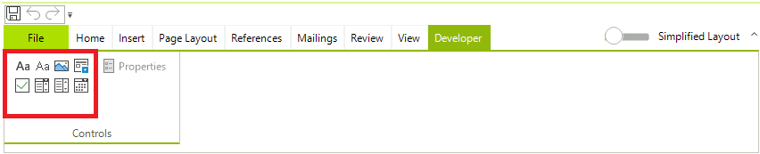

# Working with Content Controls UI

The easiest way to create a content control is through the user interface. You can also create them programmatically following the [Working with Content Controls article]().

## User Interface

You can specify which type of content control you wish to insert from the predefined UI of __RadRichTextEditor__. You can select it from the Developer Tab which is part of the [RadRichTextEditorRibbonUI]() by default:



You can choose between the following content controls:

* __Rich Text__ content control
* __Plain Text__ content control
* __Picture__ content control
* __Repeating Section__ content control
* __Check Box__ content control
* __Combo Box__ content control
* __Drop-Down List__ content control
* __Date Picker__ content control

## Content controls commands

The following commands related to the content controls functionality are available in the __RadRichTextEditor__:

* __InsertStructuredDocumentTagCommand__

In order to successfully execute the __InsertStructuredDocumentTagCommand__ you have to pass the wanted content control type (SdtType) as a CommandParameter:

#### Example 1: Execute InsertStructuredDocumentTagCommand

{{source=..\SamplesCS\RichTextEditor\Features\ContentControls.cs region=ExecuteInsertStructuredDocumentTag}} 
{{source=..\SamplesVB\RichTextEditor\Features\ContentControls.vb region=ExecuteInsertStructuredDocumentTag}} 

````C# 
this.radRichTextEditor1.InsertStructuredDocumentTag(SdtType.Picture);

````
````VB.NET 
Me.RadRichTextEditor1.InsertStructuredDocumentTag(SdtType.Picture)

````

{{endregion}}

Another way is to create a new instance of the __InsertStructuredDocumentTagCommand__ and specify the SdtType in the __Execute__ method:

{{source=..\SamplesCS\RichTextEditor\Features\ContentControls.cs region=CreateNewInsertStructuredDocumentTag}} 
{{source=..\SamplesVB\RichTextEditor\Features\ContentControls.vb region=CreateNewInsertStructuredDocumentTag}} 

````C# 
InsertStructuredDocumentTagCommand command = new InsertStructuredDocumentTagCommand(this.radRichTextEditor1.RichTextBoxElement);
command.Execute("Picture");
//OR
this.radRichTextEditor1.Commands.InsertSdtCommand.Execute("Picture");

````
````VB.NET 
Dim command As InsertStructuredDocumentTagCommand = New InsertStructuredDocumentTagCommand(Me.RadRichTextEditor1.RichTextBoxElement)
command.Execute("Picture")
'OR
Me.RadRichTextEditor1.Commands.InsertSdtCommand.Execute("Picture")

````

{{endregion}}


* __ShowContentControlPropertiesDialogCommand__

In order to execute the __ShowContentControlPropertiesDialogCommand__ you can create a new instance of the command and specify the SdtType in the __Execute()__:

#### Example 2: Execute ShowContentControlPropertiesDialogCommand

{{source=..\SamplesCS\RichTextEditor\Features\ContentControls.cs region=ShowContentControlPropertiesDialogCommand}} 
{{source=..\SamplesVB\RichTextEditor\Features\ContentControls.vb region=ShowContentControlPropertiesDialogCommand}} 

````C# 
ShowContentControlPropertiesDialogCommand command = new ShowContentControlPropertiesDialogCommand(this.radRichTextEditor1.RichTextBoxElement);
command.Execute("Text");
//OR
this.radRichTextEditor1.Commands.ShowContentControlPropertiesDialogCommand.Execute("Text");

````
````VB.NET 
Dim command As ShowContentControlPropertiesDialogCommand = New ShowContentControlPropertiesDialogCommand(Me.RadRichTextEditor1.RichTextBoxElement)
command.Execute("Text")
'OR
Me.RadRichTextEditor1.Commands.ShowContentControlPropertiesDialogCommand.Execute("Text")

````

{{endregion}}

>note In order to learn more about commands and how to use them refer to [Commands](https://docs.telerik.com/devtools/winforms/controls/richtexteditor/features/commands) help article.

