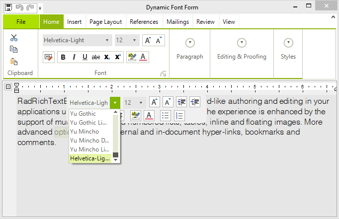

# Custom Fonts

**RadRichTextEditor** is working with the installed fonts on the client machine. Certain scenarios require that a specific document be displayed with a special font which might not be present on the machines on which the application has been deployed. This kind of setup is supported the our [Telerik Presentation Framework]() as well as the **RadRichTextEditor** control.  

>caption Figure 1: Custom Font



In order to utilize this functionality, one needs to load the font carried with the application and then register it with the editor.

>note The Ribbon UI initializes prior to the associated **RadRichTextEditor** and one needs to load and register any in memory fonts before calling the InitializeComponent method of the form

#### Custom Fonts

{{source=..\SamplesCS\RichTextEditor\Features\CustomFonts.cs region=CustomFontLoading}} 
{{source=..\SamplesVB\RichTextEditor\Features\CustomFonts.vb region=CustomFontLoading}}
````C#
public CustomFonts()
{
    using (Stream stream = System.Reflection.Assembly.GetAssembly(this.GetType()).GetManifestResourceStream("SamplesCS.RichTextEditor.Features.HelveticaLt.ttf"))
    {
        ThemeResolutionService.LoadFont(stream);
        Telerik.WinForms.Documents.Layout.FontManager.RegisterFont(new Telerik.WinControls.RichTextEditor.UI.FontFamily("Helvetica-Light"));
    }
    InitializeComponent();
}

````
````VB.NET
Public Sub New()
    Using stream As Stream = System.Reflection.Assembly.GetAssembly(Me.[GetType]()).GetManifestResourceStream("SamplesVB.HelveticaLt.ttf")
        ThemeResolutionService.LoadFont(stream)
        Telerik.WinForms.Documents.Layout.FontManager.RegisterFont(New Telerik.WinControls.RichTextEditor.UI.FontFamily("Helvetica-Light"))
    End Using
    InitializeComponent()
End Sub

```` 


{{endregion}} 

# See Also

 * [Formatting API]()
