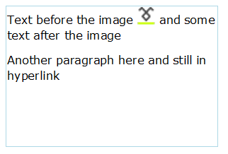

# Hyperlink

The following functionality is supported in the __RadRichTextEditor__:

* having a hyperlink span several paragraphs;

* being able to embed all kinds of elements inside hyperlinks, e.g. images, tables, and table elements;

* making bookmarks in the document the targets of hyperlinks.

The classes that encapsulate the functionality of hyperlinks are [HyperlinkInfo](#hyperlinkinfo),[HyperlinkRangeStart and HyperlinkRangeEnd](#hyperlinkrangestart-and-hyperlinkrangeend).      

[Other customization options](#othercustomizationoptions) include setting the tooltip format and detecting the click of hyperlinks.
      
## HyperlinkInfo

More often than not, you would only need to use objects of type **HyperlinkInfo**. **HyperlinkInfo** objects have the following properties:

* **IsAnchor** - a Boolean property determining if the hyperlink points to a URL or a bookmark;

* **NavigateUri** - the URI of the hyperlink;

* **Target** - determines if the link should be opened in another window (if set to HyperlinkTargets.*Blank*) or in the same frame (HyperlinkTargets.*Self*).

For example, a link to our site can be inserted in the document programmatically as follows:

{{source=..\SamplesCS\RichTextEditor\Features\HyperlinkCode.cs region=insert}} 
{{source=..\SamplesVB\RichTextEditor\Features\HyperlinkCode.vb region=insert}} 

````C#
HyperlinkInfo info = new HyperlinkInfo()
{
    NavigateUri = "http://www.telerik.com",
    Target = HyperlinkTargets.Blank,
    IsAnchor = false
};
this.radRichTextEditor1.InsertHyperlink(info, "RichTextBox demo");

````
````VB.NET
Dim info As New HyperlinkInfo() With {.NavigateUri = "http://www.telerik.com", .Target = HyperlinkTargets.Blank, .IsAnchor = False}
Me.radRichTextEditor1.InsertHyperlink(info, "RichTextBox demo")

````

{{endregion}} 


A link to a bookmark is inserted by specifying the bookmark's name as **NavigateUri** and setting the **IsAnchor** property to *true*:

{{source=..\SamplesCS\RichTextEditor\Features\HyperlinkCode.cs region=remove}} 
{{source=..\SamplesVB\RichTextEditor\Features\HyperlinkCode.vb region=remove}} 

````C#
this.radRichTextEditor1.RemoveHyperlink();

````
````VB.NET
Me.radRichTextEditor1.RemoveHyperlink()

````

{{endregion}} 

You can also use the overloaded methods for inserting a hyperlink:

* public void __InsertHyperlink__(HyperlinkInfo hyperlinkInfo, string hyperlinkText, StyleDefinition hyperlinkStyle) - insert a hyperlink using a custom style, different from the default blue font color and single underline;
            
* public void __InsertHyperlink__(HyperlinkInfo hyperlinkInfo, IEnumerable<Inline> inlines) - insert a hyperlink which spans several different adjacent inlines, e.g. part of the hyperlink text is bold or there is an image inside the hyperlink;            

* public void __InsertHyperlink__(HyperlinkInfo hyperlinkInfo) - create a hyperlink from the currently selected part of the document;
            
* public void __InsertHyperlink__(HyperlinkInfo hyperlinkInfo, StyleDefinition hyperlinkStyle) - create a hyperlink from the currently selected part of the document and change the style of the text to the style passed as second argument.

Removing a hyperlink (and keeping the part of the document that the hyperlink spanned) can be done by positioning the caret in the hyperlink and invoking:

{{source=..\SamplesCS\RichTextEditor\Features\HyperlinkCode.cs region=remove}} 
{{source=..\SamplesVB\RichTextEditor\Features\HyperlinkCode.vb region=remove}} 

````C#
this.radRichTextEditor1.RemoveHyperlink();

````
````VB.NET
Me.radRichTextEditor1.RemoveHyperlink()

````

{{endregion}} 

## HyperlinkRangeStart and HyperlinkRangeEnd

**HyperlinkRangeStart** and **HyperlinkRangeEnd** are **Inline** DocumentElements and can be added to the inlines of a document, if you are building the contents of a **RadDocument** in code-behind.
        
Here is an example that creates a document with a hyperlink spanning several paragraphs, including an image in one of the paragraphs:

{{source=..\SamplesCS\RichTextEditor\Features\HyperlinkCode.cs region=startend}} 
{{source=..\SamplesVB\RichTextEditor\Features\HyperlinkCode.vb region=startend}} 

````C#
HyperlinkRangeStart hyperlinkStart = new HyperlinkRangeStart();
HyperlinkRangeEnd hyperlinkEnd = new HyperlinkRangeEnd();
hyperlinkEnd.PairWithStart(hyperlinkStart);
HyperlinkInfo hyperlinkInfo = new HyperlinkInfo() { NavigateUri = "http://telerik.com", Target = HyperlinkTargets.Blank };
hyperlinkStart.HyperlinkInfo = hyperlinkInfo;
RadDocument document = new RadDocument();
Section section = new Section();
Paragraph paragraph = new Paragraph();
Span spanBefore = new Span("Text before the image ");
ImageInline image;
using (MemoryStream ms = new MemoryStream())
{
    System.Drawing.Image.FromFile(@"C:\logo.png").Save(ms, System.Drawing.Imaging.ImageFormat.Png);
    image = new ImageInline(ms, new Telerik.WinControls.RichTextEditor.UI.Size(25, 25), "png");
}
Span spanAfter = new Span(" and some text after the image");
paragraph.Inlines.Add(hyperlinkStart);
paragraph.Inlines.Add(spanBefore);
paragraph.Inlines.Add(image);
paragraph.Inlines.Add(spanAfter);
section.Blocks.Add(paragraph);
Paragraph anotherParagraph = new Paragraph();
anotherParagraph.Inlines.Add(new Span("Another paragraph here and still in hyperlink"));
anotherParagraph.Inlines.Add(hyperlinkEnd);
section.Blocks.Add(anotherParagraph);
document.Sections.Add(section);
this.radRichTextEditor1.Document = document;

````
````VB.NET
Dim hyperlinkStart As New HyperlinkRangeStart()
Dim hyperlinkEnd As New HyperlinkRangeEnd()
hyperlinkEnd.PairWithStart(hyperlinkStart)
Dim hyperlinkInfo As New HyperlinkInfo() With {.NavigateUri = "http://telerik.com", .Target = HyperlinkTargets.Blank}
hyperlinkStart.HyperlinkInfo = hyperlinkInfo
Dim document As New RadDocument()
Dim section As New Section()
Dim paragraph As New Paragraph()
Dim spanBefore As New Span("Text before the image ")
Dim image As ImageInline
Using ms As New MemoryStream()
    System.Drawing.Image.FromFile("C:\logo.png").Save(ms, System.Drawing.Imaging.ImageFormat.Png)
    image = New ImageInline(ms, New Telerik.WinControls.RichTextEditor.UI.Size(25, 25), "png")
End Using
Dim spanAfter As New Span(" and some text after the image")
paragraph.Inlines.Add(hyperlinkStart)
paragraph.Inlines.Add(spanBefore)
paragraph.Inlines.Add(image)
paragraph.Inlines.Add(spanAfter)
section.Blocks.Add(paragraph)
Dim anotherParagraph As New Paragraph()
anotherParagraph.Inlines.Add(New Span("Another paragraph here and still in hyperlink"))
anotherParagraph.Inlines.Add(hyperlinkEnd)
section.Blocks.Add(anotherParagraph)
document.Sections.Add(section)
Me.radRichTextEditor1.Document = document

````

{{endregion}} 

The result (`Ctrl` + `Click` to follow):



You will also need to use **HyperlinkRangeStart** and **HyperlinkRangeEnd**, if you are using hyperlinks for the implementation of custom logic and want to get all hyperlinks from the document, manipulate the properties of the **HyperlinkInfo** or the whole part of the document that is included in the hyperlink.
        
For instance, here is how you can delete all hyperlinks in the document and replace them with some text:

{{source=..\SamplesCS\RichTextEditor\Features\HyperlinkCode.cs region=delete}} 
{{source=..\SamplesVB\RichTextEditor\Features\HyperlinkCode.vb region=delete}} 

````C#
IEnumerable<HyperlinkRangeStart> links = this.radRichTextEditor1.Document.EnumerateChildrenOfType<HyperlinkRangeStart>();
foreach (HyperlinkRangeStart link in links)
{
    this.radRichTextEditor1.Document.CaretPosition.MoveToInline(link.FirstLayoutBox as Telerik.WinForms.Documents.Layout.InlineLayoutBox, 0);
    this.radRichTextEditor1.Document.Selection.SelectAnnotationRange(link);
    this.radRichTextEditor1.Delete(false);
    this.radRichTextEditor1.Insert("Removed hyperlink");
}

````
````VB.NET
Dim links As IEnumerable(Of HyperlinkRangeStart) = Me.radRichTextEditor1.Document.EnumerateChildrenOfType(Of HyperlinkRangeStart)()
For Each link As HyperlinkRangeStart In links
    Me.radRichTextEditor1.Document.CaretPosition.MoveToInline(TryCast(link.FirstLayoutBox, Telerik.WinForms.Documents.Layout.InlineLayoutBox), 0)
    Me.radRichTextEditor1.Document.Selection.SelectAnnotationRange(link)
    Me.radRichTextEditor1.Delete(False)
    Me.radRichTextEditor1.Insert("Removed hyperlink")
Next link

````

{{endregion}} 

## Other Customization Options

### ToolTip

By default, hyperlinks take a fixed string as a tooltip. The default format is:

>note "{0}{1} to follow link" - The first parameter is the URL, and the second is "Ctrl + Click" which is taken from the localization file.  
>

You have control over it using the __HyperlinkToolTipFormatString__ of **RadRichTextEditor**, which will set the format for all hyperlinks in the document.
        
### HyperlinkClicked event

When a hyperlink is clicked, the __HyperlinkClicked__ event of __RadRichTextEditor__ is fired. The sender of the event is the document element, that you have clicked, e.g. a **Span**, an **Image**, **InlineUIContainer**, etc. The __HyperlinkClickedEventArgs__ provides the possibility either to cancel or replace the navigation action. This is helpful when you need to validate the clicked hyperlink and prevent it from navigating to an unsecured address or from starting a local process.

With the 2024 Q3 (2024.3.924), the default navigation behavior of the hyperlinks is to automatically open only valid and trusted addresses. The hyperlink navigation can be canceled by either setting the __Handled__ property of the HyperlinkClickedEventArgs to _true_ or __IsTrustedUrl__ to _false_.

Here is an example of using the HyperlinkClicked event prompting that the clicked hyperlink might be unsafe and allows to cancel the navigation process upon receiving the end user confirmation:

{{source=..\SamplesCS\RichTextEditor\Features\HyperlinkCode.cs region=HyperlinkClickedEvent}} 
{{source=..\SamplesVB\RichTextEditor\Features\HyperlinkCode.vb region=HyperlinkClickedEvent}} 

````C#
void radRichTextEditor1_HyperlinkClicked(object sender, HyperlinkClickedEventArgs e)
{
   var link = e.URL;
    if (link.EndsWith("exe"))
    { 
        e.Handled = true; MessageBoxResult Result = System.Windows.MessageBox.Show("You are about to open an executable file. Do you want to proceed", "Possible unsafe link", MessageBoxButton.YesNo, MessageBoxImage.Question);
        if (Result == MessageBoxResult.Yes)
        {
            Process.Start(new ProcessStartInfo()
            {
                FileName = link,
                UseShellExecute = true
            });
        }
    }
}


````
````VB.NET
Private Sub radRichTextEditor1_HyperlinkClicked(ByVal sender As Object, ByVal e As HyperlinkClickedEventArgs)
    Dim link = e.URL

    If link.EndsWith("exe") Then
        e.Handled = True
        Dim Result As MessageBoxResult = System.Windows.MessageBox.Show("You are about to open an executable file. Do you want to proceed", "Possible unsafe link", MessageBoxButton.YesNo, MessageBoxImage.Question)
        If Result = MessageBoxResult.Yes Then
            Process.Start(New ProcessStartInfo() With {
                .FileName = link,
                .UseShellExecute = True
            })
        End If
    End If
End Sub


````

{{endregion}} 


### HyperlinkNavigationMode

The __HyperlinkNavigationMode__ allows you to control what action should trigger the opening of a hyperlink. The possible options are:

* **CtrlClick**: Triggers the hyperlink when users hold the Ctrl key and click on the hyperlink.
* **Click**: Triggers the hyperlink when users click on the hyperlink.

Below is demonstrated how to change the default hyperlink navigation mode:

{{source=..\SamplesCS\RichTextEditor\Features\HyperlinkCode.cs region=HyperlinkMode}} 
{{source=..\SamplesVB\RichTextEditor\Features\HyperlinkCode.vb region=HyperlinkMode}} 

````C#

this.radRichTextEditor1.HyperlinkNavigationMode = Telerik.WinForms.Documents.UI.HyperlinkNavigationMode.Click;

````
````VB.NET
Me.radRichTextEditor1.HyperlinkNavigationMode = Telerik.WinForms.Documents.UI.HyperlinkNavigationMode.Click

````

{{endregion}} 


## See Also

 * [Document Elements]()

 * [RadDocument]()

 * [Inline Image]()
