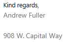
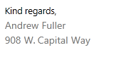

# Insert a New Line in Merge Field

In **RadRichtextBox**, you can insert a line break using the [Break element](). However, when working with mail merge fields, inserting a similar document element is not possible. This is why we introduced support for the vertical tab symbol. This article explains how you can use this symbol to insert a new line in the document content and in a merge field. 

* [What is the Vertical Tab Symbol?](#what-is-the-vertical-tab-symbol)

* [How to Insert a Vertical Tab in RadDocument?](#how-to-insert-a-vertical-tab-in-raddocument)

* [Insert a Line Break Before/After a Merge Field If the Field Result Isn't Empty](#insert-a-line-break-beforeafter-a-merge-field-if-the-field-result-isnt-empty)

* [Using Vertical Tab in a DocumentVariableField](#using-vertical-tab-in-a-documentvariablefield)

## What is the Vertical Tab Symbol?

The vertical tab character is __*"\v"*__. It can be inserted directly into a document as a string or through the merge field switches. The vertical tab character itself won’t be preserved, but it is evaluated to a [Break element]() of type **LineBreak**.

## How to Insert a Vertical Tab in RadDocument?

The [RadDocumentEditor class]() exposes the **Insert()** method that enables you add text to the document. **Example 1** shows you how to insert a vertical tab using this method.

#### Example 1: Insert vertical tab through RadDocumentEditor 

{{source=..\SamplesCS\RichTextEditor\Features\MailMergeCode.cs region=radrichtexteditor-features-mail-merge-Insert-new-line-in-merge-field_0}} 
{{source=..\SamplesVB\RichTextEditor\Features\MailMergeCode.vb region=radrichtexteditor-features-mail-merge-Insert-new-line-in-merge-field_0}} 

````C#
radDocumentEditor.Insert("\v");

````
````VB.NET
radDocumentEditor.Insert(vbVerticalTab)

````

{{endregion}} 

Another option is to create a [Span]() and assign the vertical tab character to it. 

>note This option is suitable only when the document is still not measured. For more information on the measured and not measured states of **RadDocument**, see [this topic](#specifics).

#### Example 2: Create vertical tab through document model 

{{source=..\SamplesCS\RichTextEditor\Features\MailMergeCode.cs region=radrichtexteditor-features-mail-merge-Insert-new-line-in-merge-field_2}} 
{{source=..\SamplesVB\RichTextEditor\Features\MailMergeCode.vb region=radrichtexteditor-features-mail-merge-Insert-new-line-in-merge-field_2}} 

````C#
Span span = new Span("\v");

````
````VB.NET
Dim span As New Span(vbVerticalTab)

````

{{endregion}} 

 
When the vertical tab symbol is inserted in a document, it is replaced with a Break element of type **LineBreak**.

## Insert a Line Break Before/After a Merge Field If the Field Result Isn't Empty

The vertical tab symbol enables you to insert a new line in the resulting fragment of a merge field. You can use the symbol to insert a line break before or after the result of a merge field only if it is not empty.

The next figures demonstrate a sample scenario that uses the vertical tab to separate the result values in lines. **Figure 1** shows the result fragments of merge fields for a sender's name, job title and address. 

>caption Figure 1: Result fragment of mail merge, when all the fields have values


If a line break is inserted after each merge field and a value for a field is missing, the result is an empty line. **Figure 2** shows the result of the mail merge when the merge field for job title has no value.

>caption Figure 2: Result fragment of mail merge, when one of the fields has no value 



You could handle a similar scenario using the vertical tab symbol in the **TextAfterIfNotEmpty** property of the merge field. **Example 3** shows you how to create such a field and the result is demonstrated in **Figure 3**.
 
#### Example 3: Insert vertical tab in the switch of a merge field 

{{source=..\SamplesCS\RichTextEditor\Features\MailMergeCode.cs region=radrichtexteditor-features-mail-merge-Insert-new-line-in-merge-field_4}} 
{{source=..\SamplesVB\RichTextEditor\Features\MailMergeCode.vb region=radrichtexteditor-features-mail-merge-Insert-new-line-in-merge-field_4}} 

````C#
MergeField mergeField = new MergeField() { PropertyPath = "JobTitle", TextAfterIfNotEmpty = "\v" };

````
````VB.NET
Dim mergeField As New MergeField() With { _
    .PropertyPath = "JobTitle", _
    .TextAfterIfNotEmpty = vbVerticalTab _
}

````

{{endregion}} 

 
>caption Figure 3: Result fragment of mail merge, when one of the fields has applied a switch using vertical tab and has no value



### Using End of Paragraph "\r\n" Instead the Vertical Tab

You could also use the *“\r\n”* in the **TextBeforeIfNotEmpty** or **TextAfterIfNotEmpty** switches to create a line break. 

#### Example 4: Insert \r\n in the switch of a merge field 

{{source=..\SamplesCS\RichTextEditor\Features\MailMergeCode.cs region=radrichtexteditor-features-mail-merge-Insert-new-line-in-merge-field_6}} 
{{source=..\SamplesVB\RichTextEditor\Features\MailMergeCode.vb region=radrichtexteditor-features-mail-merge-Insert-new-line-in-merge-field_6}} 

````C#
MergeField mergeField = new MergeField() { PropertyPath = "FirstName", TextAfterIfNotEmpty = "\r\n" };

````
````VB.NET
Dim mergeField As New MergeField() With { _
     .PropertyPath = "FirstName", _
     .TextAfterIfNotEmpty = vbCr & vbLf _
}

````

{{endregion}} 

 
>important The vertical tab is serialized only when it is used as a value for a document variable. In all other cases, it is not included in the document content on export.

## Using the Vertical Tab in a DocumentVariableField

The suggested approach in scenarios that include export is to use a [document variable]() as a nested field. Using this approach, the field will be persisted when importing or exporting XAML and DOCX documents.

#### Example 5: Insert the vertical tab in the switch of a merge field

{{source=..\SamplesCS\RichTextEditor\Features\MailMergeCode.cs region=radrichtexteditor-features-mail-merge-Insert-new-line-in-merge-field_8}} 
{{source=..\SamplesVB\RichTextEditor\Features\MailMergeCode.vb region=radrichtexteditor-features-mail-merge-Insert-new-line-in-merge-field_8}} 

````C#
string verticalTabSymbol = "\v";
string verticalTabKey = "verticalTab";
radRichTextEditor.Document.DocumentVariables.Add(verticalTabKey, verticalTabSymbol);
DocumentVariableField documentVariableField = new DocumentVariableField();
documentVariableField.VariableName = verticalTabKey;
var mergeField = new MergeField() { PropertyPath = "FirstName" };
mergeField.SetPropertyValue(MergeField.TextAfterIfNotEmptyProperty, documentVariableField);
radRichTextEditor.InsertField(mergeField, FieldDisplayMode.Result);

````
````VB.NET
Dim verticalTabSymbol As String = vbVerticalTab
Dim verticalTabKey As String = "verticalTab"
radRichTextEditor.Document.DocumentVariables.Add(verticalTabKey, verticalTabSymbol)
Dim documentVariableField As New DocumentVariableField()
documentVariableField.VariableName = verticalTabKey
Dim mergeField__1 = New MergeField() With { _
    .PropertyPath = "FirstName" _
}
mergeField__1.SetPropertyValue(MergeField.TextAfterIfNotEmptyProperty, documentVariableField)
radRichTextEditor.InsertField(mergeField__1, FieldDisplayMode.Result)

````

{{endregion}} 
 
As a value of the document variable, you could also insert the "\r\n". Keep in mind that this value is exported to DOCX files only.

# See Also

* [Mail Merge]()
* [Break]()
* [Document Variables]()
* [RadDocumentEditor]()
 