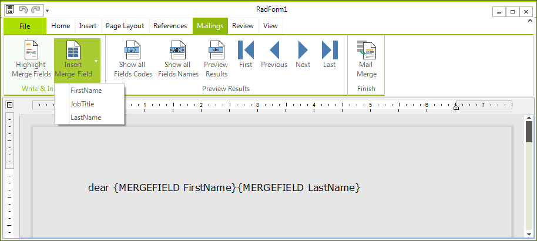

# Mail Merge

The general use of mail merge is the creation of a document serving as a template and filling in different data, e.g. the name of a person, their address, job title, etc. However, mail merge can be used in other scenarios as well, when some part of the document will be repeated several times with slight alterations. The template which stays mostly unchanged in all records is regarded as the "Main Document". In addition to the static content, it also contains placeholders – "Merge Fields" – which represent the variable data and are replaced with the actual content upon performing the mail merge. The information used for filling up the Merge Fields is kept separately and is called "Data Source".

## Setting up the Data Source

The first thing you need to do is assign a value to the __ItemsSource__ property of the __MailMergeDataSource__ of the document. For example, if you will be writing letters to Employees of a company, you can have a context that keeps a list of Employees, each Employee having a FirstName, LastName, and JobTitle.

<snippet id='richtexteditor-mailmergecode-data-cs' />
<snippet id='richtexteditor-mailmergecode-data-vb' />

All that is left is to add the following line:

<snippet id='richtexteditor-mailmergecode-source-cs' />
<snippet id='richtexteditor-mailmergecode-source-vb' />

## Performing Mail Merge

MailMerge can be done both [using the UI](#mailmerging-using-the-ui) and [programmatically.](#programmatic-mail-merge)

### MailMerging using the UI

**RadRichTextEditor** comes with a predefined UI for inserting merge fields, previewing the results, and fulfilling the merge. It is separated in the  Mailings tab:

The options in the drop-down button **InsertMergeField** are automatically populated to match the properties of the objects which are used as data sources. You can also switch the display mode of the merge fields from *FieldCodes* (as in the picture) to *FieldNames* (e.g. `FirstName`) or preview the results.
            
If you click the "**Preview Results**" button, the fields will be replaced with the data from the current record, which by default is the first item from the data source. Then, you can further iterate through the records using the *First*, *Last*, *Previous* and *Next* buttons.
 
If you wish to save the document as a template, you can do so by executing the **SaveFileCommand** from the application menu in the ribbon bar. 

>note The merge fields are persisted only in XAML and docx.
>

In the end, you can fulfill the mail merge from the **MailMerge** button, which executes the **MailMergeCommand**. A **SaveFileDialog** dialog will pop up prompting you to choose where you wish to save the document – result of mail merge and in what file format.

### Programmatic Mail Merge

The same scenario can be carried out programmatically just as easily. The methods that can be used are:
            
### Creating a MergeField:

<snippet id='richtexteditor-mailmergecode-field-cs' />
<snippet id='richtexteditor-mailmergecode-field-vb' />

This fields will look for the value of the **FirstName** property of the Employee objects.

### Changing the display mode of merge fields:

<snippet id='richtexteditor-mailmergecode-mode-cs' />
<snippet id='richtexteditor-mailmergecode-mode-vb' />

### Inserting a MergeField at the current position of the caret:

<snippet id='richtexteditor-mailmergecode-insert-cs' />
<snippet id='richtexteditor-mailmergecode-insert-vb' />

### Previewing the results of Mail Merge:

<snippet id='richtexteditor-mailmergecode-preview-cs' />
<snippet id='richtexteditor-mailmergecode-preview-vb' />

### Performing MailMerge:

<snippet id='richtexteditor-mailmergecode-perform-cs' />
<snippet id='richtexteditor-mailmergecode-perform-vb' />

You can further choose what you wish to do with the resulting **RadDocument** – assign it to a **RadRichTextEditor**’s Document property, export it, etc.
