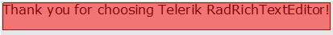
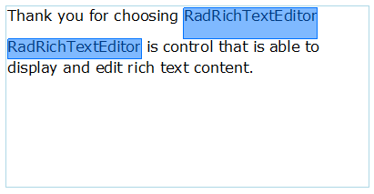
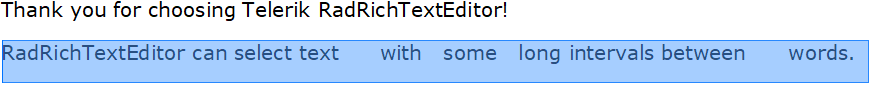

# Selection

__RadRichTextEditor__ supports not only selection via the UI, but also selection via code. This topic will explain you how to:      

* [Use UI Selection](#ui-selection)

* [Implement Programmatic Selection](#programmatic-selection)

* [Implement Multi-range Selection](#multi-range-selection)

## UI Selection

The user is able to select the content of the __RadRichTextEditor__ in the same way as in MS Word. This is done by clicking on the desired position and dragging to the desired end of the selection. A multiple ranges selection is also allowed. This one is done by holding the `Ctrl` key while selecting the different ranges.

You can modify the appearance of the selection in the control through the **SelectionFill** and **SelectionStroke** properties of RadRichTextEditor.

#### Customize the appearance of the selection

{{source=..\SamplesCS\RichTextEditor\Features\Selection.cs region=Fill}} 
{{source=..\SamplesVB\RichTextEditor\Features\Selection.vb region=Fill}} 

````C#
            
this.radRichTextEditor1.SelectionFill = Color.FromArgb(125, 255, 0, 0);
this.radRichTextEditor1.SelectionStroke = Color.DarkRed;


````
````VB.NET

Me.radRichTextEditor1.SelectionFill = Color.FromArgb(125, 255, 0, 0)
Me.radRichTextEditor1.SelectionStroke = Color.DarkRed

````

{{endregion}} 



## Programmatic Selection

The developer is allowed to work with the selection programmatically. This can be used when having a __Find__ functionality in your  __RadRichTextEditor__ and you want to select the found string. Examples that involve the programmatic selection can be found in the *How To* section.
        
The programmatic selection gets implemented via the __DocumentSelection__ class. The instance of the class gets associated with the  __RadDocument__ of __RadRichTextEditor__ and allows you to specify selection starts and ends, selection ranges and other. You can manage the selection by either using the __Selection__ property of the __RadDocument__ or by creating an instance of the __DocumentSelection__ class.
        
To learn more about the __DocumentPosition__ read the [Positioning]() topic.

### Members of DocumentSelection

**Properties**:

* **Ranges**: Holds a collection of all SelectionRange instances in the selection.
* **IsEmpty**: Holds a value determining whether the selection is empty or not.

**Methods for manipulating the selection**:

* **SelectAll()**: Selects all the content of the document.
* **SetSelectionStart()**: Empties the selection and begins a new **SelectionRange** starting at the specified position. This method starts the creation of a range, which should be finished with **AddSelectionEnd()**.
* **AddSelectionStart()**: Begins a new **SelectionRange** starting at the specified position. This method starts the creation of a range, which should be finished with **AddSelectionEnd()**.
* **AddSelectionEnd()**: Finishes the started **SelectionRange** by setting its end.
* **SelectAnnotationRange()**: Selects annotation range including the **AnnotationRangeStart** and **AnnotationRangeEnd** elements.
* **SelectTableRow()**: Creates a new selection containing the specific table row.
* **SelectTableColumn()**: Creates a new selection containing all the cells in a table column. There are two overloads that allow you to pass a cell from the column or the table and the grid column index, which should be selected.
* **AddDocumentElementToSelection()**: Adds a specified document element to the existing selection.
* **AddTableCellToSelection()**: Adds a table cell to the existing selection.
* **AddParagraphToSelection()**: Adds a paragraph to the existing selection.

**Obtaining information and elements from the selection**:

* **CopySelectedDocumentElements()**: Copies all selected document elements to a **DocumentFragment** instance.
* **GetSelectedText()**: Gets the text from the selection. Offers an overload allowing you to specify whether the result should include the bullet or numbering characters in case a paragraph is in a list.
* **GetSelectedParagraphs()**: Gets the paragraphs included in the selection.
* `GetSelectedBoxes<T>()`: Enumerates through all inline layout boxes of type T included in the selected ranges.
* **GetFullSelectionGeometry()**: Gets a System.Windows.Media.Geometry instance describing the form of the selection.
* **GetVisibleSelectionGeometry()**: Gets a System.Windows.Media.Geometry instance describing the form of the selection visible in the rectangle passed as a parameter.
* **CreateDocumentFromSelection()**: Creates a new **RadDocument** instance containing the selected elements.
* `ContainsAnnotationMarkersOfType<T>()`: Determines whether the selection contains annotation markers of type T.
* `GetAnnotationMarkersOfType<T>()`: Gets all annotation markers of type T in the selection.
* **GetSelectedSingleInline()**: Gets the selected Inline if it is the only inline selected, otherwise returns null. This method is suitable to check if only an **ImageInline** is selected, for example.
* **ToString()**: Gets the text from the selected document elements.

**Clearing the selection**:

* **Clear()**: Empties the selection

**Events**:

* **SelectionChanging**: Occurs before the selection is changed.
* **SelectionChanged**: Occurs after the selection is changed. Such an event is exposed by the **RadRichTextEditor** class as well.
        
Here is an example of how to select the current word.

#### Select current word

{{source=..\SamplesCS\RichTextEditor\Features\Selection.cs region=position}} 
{{source=..\SamplesVB\RichTextEditor\Features\Selection.vb region=position}} 

````C#
            
DocumentPosition startPosition = this.radRichTextEditor1.Document.CaretPosition; //new DocumentPosition( this.radRichTextBox.Document );
DocumentPosition endPosition = new DocumentPosition(startPosition);
startPosition.MoveToCurrentWordStart();
endPosition.MoveToCurrentWordEnd();
this.radRichTextEditor1.Document.Selection.AddSelectionStart(startPosition);
this.radRichTextEditor1.Document.Selection.AddSelectionEnd(endPosition);

````
````VB.NET
Dim _startPosition As DocumentPosition = Me.radRichTextEditor1.Document.CaretPosition 'new DocumentPosition( this.radRichTextBox.Document );
Dim endPosition As New DocumentPosition(_startPosition)
_startPosition.MoveToCurrentWordStart()
endPosition.MoveToCurrentWordEnd()
Me.radRichTextEditor1.Document.Selection.AddSelectionStart(_startPosition)
Me.radRichTextEditor1.Document.Selection.AddSelectionEnd(endPosition)

````

{{endregion}} 

The next snippet demonstrates how you can check the content that is selected and select and delete the current paragraph if the text in the selection contains the word "Test".

#### Select current paragraph and delete it


{{source=..\SamplesCS\RichTextEditor\Features\Selection.cs region=DeleteSelection}} 
{{source=..\SamplesVB\RichTextEditor\Features\Selection.vb region=DeleteSelection}} 

````C#
           if (selectedText.Contains("Test"))
           {
               this.radRichTextEditor1.Document.Selection.Clear();
               Paragraph currentParagraph = this.radRichTextEditor1.Document.CaretPosition.GetCurrentParagraph();

               this.radRichTextEditor1.Document.Selection.AddDocumentElementToSelection(currentParagraph);
               this.radRichTextEditor1.Delete(true);
           }            

````
````VB.NET

Dim selectedText As String = Me.radRichTextBox.Document.Selection.GetSelectedText() 
 
If (selectedText.Contains("Test")) Then 
 
    Me.radRichTextBox.Document.Selection.Clear() 
    Dim currentParagraph As Paragraph = Me.radRichTextBox.Document.CaretPosition.GetCurrentParagraph() 
 
    Me.radRichTextBox.Document.Selection.AddDocumentElementToSelection(currentParagraph) 
    Me.radRichTextBox.Delete(True) 
End If 

````

{{endregion}} 

### What is Selection Range?

The selection in **RadRichTextEditor** consists of selection ranges. These ranges are represented by the **SelectionRange** class which exposes the following members:

* **StartPosition**: The position determining the start of the selection range.
* **EndPosition**: The position determining the end of the selection range.
* **ContainsPosition()**: Determines whether the range contains a specified DocumentPosition.
* **IsEmpty**: Determines whether the range contains any document elements.
* **IsReversed**: Returns true when the start position is after the end position. This might be achieved as in code as well as when the user starts dragging the mouse from right to left.
* **IsValid**: A range is considered valid when it has valid start and end positions and is not empty.
* **RangeType**: When working with ranges, you might need to check what elements are included in a selection range. This could be achieved with the RangeType property of SelectionRange. This property is of type SelectionRangeType and could have one of the following values:

	* **Composite**: Represents selection range with mixed elements.
	* **Table**: SelectionRange, which contains a Table.
	* **TableRow**: The range consists of a TableRow.
	* **TableCell**: TableCell selection range.

#### Check the type of the elements inside the selection

{{source=..\SamplesCS\RichTextEditor\Features\Selection.cs region=ElementType}} 
{{source=..\SamplesVB\RichTextEditor\Features\Selection.vb region=ElementType}} 

````C#
    
            SelectionRange selectionRange = this.radRichTextEditor1.Document.Selection.Ranges.First();
            if (selectionRange.RangeType == SelectionRangeType.Table)
            {
                //SetTableProperties();
            } 

````
````VB.NET

        Dim selectionRange As Telerik.WinForms.Documents.Selection.SelectionRange = Me.radRichTextEditor1.Document.Selection.Ranges.First()
        If selectionRange.RangeType = SelectionRangeType.Table Then
            'SetTableProperties()
        End If

````

{{endregion}} 

## Multi-Range Selection

You can implement Multi-Range Selection by either calling multiple times the __AddSelectionStart()__ and   __AddSelectionEnd()__ methods or by working with the __Ranges__ collection.
        
Here is an example of selecting each "*RadRichTextEditor*" word in the text. This example uses the first approach.

#### Select all occurrences of the "RadRichTextBox" word

{{source=..\SamplesCS\RichTextEditor\Features\Selection.cs region=multiselect}} 
{{source=..\SamplesVB\RichTextEditor\Features\Selection.vb region=multiselect}} 

````C#
    
DocumentPosition position = new DocumentPosition(this.radRichTextEditor1.Document);
do
{
    //GetCurrentSpan().Text returns the word at the position
    string word = position.GetCurrentSpanBox().Text;
    if (word.Contains("RadRichTextBox"))
    {
        DocumentPosition wordEndPosition = new DocumentPosition(position);
        wordEndPosition.MoveToCurrentWordEnd();
        this.radRichTextEditor1.Document.Selection.AddSelectionStart(position);
        this.radRichTextEditor1.Document.Selection.AddSelectionEnd(wordEndPosition);
    }
}
while (position.MoveToNextWordStart());

````
````VB.NET
Dim position As New DocumentPosition(Me.radRichTextEditor1.Document)
Do
    'GetCurrentSpan().Text returns the word at the position
    Dim word As String = position.GetCurrentSpanBox().Text
    If word.Contains("RadRichTextEditor") Then
        Dim wordEndPosition As New DocumentPosition(position)
        wordEndPosition.MoveToCurrentWordEnd()
        Me.radRichTextEditor1.Document.Selection.AddSelectionStart(position)
        Me.radRichTextEditor1.Document.Selection.AddSelectionEnd(wordEndPosition)
    End If
Loop While position.MoveToNextWordStart()

````

{{endregion}} 



## Customize Mouse Selection Behavior 

The mouse selection behavior in the RadRichTextEditor control is defined in **MouseSelectionHandler**. MouseSelectionHandler is the base class that controls the selection made through mouse moving, dragging, etc. 

As of 2025 Q1 the default mouse selection behavior can be customized by creating a class that derives from MouseSelectionHandler and override its methods. The customized handler, can be assigned to the **MouseSelectionHandler** property of the **ActiveEditorPresenter** of RadRichTextEditor. Thus it can replace the default mouse behavior offering the desired customized one that fulfil client's needs.

The following example shows how to implement a custom selection behavior which selects words on a single click even when there are more that one empty spaces. The default behavior selects specific word when the user double click the word.

#### Creating a Custom MouseSelectionHandler

{{source=..\SamplesCS\RichTextEditor\Features\Selection.cs region=CustomMouseSelectionHandler}} 
{{source=..\SamplesVB\RichTextEditor\Features\Selection.vb region=CustomMouseSelectionHandler}} 

````C#
    
public class CustomMouseSelectionHandler : MouseSelectionHandler
{
    RadDocument currentDocument;
    public CustomMouseSelectionHandler(RadDocument document, DocumentPresenterBase presenter)
        : base(document, presenter)
    {
        currentDocument = document;
    }

    protected override void RegisterDocumentSingleMouseDown(bool ctrlPressed, bool shiftPressed, Telerik.WinControls.RichTextEditor.UI.Point position, UIElement originalSource)
    {
        base.RegisterDocumentSingleMouseDown(ctrlPressed, shiftPressed, position, originalSource);
    }

    public override void RegisterDocumentMouseUp(SourceType source = SourceType.Mouse, Telerik.WinControls.RichTextEditor.UI.Point? position = null)
    {
        base.RegisterDocumentMouseUp(source, position);
        SelectEmptyAnnotation();
    }

    public void SelectEmptyAnnotation()
    {
        var position = currentDocument.CaretPosition;
        var span = position.GetCurrentInline() as Span;

        if (span != null && span.Text.Contains("   "))
        {
            var start = new DocumentPosition(currentDocument);
            var end = new DocumentPosition(currentDocument);

            start.MoveToDocumentElementStart(span);
            end.MoveToDocumentElementEnd(span);
            end.MoveToNext();

            this.currentDocument.Selection.SetSelectionStart(start);
            this.currentDocument.Selection.AddSelectionEnd(end);
        }
    }
}

````
````VB.NET
Public Class CustomMouseSelectionHandler
    Inherits MouseSelectionHandler

    Private currentDocument As RadDocument
    Public Sub New(ByVal document As RadDocument, ByVal presenter As DocumentPresenterBase)
        MyBase.New(document, presenter)
        currentDocument = document
    End Sub
    Protected Overrides Sub RegisterDocumentSingleMouseDown(ByVal ctrlPressed As Boolean, ByVal shiftPressed As Boolean, ByVal position As Telerik.WinControls.RichTextEditor.UI.Point, ByVal originalSource As UIElement)
        MyBase.RegisterDocumentSingleMouseDown(ctrlPressed, shiftPressed, position, originalSource)
    End Sub
    Public Overrides Sub RegisterDocumentMouseUp(ByVal Optional source As SourceType = SourceType.Mouse, ByVal Optional position As Telerik.WinControls.RichTextEditor.UI.Point? = Nothing)
        MyBase.RegisterDocumentMouseUp(source, position)
        SelectEmptyAnnotation()
    End Sub
    Public Sub SelectEmptyAnnotation()
        Dim position = currentDocument.CaretPosition
        Dim span = TryCast(position.GetCurrentInline(), Span)

        If span IsNot Nothing AndAlso span.Text.Contains("   ") Then
            Dim start = New DocumentPosition(currentDocument)
            Dim [end] = New DocumentPosition(currentDocument)
            start.MoveToDocumentElementStart(span)
            [end].MoveToDocumentElementEnd(span)
            [end].MoveToNext()
            Me.currentDocument.Selection.SetSelectionStart(start)
            Me.currentDocument.Selection.AddSelectionEnd([end])
        End If
    End Sub
End Class

````

{{endregion}} 

#### Assign the custom MouseSelectionHandler to the ActiveEditorPresenter

{{source=..\SamplesCS\RichTextEditor\Features\Selection.cs region=AssignCustomMouseSelectionHandler}} 
{{source=..\SamplesVB\RichTextEditor\Features\Selection.vb region=AssignCustomMouseSelectionHandler}} 

````C#
private void RadRichTextEditor1_DocumentChanged(object sender, EventArgs e)
{
    DocumentPresenterBase presenter = this.radRichTextEditor1.RichTextBoxElement.ActiveEditorPresenter as DocumentPresenterBase;
    if (presenter != null)
    {
        presenter.MouseSelectionHandler = new CustomMouseSelectionHandler(this.radRichTextEditor1.Document, presenter);
    }
} 

````
````VB.NET
Private Sub RadRichTextEditor1_DocumentChanged(ByVal sender As Object, ByVal e As EventArgs)
    Dim presenter As DocumentPresenterBase = TryCast(Me.radRichTextEditor1.RichTextBoxElement.ActiveEditorPresenter, DocumentPresenterBase
    If presenter IsNot Nothing Then
        presenter.MouseSelectionHandler = New CustomMouseSelectionHandler(Me.radRichTextEditor1.Document, presenter)
    End If
End Sub

````

{{endregion}} 

#### Custom Selection Behavior


## MouseSelectionHandler Settings

The following static mouse selection properties are helpful to customize settings of **MouseSelectionHandler** in case you have more specific requirements:

* **MouseSelectionHandler.DoubleClickTime**: This static property controls the double click speed of the RadRichTextEditor. The default value is 400ms. It is different from the default value in .NET which is 500ms. This property allows you to set the value that best suits your case. You can set it in your code usually when initializing the RadRichTextEditor control.

* **MouseSelectionHandler.MouseDragThreshold**: This static property controls the number of pixels that the mouse needs to travel so that the action is considered a drag operation. The default value is 3.

* **MouseSelectionHandler.MouseDoubleClickThreshold**: This static property controls the number of pixels that are allowed for the mouse to move when double-clicking. The default value of this property is 1.


# See Also

* [Positioning]()

* [History]()

* [Clipboard Support]()

* [How to Search and Highlight Text in RichTextEditor]()
