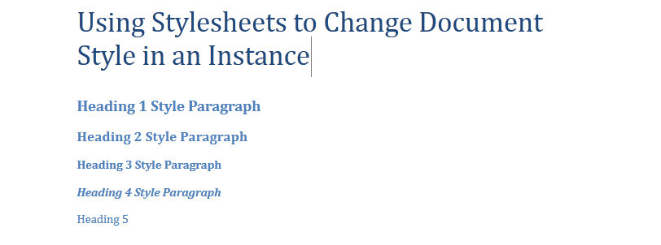
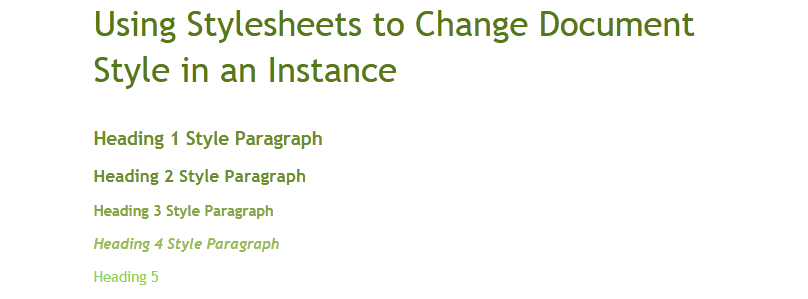

# Style Sheets 

Style sheets provide an easy way to change the look of documents without altering their content. They extend the support for predefined styles by allowing the saving and loading of custom style sheets – a set of styles to be used throughout the document. What is particularly convenient about them is that you can change the colors and sizes used for headings, TOC entries, etc. just by changing the style sheet.

Instances of the __Stylesheet__ class contain __StyleDefinitions__ and __ListStyles__. The class also exposes the __ApplyStylesheetToDocument__ and __ExtractStylesheetFromDocument__ methods used respectively for applying and extracting a style sheet.

Below you can see the result when the style sheet of a document is changed




## Exporting and Importing Style sheets

__XamlFormatProvider__ has been extended to import and export style sheets to back up this functionality.
        
Here is an example of how to load a style sheet from a file using the __LoadStylesheet__ method of __XamlFormatProvider__:

{{source=..\SamplesCS\RichTextEditor\Features\StyleSheets.cs region=add}} 
{{source=..\SamplesVB\RichTextEditor\Features\StyleSheets.vb region=add}} 

````C#
            
OpenFileDialog ofd = new OpenFileDialog();
ofd.Filter = "Xaml Files|*.xaml";
if (ofd.ShowDialog() == DialogResult.OK)
{
    using (var stream = ofd.OpenFile())
    {
        Stylesheet stylesheet = XamlFormatProvider.LoadStylesheet(stream);
        stylesheet.ApplyStylesheetToDocument(this.radRichTextEditor1.Document);
    }
}

````
````VB.NET
Dim ofd As New OpenFileDialog()
ofd.Filter = "Xaml Files|*.xaml"
If ofd.ShowDialog() = System.Windows.Forms.DialogResult.OK Then
    Using stream = ofd.OpenFile()
        Dim stylesheet As Stylesheet = XamlFormatProvider.LoadStylesheet(stream)
        stylesheet.ApplyStylesheetToDocument(Me.radRichTextEditor1.Document)
    End Using
End If

````

{{endregion}} 

This is how you can save a style sheet with the __SaveStyleSheet__ method of __XamlFormatProvider__:

{{source=..\SamplesCS\RichTextEditor\Features\StyleSheets.cs region=save}} 
{{source=..\SamplesVB\RichTextEditor\Features\StyleSheets.vb region=save}} 

````C#
    
SaveFileDialog sfd = new SaveFileDialog();
sfd.Filter = "Xaml Files|*.xaml";
if (sfd.ShowDialog() == DialogResult.OK)
{
    using (var stream = sfd.OpenFile())
    {
        Stylesheet stylesheet = new Stylesheet();
        stylesheet.ExtractStylesheetFromDocument(this.radRichTextEditor1.Document);
        XamlFormatProvider.SaveStylesheet(stylesheet, stream);
    }
}

````
````VB.NET
Dim sfd As New SaveFileDialog()
sfd.Filter = "Xaml Files|*.xaml"
If sfd.ShowDialog() = System.Windows.Forms.DialogResult.OK Then
    Using stream = sfd.OpenFile()
        Dim stylesheet As New Stylesheet()
        stylesheet.ExtractStylesheetFromDocument(Me.radRichTextEditor1.Document)
        XamlFormatProvider.SaveStylesheet(stylesheet, stream)
    End Using
End If

````

{{endregion}} 


