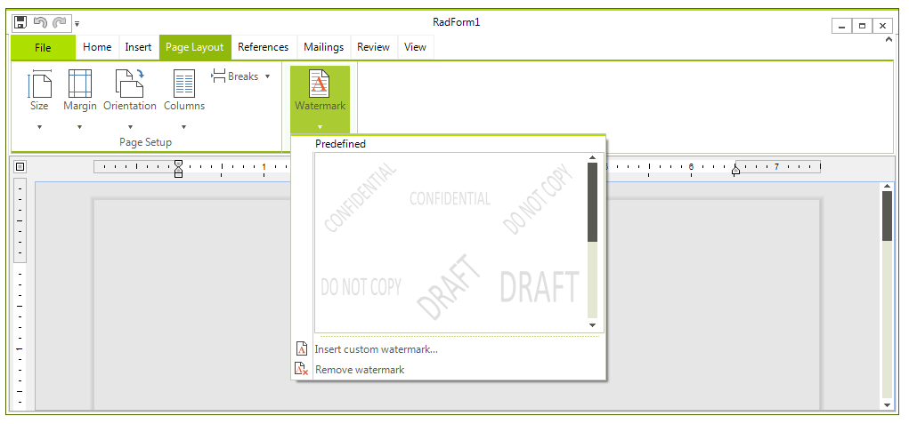
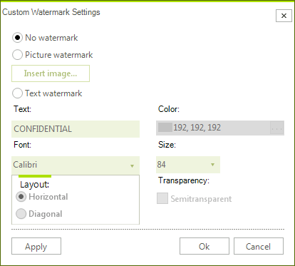

# Watermark

Watermarks are text or pictures that appear behind document's text. They often add interest or identify the document status. You can see watermarks in *Paged* layout mode. They can be printed and exported to all rich-text formats, except HTML.

>tip More on the specifics of the format providers you can find [here]().
>

* [Uisng UI](#using-ui)

* [Manipulating Watermarks Programatically](#manipulating-watermarks-programatically)

## Using UI

You can easily insert bookmarks, for example you can use the __RichTextEditor__ and choose from several predefined watermarks: 



Alternatively, you can create your custom watermark from text or picture through the *Insert custom watermark* option. 



## Manipulating Watermarks Programatically

There are two types of watermarks - text and image. Both of them are shown behind the contents of the documents - text, images, tables, etc. and are applied on a per document basis.

There is also a set of predefined textual watermarks - the most commonly used ones like ASAP, Urgent, Confidential, etc., that can be easily set in the following way:

{{source=..\SamplesCS\RichTextEditor\Features\Watermark.cs region=set}} 
{{source=..\SamplesVB\RichTextEditor\Features\Watermark.vb region=set}} 

````C#
this.radRichTextEditor1.SetWatermark(PredefinedWatermarkType.Confidential);

````
````VB.NET
Me.radRichTextEditor1.SetWatermark(PredefinedWatermarkType.Confidential)

````

{{endregion}} 

You can create custom watermarks using the __WatermarkTextSettings__ and __WatermarkImageSettings__ classes and the respective methods of __RadRichTextEditor__ - __SetWatermarkText()__ and __SetWatermarkImage()__.
        
The following example demonstrates how to create a text watermark and apply it to the document in the editor:

{{source=..\SamplesCS\RichTextEditor\Features\Watermark.cs region=settings}} 
{{source=..\SamplesVB\RichTextEditor\Features\Watermark.vb region=settings}} 

````C#
WatermarkTextSettings textSettings = new WatermarkTextSettings();
textSettings.Text = "Purple Watermark";
textSettings.RotateAngle = 30;
textSettings.Opacity = 1;
textSettings.ForegroundColor = Colors.Purple;
this.radRichTextEditor1.SetWatermarkText(textSettings);

````
````VB.NET
Dim textSettings As New WatermarkTextSettings()
textSettings.Text = "Purple Watermark"
textSettings.RotateAngle = 30
textSettings.Opacity = 1
textSettings.ForegroundColor = Colors.Purple
Me.radRichTextEditor1.SetWatermarkText(textSettings)

````

{{endregion}} 

And this is how you create an image watermark and apply it: 

{{source=..\SamplesCS\RichTextEditor\Features\Watermark.cs region=image}} 
{{source=..\SamplesVB\RichTextEditor\Features\Watermark.vb region=image}} 

````C#
WatermarkImageSettings imageSettings = new WatermarkImageSettings();
imageSettings.UriSource = uri;
imageSettings.Size = new Size(500, 665);
this.radRichTextEditor1.SetWatermarkImage(imageSettings);

````
````VB.NET
Dim imageSettings As New WatermarkImageSettings()
imageSettings.UriSource = uri
imageSettings.Size = New Size(500, 665)
Me.radRichTextEditor1.SetWatermarkImage(imageSettings)

````

{{endregion}} 

# See Also

 * [Formatting API]()
