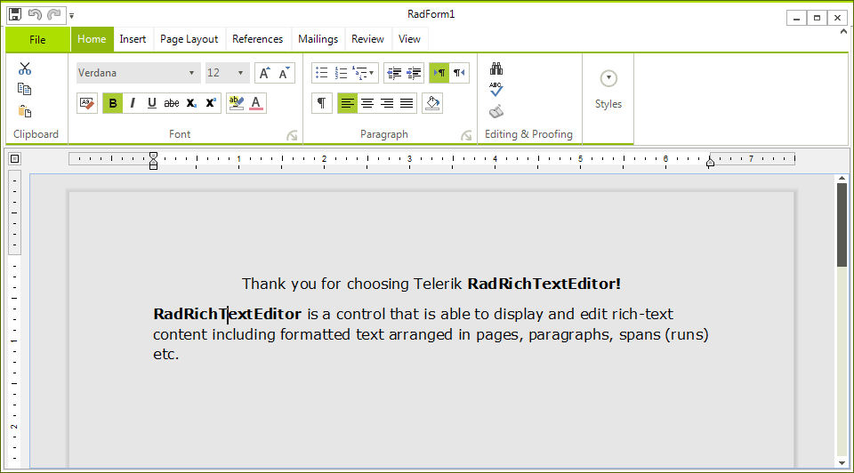
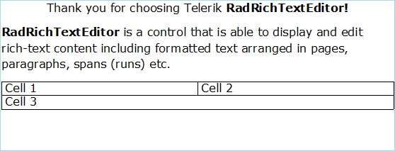

# Getting Started with WinForms RichTextEditor

This tutorial will help you to quickly get started using the control.

## Adding Telerik Assemblies Using NuGet

To use `RadRichTextEditor` when working with NuGet packages, install the `Telerik.UI.for.WinForms.AllControls` package. The [package target framework version may vary]().

If you don’t need all controls, you can instead install a more lightweight package targeting only RadRichTextEditor: **UI.for.WinForms.RichTextEditor**. This package has a dependency on the following NuGets, that will be automatically installed when adding the **RichTextEditor NuGet**.

* __UI.for.WinForms.Common__
* __Telerik.Windows.Documents.Core__

Read more about NuGet installation in the [Install using NuGet Packages]() article.

>tip With the 2025 Q1 release, the Telerik UI for WinForms has a new licensing mechanism. You can learn more about it [here]().

## Adding Assembly References Manually

When dragging and dropping a control from the Visual Studio (VS) Toolbox onto the Form Designer, VS automatically adds the necessary assemblies. However, if you're adding the control programmatically, you'll need to manually reference the following assemblies:

* __Telerik.Licensing.Runtime__
* __Telerik.WinControls__
* __Telerik.WinControls.RichTextEditor__
* __Telerik.WinControls.UI__
* __Telerik.Windows.Documents.Core__
* __TelerikCommon__

The Telerik UI for WinForms assemblies can be install by using one of the available [installation approaches](). 

## Defining the RadRichTextEditor

**RadRichTextEditor** is a control that allows you to display and edit rich text content including sections, paragraphs, spans, italic text, bold text, inline images, tables etc. This topic will help you to quickly get started using the control. It will focus on the following:

* [Creating a RadRichTextEditor](#creating-a-radrichtexteditor)

* [Formatting the text via sample UI](#formatting-via-a-sample-ui)

* [Creating a Document at run time](#creating-a-document-at-run-time)

## Creating a RadRichTextEditor

You can declare a new __RadRichTextEditor__ as any normal WinForms control.

<snippet id='richtexteditor-main-declare-cs' />
<snippet id='richtexteditor-main-declare-vb' />

## Formatting via a sample UI

If you want to allow the user to edit and format the content of __RadRichTextEditor__, you have to create UI and use the API exposed  by __RadRichTextEditor__. The __API__ exposes methods (like __ToggleBold()__,           __ToggleItalic()__ etc.) that modify the text in the control when called. Here is an example of using the API for making the text bold, italic and underlined.

<snippet id='richtexteditor-main-api-cs' />
<snippet id='richtexteditor-main-api-vb' />

The UI should also respond when the caret is on a document position where the text is modified. For example, the BoldButton should be toggled if the caret is on bold text. This can be done by handling the **ToggleStateChanged** event. Here is an example:

<snippet id='richtexteditor-main-commands-cs' />
<snippet id='richtexteditor-main-commands-vb' />

**RichTextEditor sample UI for applying bold, italic, and underline formatting**

## Creating a Document at run time

One of the common uses of __RadRichTextEditor__ is to create a document programatically and show it in the editor. The root element - [RadDocument]() can contain several other elements:

* [Section]()

* [Paragraph]()

* [Span]()

* [InlineImage]()

* [Hyperlink]()

* [Table]()

The whole hierarchy of the elements can be found [here]().

Here is an example of a document created from code-behind:

<snippet id='richtexteditor-main-code-cs' />
<snippet id='richtexteditor-main-code-vb' />

**RichTextEditor document created at run time**

This document is editable. To make it read only you have to set the __IsReadOnly__ property of the __RadRichTextEditor__ to *true*.

>tip To learn more about the read only feature read [this topic]().
>

## See Also

 * [Import/Export]()

 * [Events]()

## Telerik UI for WinForms Learning Resources
* [Telerik UI for WinForms  RichTextEditor Component](https://www.telerik.com/products/winforms/richtexteditor.aspx)
* [Getting Started with Telerik UI for WinForms Components](https://docs.telerik.com/devtools/winforms/getting-started/first-steps)
* [Telerik UI for WinForms Setup](https://docs.telerik.com/devtools/winforms/installation-and-upgrades/installing-on-your-computer)
* [Telerik UI for WinForms Converter](https://www.telerik.com/products/winforms/documentation/ai-coding-assistant/converter/converter)
* [Telerik UI for WinForms Visual Studio Templates](https://docs.telerik.com/devtools/winforms/visual-studio-integration/visual-studio-templates)
* [Deploy Telerik UI for WinForms Applications](https://docs.telerik.com/devtools/winforms/deployment-and-distribution/application-deployment)
* [Telerik UI for WinForms Virtual Classroom(Training Courses for Registered Users)](https://learn.telerik.com/learn/course/external/view/elearning/17/telerik-ui-for-winforms)
* [Telerik UI for WinForms License Agreement)](https://www.telerik.com/purchase/license-agreement/winforms-dlw-s)

